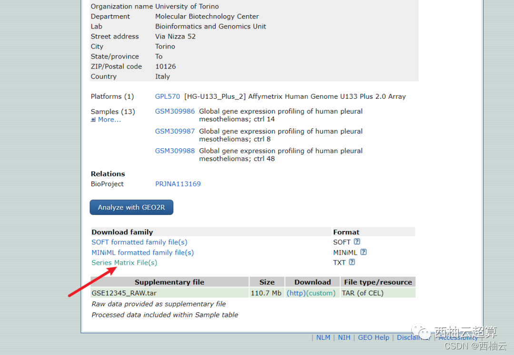
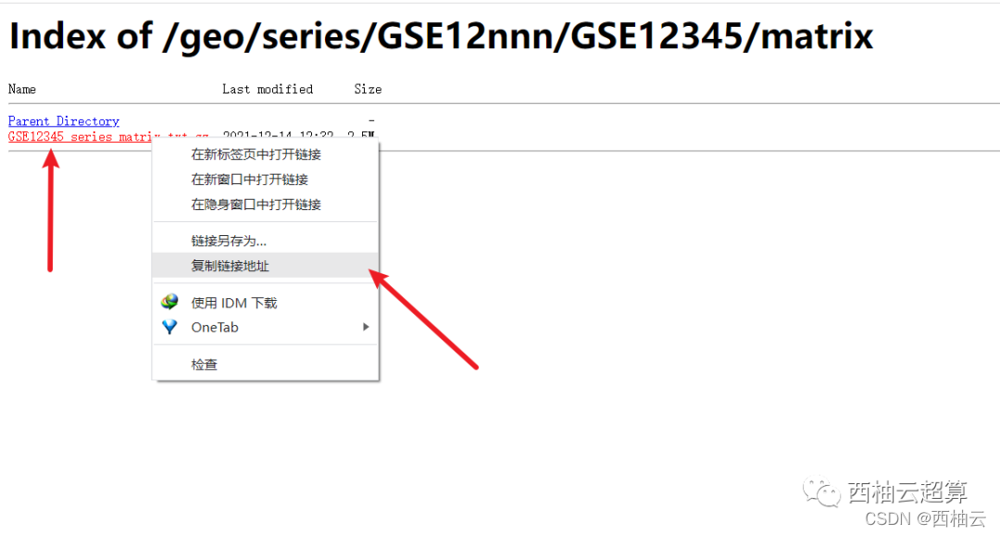
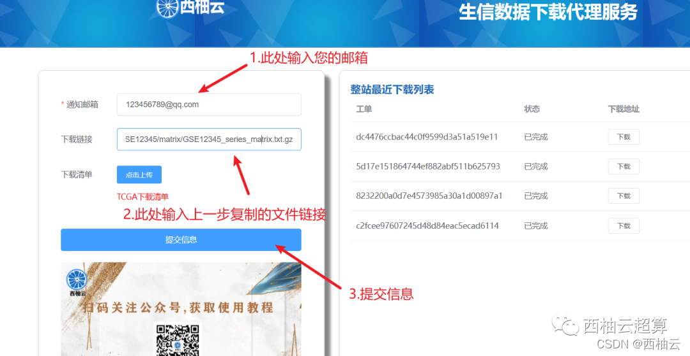

很多同学下载GEO数据库的数据和TCGA的数据网速特别的慢，或者总是中断，生信之路的第一个跟头就摔在了数据下载

下面给大家分享一个下载神器——西柚云代理下载！

[https://fileproxy.xiyoucloud.net/#/](https://links.jianshu.com/go?to=https%3A%2F%2Ffileproxy.xiyoucloud.net%2F%23%2F)

<!--more-->

首先在GEO数据库上面找到您所需要的数据，然后页面往下拉

找到Series Matrix File(s)，点进去

 找到您要下载的文件，右键-复制链接地址

打开我们的代理下载网站

**https://fileproxy.xiyoucloud.net/#/**

输入您用于接收下载链接的邮箱

把上一步复制的链接粘贴到下载地址

点提交信息

下载完成后会自动发送到预留邮箱里面

tar数据直接复制粘贴进去会提示url非法，这个是因为还需要进一步提取下载链接才能下载，具体方法可以参考网站里面的教程

TCGA的使用教程可以看网站里面的教程，篇幅有限就不一一列举了。

**最重要的是！！！这个代理下载服务是完全免费的！！！**