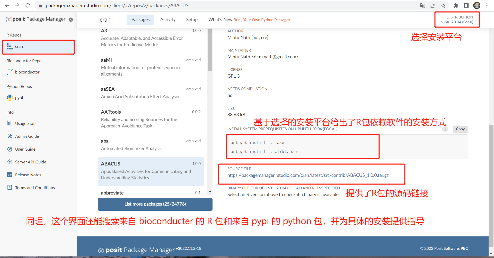

不知道大家听说没有，rstudio 现在已经改名为 posit 了，他们的团队还出了一个包管理工具：Posit Package Manager。

<!--more-->

这篇文章来给大家介绍一下它的功能吧！

它提供统一的包搜索页面（python、来自CRAN的R包、来自bioconductor的R包）：[https://packagemanager.rstudio.com/client/#/repos/5/packages/appdirs](https://packagemanager.rstudio.com/client/#/repos/5/packages/appdirs)

对于来源于 CRAN 的 R 包，它还提供了源码链接和一个 CRAN 的镜像仓库。对于 python 包它也提供有镜像仓库，不过 Python 在国内有更好的镜像，这里就不再提了。

显而易见的是，这个页面目前还没有集成 github，依我看在可见的未来也不会有这个功能，因此来自于 github 的 R 包或 python包 还是需要到 github 网站去搜索：[https://github.com](https://github.com)

## An easy way to access R and Python packages

## 使用 Posit Package Manager

这篇文章介绍了如何在安装 R 包是指定posit团队提供的 CRAN 镜像仓库，它还支持直接安装预编译版本的 R 包，这样能够避免部分 R 包安装过程中编译出错的问题。

## 官网

更多详细信息请查看 Posit Package Manger 的官网：[https://packagemanager.rstudio.com/client/#/](https://packagemanager.rstudio.com/client/#/)

