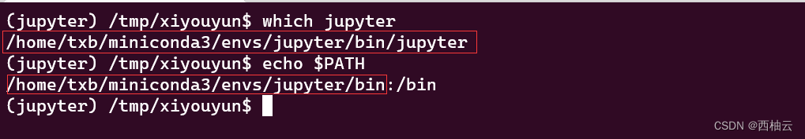
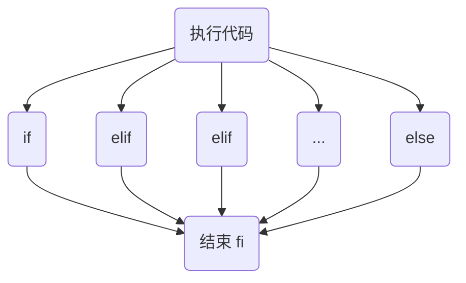

<iframe src="//player.bilibili.com/player.html?aid=775634812&bvid=BV1114y1n7Ei&cid=906225871&page=1" style="width:100%;height:500px;min-width:375px;min-height:200px"scrolling="no" border="0" frameborder="no" framespacing="0" allowfullscreen="true"> </iframe>

<!--more-->

>适用于 ubuntu 20.04
>ubuntu 20.04 是 “西柚云” 主要使用的操作系统 [西柚云官网](https://www.xiyoucloud.net/aff/VKRWMUHQ)

## 前言

shell 是一个命令解释程序，解释用户输入的命令，Linux 系统最常用的 shell 是 bash，不同的 shell 程序会有细微的差别，这里我们学习的也是 bash。

推荐教程：阮一峰老师的《Bash 脚本教程》：https://wangdoc.com/bash/intro

```bash
# 查看当前系统中包含的 shell 程序
cat /etc/shells

# 查看当前系统中使用的 shell 程序
echo $SHELL

# 使用 bash 解释脚本
echo "echo hello xiyouyun" > xiyou.sh
bash xiyou.sh
```

## 变量

变量是一串字符，它代表一个值，可以通过 "$变量名" 的方式获得变量的值。如上文中的 \$SHELL，SHELL 是一个变量，可以通过\$SHELL的方式获得它代表的值。

变量命名规则：

1. 只能使用英文字母，数字和下划线，首个字符不能以数字开头。
2. 中间不能有空格，可以使用下划线_。
3. 不能使用标点符号。
4. 不能使用**bash**里的关键字（可用help命令查看保留关键字）

### 0.echo（单引号、双引号、转义）

使用 echo 可以输出字符串或变量。

好习惯是使用 echo 输出时给要输出的字符串打上引号，这样看起来更直观。

单引号和双引号是不同的，单引号中的特殊字符不会被解释（保持原样输出），双引号中的部分特殊字符会被解释。

| 特殊字符 | 作用                             |
| -------- | -------------------------------- |
| \$       | 读取变量的值                     |
| \``      | 读取命令的输出                   |
| \$()     | 读取命令的输出                   |
| \$(())   | 读取数学运算的结果（只支持整数） |

| 转义字符 | 含义           |
| -------- | -------------- |
| \n       | 换行           |
| \t       | 制表符         |
| \\\      | 不解释转义字符 |

```bash
# 输出字符串（不加引号）
echo hello, xiyouyun
# 输出字符串（单引号）
echo 'hello', '$USER'
echo '$((2+2))'
# 输出字符串（双引号）
echo "hello", "$USER"
echo "$((2+2))"
# 启用反斜杠转义
echo -e 'hello\nxiyouyun'
# \\ 不解释转义字符，保持原样输出
echo -e 'hello\\nxiyouyun'

# 对特殊字符的解释并不是 echo 的功能，而是 bash 的功能，使用 echo 来演示是因为它更直观
sleep "$((2+2))"  # 让终端卡住 4 秒
echo "$((2+2))" 
cat <<< `ls`
```

### 1.环境变量（USER, PATH, PWD, HOME, printenv, env）

环境变量是一种可以在当前 bash 环境和在当前 bash 环境中创建的 bash 子环境中都能访问到的变量。我们使用的终端就是一个 bash 环境，在终端中通过命令运行的其他 bash 进程都是它的子进程。

```bash
# 输出环境变量
echo $USER $PATH $PWD $HOME
# 输出环境变量
printenv
env

# 查看某个环境变量的值，以 PATH为例
env | grep PATH

echo "echo $USER" > user.sh
# 在子 bash 环境中访问环境变量
bash user.sh
```

### 2.自定义变量(=, declare, export)

```bash
# 定义一个普通变量，注意“=”两边不能有空格
sayhello="hello,xiyouyun"
# 定义一个普通变量
declare saygood="good xiyouyun"
# 将自定义变量暴露为环境变量
env | grep say
export sayhi="hi,xiyouyun"
declare -x saygood
env | grep say
```
普通变量和环境变量的区别是环境变量可以在当前 bash 和当前 bash 创建的子 bash 中被读取到，而普通变量只能在当前的 bash 中被读取。

在当前的 bash 环境中创建 1 个子 bash，两者是父进程和子进程的关系。

```bash
# 查看进程树
pstree -antp 
ps -ef
```

```bash
echo $USER
echo $sayhello

echo 'echo "$sayhello $USER"' > xiyou.sh

# 使用这种方式可以执行一个 bash 脚本
bash xiyou.sh

# 暴露 sayhello 为环境变量，再次执行脚本
export sayhello
bash xiyou.sh
```

### 3.删除一个变量(unset)

删除一个变量后，就不能通过 \$+变量 的方式获得变量代表的值了。

```bash
# 删除一个变量，可以是普通变量，也可以是环境变量
unset sayhello
# 让变量等于空字符串，不等价于 unset，但是可以这么用
sayhello=''
```

### 4.变量的数据类型

我们来看看 declare 的参数。

- `-a`：声明数组变量。
- `-i`：声明整数变量。
- `-l`：声明变量为小写字母。
- `-r`：声明只读变量。
- `-u`：声明变量为大写字母。
- `-x`：该变量输出为环境变量。

虽然它能够声明这么多类型的变量，但总的来说变量的类型只有两类：字符串和数组。

- 字符串

    ```bash
    xiyouyun='西柚云'
    xiyou=西柚
    yun="云"
    echo $xiyouyun $xiyou $yun
    ```

- 数组

    ```bash
    # 创建数组
    a=(1 2 3 4 5)
    b=("1" "2" "3" "4" "5")
    c=('x' 'i' 'o' 'u')
    
    # 读取数组单个元素，数组的序号是从 0 开始的
    echo "${a[0]}"
    
    # 读取数组的全部元素
    echo "${c[*]}"
    echo "${c[@]}"
    
    # 获取数组的长度
    echo "${#c[*]}"
    
    # 获取数组的序号
    echo "${!c[*]}"
    
    # 数组切片：从序号 1 开始，截取一个长度为 3 的序列
    echo ${a[@]:1:3}
    
    # 在数组的末尾添加几个元素
    c+=("y" "u" "n")
    
    # 删除数组对应的变量
    unset a b c
    ```

- 关联数组

    数组其实有点像关联数组的另一种形式，关联数组是将一个字符串与另一个字符串关联起来，构成的一个序列。

    数组是将一个序号与一个字符串关联起来。 

    我们将关联字符串和被关联的字符串分别称为 key 和 value。
    
    ```bash
    # 创建关联数组
    declare -A map
    map=(["xiyou"]="西柚" ["xiyouyun"]="西柚云")
    
    # 根据 key 获得 value 的值
    echo "${map["xiyou"]}" "${map["xiyouyun"]}"
    # 读取关联数组的 value 序列
    echo "${map[*]}"
    echo "${map[@]}"
    
    # 获取关联数组的长度
    echo "${#map[*]}"
    
    # 获取关联数组的 key 的序列
    echo "${!map[*]}"
    
    # 向关联数组中追加元素
    map+=(["hello"]="你好")
    
    # 删除关联数组
    unset map
    ```

### 补充内容（变量）

**一条命令输出多行内容**

怎么判断命令是否支持标准输入？

1. 在终端输入命令并按回车后，终端会暂停并等待输入（cat，md5sum）
2. 支持使用管道符(|)将标准输出数据流入为标准输入的命令（grep）

```bash
# << 可以给支持标准输入的命令提供字符串参数
cat << _EOF_
hello,
$USER,
xiyouyun;
_EOF_

# <<< 可以给支持标准输入的命令提供字符串参数
md5sum <<< "hello, xiyouyun"
grep -E xiyou <<< "hello, xiyouyun"

# 将多行文本写入文件
cat > xiyou.txt << _EOF_
hello,
xiyou,
xiyouyun;
_EOF_

# 使用 \n 来做标准的多行内容的输出
echo "hello\nxiyouyun"
```

## 脚本

脚本是一个包含代码的文件。

### 1.脚本的执行原理

脚本的执行原理就是让**解释程序**去解释脚本的内容，让计算机做某种操作。

解释程序：bash，python，perl，Rscript ……

```bash
# 执行 1 个 bash 脚本
bash xx.sh
# 执行 1 个 python 脚本
python xx.py
# 执行 1 个 perl 脚本
perl xx.pl
# 执行 1 个 R 脚本
Rscript xx.R
```

- Shebang 和注释

    Shebang：代码的“#!”，为 Shebang，它帮助 bash 定位到解释该文件的程序，它只有在脚本以不显式声明解释程序的情况下执行才有用。

    ```bash
    #! /bin/bash
    #! /bin/python
    
    # 推荐使用这种方式定位到解释程序的位置会更加灵活，它会让 env 去解释在当前的 bash 环境中 python 对应的是哪个可执行程序
    #! /bin/env python
    #! /bin/env “perl” -w
    ```

    注释：以'#'开头的行，这些行不会被 bash 解释，不会执行。

    ```bash
    cat > xiyou.sh << _xiyou_
    # pwd
    # ls
    echo "hello, xiyouyun"
    _xiyou_
    # 不会执行脚本中被注释的内容
    bash xiyou.sh
    ```

- 脚本的返回值和 \$?

    在终端中输出的内容不是脚本的返回值，脚本的返回值保存在特殊变量 \$? 中
    
    ```bash
    # 命令执行成功了
    cd /tmp
    # 输出 0 表示上一条命令被正确执行
    echo $?
    
    # 将工作目录切换到一个在系统中不存在的目录
    cd /not_exists_path
    # 输出 1 表示上一条命令执行失败
    echo $?
    
    echo "cd /not_exists_path " > xiyou.sh
    # 这也可以看做一条命令，所以我们可以通过 $? 来判断脚本是否能够正确被解释
    bash xiyou.sh
    echo $?
    ```
    
    脚本执行后的返回值可以通过一个特殊的变量\$?获取到
    
    | \$?  | 含义                            |
    | ---- | ------------------------------- |
    | 0    | 脚本/命令内容被 bash 正确解释了 |
    | 其他 | 脚本/命令执行出错               |
    

### 2.bash脚本的执行方式

无论执行方式是怎样，都是使用 bash 去解释脚本文件内容。

- source(在当前的 bash 环境中执行)

    ```bash
    # 这个文件中通常配置了很多环境变量，因此我们想要它们在当前的 bash 环境中生效。
    source ~/.bashrc
    
    echo "export hello='hello, xiyouyun'" >> xiyouyun.sh
    # 在 bash 子环境中定义一个环境变量，这样是不能被当前的 bash 环境读到的
    bash xiyouyun.sh
    env | grep hello
    
    # 使用 source 执行会让环境变量在当前的环境中可读
    source xiyouyun.sh
    env | grep hello
    ```
- bash xx.sh

    用户只要保证对 bash 具有可执行权限，并且用户具有 xx.sh 的可读权限就可以执行脚本了，不需要让 xx.sh 文件本身就有可执行权限。

    ```bash
    # 查看 bash 可执行程序的位置
    which bash
    # 查看 bash 的文件权限
    ls -l $(which bash)
    # 去除文件的可执行权限
    chmod u-x xiyou.sh
    # 查看文件的权限
    ls -l xiyou.sh
    # 执行脚本
    bash xiyou.sh
    ```

- ./xx.sh 配合 Shebang 可以执行所有类型的脚本。

    使用这种方式执行脚本如果使用 Shebang 指定了解释的程序，则根据这个程序来解释脚本的内容。否则默认使用 bash 来解释脚本的内容。

    ```bash
    # 向文件中写入脚本内容
    echo "echo hello xiyouyun" >> xiyou.sh
    # 使用 ./xx.sh 的方式执行脚本，会报错
    ./xiyou.sh
    # 给脚本赋予可执行权限，在Linux课程的《文件的权限和属性》讲到过
    chmod u+x xiyou.sh
    ./xiyou.sh
    
    # 如果不指定 Shebang，它默认被 bash 解释
    cat > xiyouyun.sh << _xiyou_
    #! /bin/env python
    print("hello, xiyouyun")
    _xiyou_
    
    # 如果指定错误的 Shebang，执行时会报错
    cat > bad.sh << _xiyou_
    #! /a_not_exists_interpreter
    print("hello, xiyouyun")
    _xiyou_
    
    chmod u+x xiyouyun.sh bad.sh
    # 执行该脚本会通过 Shebang 找到 python 程序，然后使用 python 程序来解释脚本内容
    ./xiyouyun.sh 
    ./bad.sh
    # 可以看到 Linux 中程序的执行只跟文件内容和用来解释文件的程序有关，而跟文件后缀无关
    bash xiyouyun.sh
    # 当然，我们可以改一下文件后缀，方便知道文件应该让哪个程序来解释
    mv xiyouyun.sh xiyouyun.py
    ```

如果将拥有可执行权限的脚本所在的目录加入到 PATH 变量中，这样就可以直接使用文件名来执行文件了，否则需要使用文件的相对路径或者绝对路径来执行脚本。

```bash
which jupyter
echo $PATH
jupyter
```




### 3.bash 脚本的参数（$0）

执行脚本时，我们可以给脚本传入参数，然后在脚本内部读取传入的

| 特殊变量（参数） | 含义                                        |
| ---------------- | ------------------------------------------- |
| $0               | 脚本文件名称                                |
| \$1 ~ \$9        | 脚本的第1~9个参数                           |
| $#               | 参数的总数                                  |
| $@               | 全部参数，使用空格分割                      |
| $*               | 全部参数，使用 $IFS 分割，IFS是一个环境变量 |

```bash
echo "echo -e \" \$1 \$2 \$3 \$4 \$5 \$6 \\n \$@ \\n \$* \"" > xiyou.sh
cat > xiyou.sh << _xiyou_
echo "\$1 \$2 \$3 \$4 \$5 \$6 "
echo "\$@"
echo "\$*"
echo "参数的长度为 \$#"
_xiyou_


chmod u+x xiyou.sh
./xiyou.sh x i y o u y u n
```

我们见到的很多命令的参数前面通常是有名称的，这可以帮助脚本和使用者更好地理解各个参数的含义，比如说 wget。那么我们怎么通过指定不同名称的参数来影响脚本的执行过程和结果呢？

这里就涉及到一些逻辑判断的问题。

如果指定了 o 参数，就将跟在其后的一段字符解释为保存结果的文件路径。

如果指定了 d 参数，就打印 debug 信息。

我们下个视频讲如何在脚本中使用这种逻辑判断。

```bash
wget --help
```

## 语法

### 1.命令的执行方式（&&,||, ;）

```bash
# 在一行执行多条命令，几条命令执行成功与否并无关联
cd /not_exists_path;pwd;ls
# 只有前一条命令执行成功才执行后一条
pwd && ls
cd /not/exists/path && ls
# 如果前一条命令执行不成功就执行后一条，否则不执行后一条命令
cd /not/exists/path || ls
```

### 2.条件判断（if，test）

三类条件判断：

1. 对字符串进行条件判断
2. 对文件进行条件判断
3. 对命令的返回值进行条件判断

语法规则：

1. if 和 fi 包裹了整个条件判断的代码，以 if、elif、else 作为分隔符，**分割后的代码块最多只有 1 个块会被执行。**
2. if 和 fi 是必须要有的，elif 和 else 都不是必须的，如果同时有 elif 和 else，else要放在最后

使用条件判断的 3 种代码形式：

1. []
2. [[]] 支持正则表达式
3. test




```bash
# 字符串判断
vi xiyou.sh
# 如果没传参数，就直接终止脚本的运行，返回 0
if [[ $1 = "" ]]; then
	echo "没传参数"
	exit 0  # 可以退出 1 个脚本，不再继续往下执行
fi
# "[]" 两边必须有空格	
if [ $1 = "xiyouyun" ]; then
	echo "hello xiyouyun"
# 使用 test 做逻辑判断    
elif test $1 = "xiyou"; then
	echo "hello xiyou"
# "[[]]" 两边必须有空格, 支持正则表达式
elif [[ $1 =~ t.* ]]; then
	echo "hello txb"	
else
	echo "前面所有的条件都为假"
fi


# 文件判断，判断文件是否存在，且是一个普通文件而不是目录
test -a /etc/hosts
[ -a /etc/hosts ]
if [[ -a /etc/hosts ]]; then
	echo "file exists"
fi

# 命令返回值判断，如果命令的返回值为 0，则为真
if [[ `cd not_exists_path` ]]; then
	echo "cd not_exists_path 命令的返回值为真"
elif [[ $(ls) ]]; then
	echo "ls 命令的返回值为真"
fi	

# 查看 test 命令的用法
man test

# 与、或：组合多个条件表达式的方式
# 0 < 1 且 2 < 1
if [[ 0 -lt 1 && 2 -lt 1 ]]; then
	echo "0 小于 1 且 2 小于 1 的条件为真"
else
	echo "0 小于 1 且 2 小于 1 的条件为假"
fi
# 0 < 1 且 1 小于 2
if [[ 0 -lt 1 && 1 -lt 2 ]]; then
	echo "0 小于 1 且 1 小于 2 的条件为真"
else
	echo "0 小于 1 且 1 小于 2 的条件为假"
fi
# 1 < 0 或 1 大于等于 1
if [[ 1 -lt 0 || 1 -gt 1 || 1 -ge 1 ]]; then
	echo "1 小于 0 或 1 大于 1 或 1 大于等于 1 的条件为真"
else
	echo "1 小于 0 或 1 大于 1 或 1 大于等于 1 的条件为假"
fi	

# 非：让表达式的值取反，即让假的变成真，真的变成假
if [[ ! "一碗粉" = "两碗粉" ]]; then
	echo "一碗粉不等于两碗粉"
else
	echo "一碗粉等于两碗粉"
fi	
```

| 条件                 | 值为真的情况                                                 |
| -------------------- | :----------------------------------------------------------- |
| -z 字符串            | 字符串的长度为0时                                            |
| 字符串1 = 字符串 2   | 两个字符串相同时                                             |
| 字符串1 '<' 字符串 2 | 按照字典顺序字符串1 < 字符串2：<br />a < b<br />ab < b<br />abcdefgg < acdefgh |
| 字符串1 -lt 字符串2  | 字符串1对应的数学值比字符串2对应的数学值小（lower than）<br />"1" < "2" |
| 字符串1 -gt 字符串2  | 字符串1对应的数学值比字符串2对应的数学值大（greater than）   |
| 字符串1 -ge 字符串2  | greater or equal                                             |
| 字符串1 -le 字符串2  | lower or equal                                               |
| 字符串1 -ne 字符串2  | not equal                                                    |
|                      |                                                              |
| -a file              | file 对应的文件存在                                          |
| -d file              | file 对应的目录存在                                          |
| -h file              | file 存在，并且是一个软链接或硬链接                          |
| -r file              | file 可读                                                    |
| -w file              | file 可写                                                    |
| -x file              | file 可执行                                                  |
|                      |                                                              |
| \`command\`          | 如果命令的返回值为 0 ，则为真                                |

| 逻辑表达式                 | 值为真的情况                   |
| -------------------------- | ------------------------------ |
| expression                 | 条件成立，则表达式的值为真     |
| ! expression               | 当表达式的值为假时             |
| expression1 && expression2 | 当表达式1和表达式2的值都为真时 |
| expression1 && expression2 | 当表达式1或表达式2的值为真时   |

### 3.循环（for...in, while, for, break, continue）

```bash
# while 循环
while condition; do
  commands
done

# for...in 循环
for i in test.log *.txt; do
  echo $i
done	

# for 循环
for (( i=0; i<5; i=i+1 )); do
  echo $i
done

# break 用于结束循环
for number in 1 2 3 4 5 6
do
  echo "number is $number"
  if [ "$number" = "3" ]; then
    break
  fi
done
# continue 用于终止本轮循环
while read -p "What file do you want to test?" filename
do
  if [ ! -e "$filename" ]; then
    echo "The file does not exist."
    continue
  fi

  echo "You entered a valid file.."
done

for i in "$@"; do
if [[ $i = "\-o" ]]; then
	
elif [[]]
done
```


### 4.函数（定义，参数）

函数是可以重复使用的代码片段。

在函数中可以使用参数，调用函数时可以传递参数到函数中。

0. 函数的定义

1. 函数的参数
2. 函数的返回值和脚本的返回值
3. 函数中的局部变量和全局变量（**推荐在函数中使用局部变量**）

```bash
# 定义一个函数
function fn() {
	echo $1 $2 $3 $4 $5
	# 函数执行到 return 语句就直接返回，不再往下执行
	return 0
}
# 调用一个函数, fn 是函数名，剩下的是参数
fn x y o u
echo "$?"

# 定义 1 个函数让两个数相加
add () {
	a=$(($1 + $2))
	return $a
	echo "函数中 return 后面的代码不会运行"
}
add 1 2
# 通过 $? 获取函数的返回值，不过返回值只能为 0~255 的数字，否则会溢出
# 其实它更大的意义是能让 1 个函数结束运行
sum=$?
echo $sum
add 0 255
echo $?
add 1 256
echo $?
# 脚本的返回值，范围也是 0~255，它的主要意义是让后面的代码不再执行
# 次要意义是我们通常在脚本正常执行是返回 0，脚本执行出错时返回其他数字
exit 255
echo "hello, xiyouyun"

# 定义全局变量
foo=9527
# 在函数中使用 local 定义局部变量
fn2 () {
  local foo
  foo=1
  echo "fn: foo = $foo"
}

fn2
echo "global: foo = $foo"
# 查看当前 shell 环境下定义的函数
declare -f
declare -F
```

- `$1`~`$9`：函数的第1个到第9个参数。
- `$0`：函数所在的脚本名。
- `$#`：函数的参数总数。
- `$@`：函数的全部参数，参数之间使用空格分隔。
- `$*`：函数的全部参数，参数之间使用变量`$IFS`值的第一个字符分隔，默认为空格