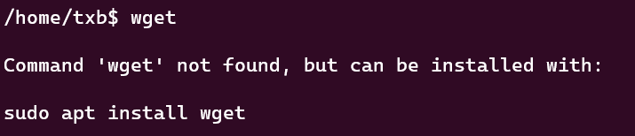

## PATH

我们运行 1 个命令，shell解释程序（以下用bash代替）首先需要知道命令对应的程序的位置，也就是程序文件对应的路径。

计算机如何找到命令对应的程序的位置呢？这是通过 PATH 这个系统变量来实现的。

使用 echo $PATH 可以查看 PATH 这个系统变量的值

```bash
/home/txb/.local/bin:/home/txb/miniconda3/bin:/home/txb/miniconda3/condabin:/usr/local/sbin:/usr/local/bin:/usr/sbin:/usr/bin:/sbin:/bin:/usr/games:/usr/local/games:/usr/lib/wsl/lib:/
```

PATH 变量中使用使用 ":" 来分割路径，执行命令时，bash 会去每个路径对应的目录中去找可执行程序，如果找到1个名称匹配的可执行程序，就执行这个程序，不再继续往下找了。而如果找遍PATH中配置的所有目录也找不到名称匹配的可执行程序，就会报错 "command not found xxx" 

<!--more-->

## 导致“xxx command not found”的原因

导致 command not found xxx 的原因大致有 2 种：

### 1.软件未安装

### 2.软件已安装，但软件对应的可执行程序所在的目录未配置在 PATH 中

第 1 种情况的解决办法就是在系统中安装对应的软件。



第 2 种情况的解决办法就是将可执行程序所在的目录加入到 PATH 中，具体可以参考一下步骤。

## 向PATH添加路径

### 1.在PATH的最前面添加目录

执行后**暂时**添加，退出登陆后失效，如果想登陆后立即生效，需要写入 ~/.bashrc 文件

```bash
PATH=/hom/txb/bin:$PATH
```

### 2.在PATH的最后面添加目录

执行后**暂时**添加，退出登陆后失效，如果想登陆后立即生效，需要写入 ~/.bashrc 文件

```bash
PATH=$PATH:/home/txb/bin:
```

### 3.在PATH的任意位置添加目录

执行后**暂时**添加，退出登陆后失效，如果想登陆后立即生效，需要写入 ~/.bashrc 文件

```bash
function insert_path() {
	# 第 1 个参数为插入的序号，从 1 开始
	# 第 2 个参数为插入的目录
	index=$1
	directory=$2
	export PATH=$(echo $PATH | awk -F ":" -v directory="$directory" -v insert_index="$index" '{for(i=1;i<=NF;i++){if(i==insert_index){printf("%s%s", directory, ":")};if(i==NF){printf("%s",$i);break};printf("%s%s", $i, ":")}}')
}
insert_path 2 /home/txb/bin
```

### 4.删除PATH对应位置的目录

执行后**暂时**删除，退出登陆后失效，如果想登陆后立即生效，需要写入 ~/.bashrc 文件

**注意：delete_path 是根据目录的序号删除目录，因此在不清楚待删除目录的序号时应该避免使用**

```bash
function delete_path() {
	# 第 1 个参数为删除的目录的序号，从 1 开始
	index=$1
	export PATH=$(echo $PATH | awk -F ":" -v directory="$directory" -v insert_index="$index" '{for(i=1;i<=NF;i++){if(i==insert_index){continue};printf("%s%s", $i, ":")}}')
}
delete_path 2
```

将目录添加到PATH的位置决定了目录中软件的优先级，因为bash按照顺序在目录中查找可执行程序，一旦找到就不继续往后找了。

## 误删.bashrc

误删 .bashrc 文件，发现之前安装的软件全都不能使用了。 

原因：用户登陆系统时会自动执行 .bashrc 脚本，执行脚本时会设置一些环境变量，如PATH变量。PATH变量未设置或者可执行程序所在的目录没有添加到PATH变量中都会导致软件已经安装，但对应的程序却不能执行，报错信息：command not found xxx

这种情况如果你之前的 .bashrc 没有备份的话就无法补救了，这里我提供一份原始的 .bashrc 文件吧，你可以在这份文件的基础上重新编写 .bashrc 文件，.bashrc 文件位于家目录下。

```bash
# ~/.bashrc: executed by bash(1) for non-login shells.
# see /usr/share/doc/bash/examples/startup-files (in the package bash-doc)
# for examples

# If not running interactively, don't do anything
case $- in
    *i*) ;;
      *) return;;
esac

# don't put duplicate lines or lines starting with space in the history.
# See bash(1) for more options
HISTCONTROL=ignoreboth

# append to the history file, don't overwrite it
shopt -s histappend

# for setting history length see HISTSIZE and HISTFILESIZE in bash(1)
HISTSIZE=1000
HISTFILESIZE=2000

# check the window size after each command and, if necessary,
# update the values of LINES and COLUMNS.
shopt -s checkwinsize

# If set, the pattern "**" used in a pathname expansion context will
# match all files and zero or more directories and subdirectories.
#shopt -s globstar

# make less more friendly for non-text input files, see lesspipe(1)
[ -x /usr/bin/lesspipe ] && eval "$(SHELL=/bin/sh lesspipe)"

# set variable identifying the chroot you work in (used in the prompt below)
if [ -z "${debian_chroot:-}" ] && [ -r /etc/debian_chroot ]; then
    debian_chroot=$(cat /etc/debian_chroot)
fi

# set a fancy prompt (non-color, unless we know we "want" color)
case "$TERM" in
    xterm-color|*-256color) color_prompt=yes;;
esac

# uncomment for a colored prompt, if the terminal has the capability; turned
# off by default to not distract the user: the focus in a terminal window
# should be on the output of commands, not on the prompt
#force_color_prompt=yes

if [ -n "$force_color_prompt" ]; then
    if [ -x /usr/bin/tput ] && tput setaf 1 >&/dev/null; then
        # We have color support; assume it's compliant with Ecma-48
        # (ISO/IEC-6429). (Lack of such support is extremely rare, and such
        # a case would tend to support setf rather than setaf.)
        color_prompt=yes
    else
        color_prompt=
    fi
fi

if [ "$color_prompt" = yes ]; then
    PS1='${debian_chroot:+($debian_chroot)}\[\033[01;32m\]\u@\h\[\033[00m\]:\[\033[01;34m\]\w\[\033[00m\]\$ '
else
    PS1='${debian_chroot:+($debian_chroot)}\u@\h:\w\$ '
fi
unset color_prompt force_color_prompt

# If this is an xterm set the title to user@host:dir
case "$TERM" in
xterm*|rxvt*)
    PS1="\[\e]0;${debian_chroot:+($debian_chroot)}\u@\h: \w\a\]$PS1"
    ;;
*)
    ;;
esac

# enable color support of ls and also add handy aliases
if [ -x /usr/bin/dircolors ]; then
    test -r ~/.dircolors && eval "$(dircolors -b ~/.dircolors)" || eval "$(dircolors -b)"
    alias ls='ls --color=auto'
    #alias dir='dir --color=auto'
    #alias vdir='vdir --color=auto'

    alias grep='grep --color=auto'
    alias fgrep='fgrep --color=auto'
    alias egrep='egrep --color=auto'
fi

# colored GCC warnings and errors
#export GCC_COLORS='error=01;31:warning=01;35:note=01;36:caret=01;32:locus=01:quote=01'

# some more ls aliases
alias ll='ls -alF'
alias la='ls -A'
alias l='ls -CF'

# Add an "alert" alias for long running commands.  Use like so:
#   sleep 10; alert
alias alert='notify-send --urgency=low -i "$([ $? = 0 ] && echo terminal || echo error)" "$(history|tail -n1|sed -e '\''s/^\s*[0-9]\+\s*//;s/[;&|]\s*alert$//'\'')"'

# Alias definitions.
# You may want to put all your additions into a separate file like
# ~/.bash_aliases, instead of adding them here directly.
# See /usr/share/doc/bash-doc/examples in the bash-doc package.

if [ -f ~/.bash_aliases ]; then
    . ~/.bash_aliases
fi

# enable programmable completion features (you don't need to enable
# this, if it's already enabled in /etc/bash.bashrc and /etc/profile
# sources /etc/bash.bashrc).
if ! shopt -oq posix; then
  if [ -f /usr/share/bash-completion/bash_completion ]; then
    . /usr/share/bash-completion/bash_completion
  elif [ -f /etc/bash_completion ]; then
    . /etc/bash_completion
  fi
fi
```

## 误删.profile

误删 .profile 文件，发现 .bashrc 中配置的软件不能使用了。用户登陆系统时会执行 .bashrc 文件是因为登陆时会执行 .profile 脚本，而在 .profile 脚本内部会调用执行 .bashrc 脚本。因此如果误删 .profile，在登陆时就不会执行 .bashrc 文件了。此时可以手动执行 .bashrc 文件，当然这样只是暂时生效，下次登陆后就失效了。如果想让 .bashrc文件在登陆后被执行，你需要新建 .profile 并向其中写入调用 ~/.bashrc 的语句。（**参考下方.profile文件的内容**）

```bash
source ~/.bashrc
```

如果误删 ~/.profile 文件，可以根据我下方提供的文件内容在系统中创建对应的文件。.profile位于用户家目录下

```bash
# ~/.profile: executed by the command interpreter for login shells.
# This file is not read by bash(1), if ~/.bash_profile or ~/.bash_login
# exists.
# see /usr/share/doc/bash/examples/startup-files for examples.
# the files are located in the bash-doc package.

# the default umask is set in /etc/profile; for setting the umask
# for ssh logins, install and configure the libpam-umask package.
#umask 022

# if running bash
if [ -n "$BASH_VERSION" ]; then
    # include .bashrc if it exists
    if [ -f "$HOME/.bashrc" ]; then
        . "$HOME/.bashrc"
    fi
fi

# set PATH so it includes user's private bin if it exists
if [ -d "$HOME/bin" ] ; then
    PATH="$HOME/bin:$PATH"
fi

# set PATH so it includes user's private bin if it exists
if [ -d "$HOME/.local/bin" ] ; then
    PATH="$HOME/.local/bin:$PATH"
fi
```