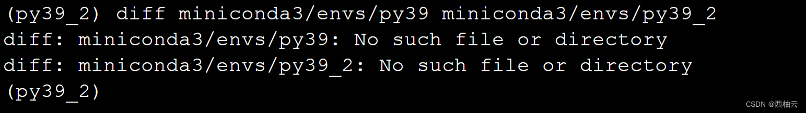
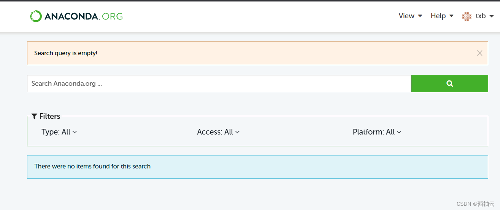

<iframe src="//player.bilibili.com/player.html?aid=944424445&bvid=BV18W4y1E7sw&cid=881784737&page=1" style="width:100%;height:500px;min-width:375px;min-height:200px"scrolling="no" border="0" frameborder="no" framespacing="0" allowfullscreen="true"> </iframe>

<!--more-->


> 针对 ubuntu 20.04
> ubuntu 20.04 是 “西柚云” 主要使用的操作系统 [西柚云官网](https://www.xiyoucloud.net/aff/VKRWMUHQ)


参考教程：[conda 的安装和卸载](https://blog.csdn.net/weixin_64316191/article/details/127435729)

## 虚拟环境管理
1. conda env list （列出虚拟环境信息）
2. conda create -n <env_name> (创建虚拟环境)
	```shell
	# 命令示例
	conda create -n py38 -y
	conda create -n py39 python=3.9 -y  # 官方推荐使用这种方式
	conda create -n py39_2 -y && conda install -n py39_2 python=3.9 -y
	
	# 比较两种创建方式有何不同，并无任何不同
	diff miniconda3/envs/py39 miniconda3/envs/py39_2
	```
	
	可以看到，在创建环境时指定 python 版本，和创建完环境后安装 python 的指定版本两者导致的结果并无不同，那为什么官方推荐在创建环境时使用 python=3.9 的方式指定 python
	 版本呢？ 这是因为如果您要在该虚拟环境中使用 python，就应该在创建环境之初下载 python3.9 ，之后在这个虚拟环境中下载的其他包都会匹配 python3.9的依赖与约束。如果安装了很多其他包之后再安装 python3.9，处理环境依赖就会变得较为复杂，甚至导致一些不易察觉的 bug。
	

	
3. conda activate <env_name> (进入虚拟环境)
	```shell
	# 命令示例
	conda activate py39
	```
4. conda deactivate <env_name> (退出虚拟环境) 
	```shell
	# 命令示例
	conda deactivate 
	```
5. conda remove -n <env_name> --all 删除虚拟环境
	```shell
	# 命令示例
	conda create -n test -y
	conda env list
	# 删除 test 虚拟环境
	conda remove -n test --all
	conda env list
	```
6. 导出虚拟环境
	```shell
	# 适用于在相同操作系统版本下 clone 虚拟环境
	conda list --explicit > spec-list.txt
	# 适用于所有平台之间 clone 虚拟环境，这里的平台指的是操作系统，如win、centos、ubuntu
	conda env export > environment.yml
	```
5. 根据导出的文件创建虚拟环境
	```shell
	# 代码示例
	# 根据导出包创建 env_name1 的虚拟环境
	conda create -n env_name1 --file spec-list.txt
	conda env create --file environment.yml
	```


## channels 管理

**conda 处理 channels 的优先级的步骤:**
	1. 按通道优先级从高到低对包进行排序。
	2. 将捆绑的软件包（具有相同通道优先级的软件包）从最高版本号到最低版本号排序。例如，如果 channel A 包含 NumPy 1.12.0 和 1.13.1，则 NumPy 1.13.1 将被排序更高。
	3. 将仍然绑定的软件包（具有相同通道优先级和相同版本的软件包）从最高到最低内部版本号排序。例如，如果 channelA 同时包含 NumPy 1.12.0 build 1 和 build 2，则 build 2 首先排序。通道B 中的任何包都将排在通道A 之下。
	4. 安装排序列表中满足安装规范的第一个包

1. 列出 conda 中配置的 channels，根据从低到高的优先级排列
	```shell
	conda config --get channels 
	```
3. 添加 channels，添加国内的 channels 也就是我们常说的添加国内源
	```shell
	# 添加中科大源
	conda config --add channels https://mirrors.ustc.edu.cn/anaconda/pkgs/free/
	conda config --add channels https://mirrors.ustc.edu.cn/anaconda/cloud/conda-forge/
	conda config --add channels https://mirrors.ustc.edu.cn/anaconda/cloud/bioconda/
	conda config --add channels https://mirrors.ustc.edu.cn/anaconda/pkgs/main/
	conda config --set show_channel_urls yes
	
	# 添加清华大学源（偶尔抽风，此时需要更换为其他国内镜像源，更换国内镜像源的教程可以查看《conda安装教程》）
	conda config --add channels https://mirrors.tuna.tsinghua.edu.cn/anaconda/pkgs/free/
	conda config --add channels https://mirrors.tuna.tsinghua.edu.cn/anaconda/cloud/conda-forge/
	conda config --add channels https://mirrors.tuna.tsinghua.edu.cn/anaconda/cloud/bioconda/
	conda config --set show_channel_urls yes
	
	# 添加阿里云源
	conda config --add channels https://mirrors.aliyun.com/anaconda/pkgs/free
	conda config --add channels https://mirrors.aliyun.com/anaconda/pkgs/main
	conda config --add channels https://mirrors.aliyun.com/anaconda/cloud/conda-forge
	conda config --add channels https://mirrors.aliyun.com/anaconda/cloud/bioconda
	conda config --set show_channel_urls yes
	```
4. 删除 channels 
	- 方法 1 （通过命令删除）：
		```shell
		# 首先查看 channels
		conda config --get channels
		# 删除指定的 channels
		conda config --remove channels https://mirrors.tuna.tsinghua.edu.cn/anaconda/cloud/bioconda/
		# 删除配置的所有镜像源
		conda config --remove-key channels
		```
	- 方法 2 （编辑 .condarc 文件删除想要删除 channels 对应的行）
		```shell
		vi ~/.condarc
		```
5. 安装包时暂时添加 channels，此 channels 处于最高优先级
	```shell
	conda install -c bioconda presto
	```


## 包管理

使用 conda 安装包之前，需要在以下链接中搜索 conda 包，找到安装对应包的命令后再进行安装，如果不能在下面的链接中找到安装方法，即表明该包不能通过 conda 安装。
[搜 conda 包](https://anaconda.org/search?)


1. conda list （查看当前虚拟环境已经安装的包）
2. conda install <package_name> 
	```shell
	# 命令示例
	conda install --help
	# -y: yes
	conda install requests -y
	# -c: 临时增加一个 channel ，并且增加的 channels 会处于最高优先级
	conda install -c bioconda presto
	# -vv: 显示下载过程中的详细日志，方便定位问题
	conda install numpy -y -vv
	# 后台下载
	nohup conda install pandas -y &
	```
3. conda 官方建议，使用 conda 安装的 python包和使用 pip 安装的 python 包是有略微不同的，如果可能，尽量使用 conda 来安装包。[参考链接](https://conda.io/projects/conda/en/latest/user-guide/tasks/manage-pkgs.html?highlight=pip#id5)
	- 在 conda 4.6 以后，conda 可以识别 pip 安装的 python包，不过目前这一功能还处于实验阶段。
	- 在 conda 中应该优先使用 conda 安装包，不要混用 conda 和 pip，可以设置一个虚拟环境专门用户 pip 管理 python 包
	- conda 和 pip 都可以根据文件批量安装 python 包
		```shell
		pip list --format=freeze > requirements.txt
		pip install -r requirements.txt
		conda install -n env_name --file requirements.txt
		```
## 

## 配置管理

1. conda config --show
	```shell
	# 查看 channels
	conda config --help
	conda config --get channels
	conda config --remove <key> <value>
	```
我们很难记住那么多配置项的作用，如果需要可以查阅 conda 官方教程对各配置项的详解
[conda 配置项的作用](https://conda.io/projects/conda/en/latest/configuration.html#)