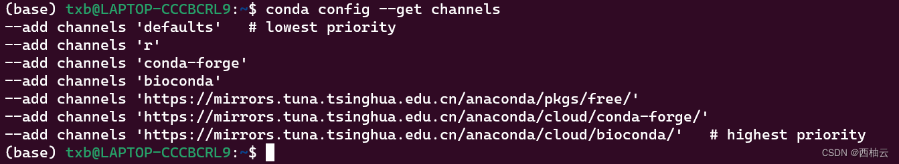
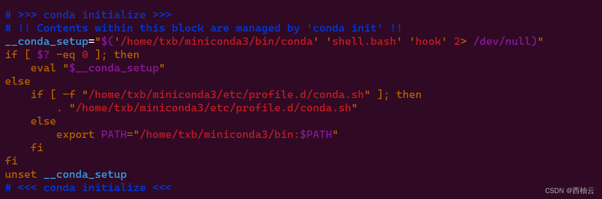

<iframe src="//player.bilibili.com/player.html?aid=559359158&bvid=BV1xe4y1U7Fe&cid=881565520&page=1" style="width:100%;height:500px;min-width:375px;min-height:200px"scrolling="no" border="0" frameborder="no" framespacing="0" allowfullscreen="true"> </iframe>

<!--more-->
<iframe src="//player.bilibili.com/player.html?aid=731773217&bvid=BV1aD4y1r7H1&cid=881602406&page=1" style="width:100%;height:500px;min-width:375px;min-height:200px"scrolling="no" border="0" frameborder="no" framespacing="0" allowfullscreen="true"> </iframe>

> 针对 ubuntu20.04
> ubuntu20.04 是 “西柚云” 主要使用的操作系统  [西柚云官网](https://www.xiyoucloud.net/aff/VKRWMUHQ)

## 安装
1. 下载 conda 的安装脚本（这里使用清华大学的镜像）
```shell
cd ~  # 推荐将 conda 安装在家目录下
wget -c https://mirrors.tuna.tsinghua.edu.cn/anaconda/miniconda/Miniconda3-py39_4.10.3-Linux-x86_64.sh
```
2. 执行conda安装脚本
```shell
bash Miniconda3-py39_4.10.3-Linux-x86_64.sh
```
3. 阅读并同意conda的相关协议，不停地回车然后输入yes再回车就安装成功了, 执行脚本后输入的文字的顺序可以参考这个
```shell
回车
q
yes
回车
yes
```
4. 为了让安装立即生效，需要执行 .bashrc 脚本，这样会立即进入到 conda 的 base 环境下
```shell
source ~/.bashrc
```
5. 添加官方源和国内源，这**几乎**是提速 conda 的唯一方式了。
```shell
# 添加官方源
conda config --add channels r # R软件包
conda config --add channels conda-forge # Conda社区维护的不在默认通道中的软件
conda config --add channels bioconda # 生物信息学类工具

# 添加国内源头 （选其一添加即可）
# 添加中科大源
conda config --add channels https://mirrors.ustc.edu.cn/anaconda/pkgs/free/
conda config --add channels https://mirrors.ustc.edu.cn/anaconda/cloud/conda-forge/
conda config --add channels https://mirrors.ustc.edu.cn/anaconda/cloud/bioconda/
conda config --set show_channel_urls yes

# 添加清华大学源（偶尔抽风，此时需要换其他国内源）
conda config --add channels https://mirrors.tuna.tsinghua.edu.cn/anaconda/pkgs/free/
conda config --add channels https://mirrors.tuna.tsinghua.edu.cn/anaconda/cloud/conda-forge/
conda config --add channels https://mirrors.tuna.tsinghua.edu.cn/anaconda/cloud/bioconda/
conda config --set show_channel_urls yes

# 添加阿里云源
conda config --add channels https://mirrors.aliyun.com/anaconda/pkgs/free
conda config --add channels https://mirrors.aliyun.com/anaconda/pkgs/main
conda config --add channels https://mirrors.aliyun.com/anaconda/cloud/conda-forge
conda config --add channels https://mirrors.aliyun.com/anaconda/cloud/bioconda
conda config --set show_channel_urls yes
```
6. 查看 conda 源是否配置成功，可以看出各 channel 的优先级（从上到下优先级依次增加）
```shell
conda config --get channels
```


**安装完成！**

## 卸载
conda 的卸载很方便，因为 conda 的安装并不会污染其他系统目录，conda 几乎将所有数据都保存在 miniconda3 目录下
```shell
rm -rf .conda
rm -rf .condarc
rm -rf miniconda3
```
然后再删除 ~/.bashrc 文件中的 conda 初始化添加的语句，也就是删除图示内容

使用文字描述一下这个动作：使用 vim 编辑 .bashrc，将光标移动到要删除的文字后方，输入 i 进入 vim 的编辑模式，然后敲击键盘上的"Backspace" 删除相应文字，文字删除完毕后，按键盘上的 "Esc" 进入 vim 的命令模式，输入 ":wq"  然后回车保存对文件的更改。

```shell
vim ~/.bashrc
```

删完之后执行一下 .bashrc 文件。
```bash
source ~/.bashrc
```
**卸载完成！**
## 重装
所谓重装，就是将原来安装的 conda 卸载后再重新安装一次。（参考上述步骤）

## 补充内容

### 更换镜像源：

首先删除当前配置的源，然后根据上述教程重新配置源即可

```bash
# 删除当前配置的源
conda config --remove-key channels
```

