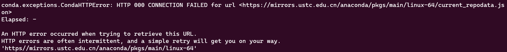

# conda换源教程

conda 为什么要换源？有两个原因，一是因为官方源对应的服务器位于国外，下载速度慢，或者根本访问不了，需要添加国内镜像源。二是因为就算添加了国内镜像源，已知的国内镜像源没有一个是绝对稳定的，都有崩溃不能访问的记录，此时需要切换为其他的国内镜像源。

<!--more-->

下图是中科大源崩溃不能使用的记录，重试多次后稳定出现 HTTP error：



## 1.删除之前配置的镜像源

```bash
conda config --remove-key channels
```

## 2.新增镜像源(以北京外国语大学源为例)

```bash
conda config --add channels https://mirrors.bfsu.edu.cn/anaconda/pkgs/main/
conda config --add channels https://mirrors.bfsu.edu.cn/anaconda/cloud/conda-forge/
conda config --add channels https://mirrors.bfsu.edu.cn/anaconda/cloud/bioconda/
```

## 3.清除之前本地保存的镜像索引

```bash
conda clean -i
```


# 清华大学

```bash
conda config --add channels https://mirrors.tuna.tsinghua.edu.cn/anaconda/pkgs/main/
conda config --add channels https://mirrors.tuna.tsinghua.edu.cn/anaconda/cloud/conda-forge/
conda config --add channels https://mirrors.tuna.tsinghua.edu.cn/anaconda/cloud/bioconda/
```

# 北京大学

```bash
conda config --add channels conda config --add channels https://mirrors.pku.edu.cn/anaconda/pkgs/main/
conda config --add channels conda config --add channels https://mirrors.pku.edu.cn/anaconda/cloud/conda-forge/
conda config --add channels conda config --add channels https://mirrors.pku.edu.cn/anaconda/cloud/bioconda/
```

# 南京大学

```bash
conda config --add channels https://mirror.nju.edu.cn/anaconda/pkgs/main/
conda config --add channels https://mirror.nju.edu.cn/anaconda/cloud/conda-forge/
conda config --add channels https://mirror.nju.edu.cn/anaconda/cloud/bioconda/
```

# 哈尔滨工业大学

```bash
conda config --add channels https://mirrors.hit.edu.cn/anaconda/pkgs/main/
conda config --add channels https://mirrors.hit.edu.cn/anaconda/cloud/conda-forge/
conda config --add channels https://mirrors.hit.edu.cn/anaconda/cloud/bioconda/
```

# 西安交通大学

```bash
conda config --add channels https://mirrors.xjtu.edu.cn/anaconda/pkgs/main/
conda config --add channels https://mirrors.xjtu.edu.cn/anaconda/cloud/conda-forge/
conda config --add channels https://mirrors.xjtu.edu.cn/anaconda/cloud/bioconda/
```

# 北京交通大学

```bash
conda config --add channels https://mirror.bjtu.edu.cn/anaconda/pkgs/main/
conda config --add channels https://mirror.bjtu.edu.cn/anaconda/cloud/conda-forge/
conda config --add channels https://mirror.bjtu.edu.cn/anaconda/cloud/bioconda/
```

# 重庆邮电大学

```bash
conda config --add channels https://mirrors.cqupt.edu.cn/anaconda/pkgs/main/
conda config --add channels https://mirrors.cqupt.edu.cn/anaconda/cloud/conda-forge/
conda config --add channels https://mirrors.cqupt.edu.cn/anaconda/cloud/bioconda/
```

# 南方科技大学

```bash
conda config --add channels https://mirrors.sustech.edu.cn/anaconda/pkgs/main/
conda config --add channels https://mirrors.sustech.edu.cn/anaconda/cloud/conda-forge/
conda config --add channels https://mirrors.sustech.edu.cn/anaconda/cloud/bioconda/
```

# 阿里云

```bash
conda config --add channels https://mirrors.aliyun.com/anaconda/pkgs/free
conda config --add channels https://mirrors.aliyun.com/anaconda/pkgs/main
conda config --add channels https://mirrors.aliyun.com/anaconda/cloud/conda-forge
conda config --add channels https://mirrors.aliyun.com/anaconda/cloud/bioconda
conda config --set show_channel_urls yes
```

# 中科大

```bash
conda config --add channels https://mirrors.ustc.edu.cn/anaconda/pkgs/free/
conda config --add channels https://mirrors.ustc.edu.cn/anaconda/cloud/conda-forge/
conda config --add channels https://mirrors.ustc.edu.cn/anaconda/cloud/bioconda/
conda config --add channels https://mirrors.ustc.edu.cn/anaconda/pkgs/main/
conda config --set show_channel_urls yes
```

