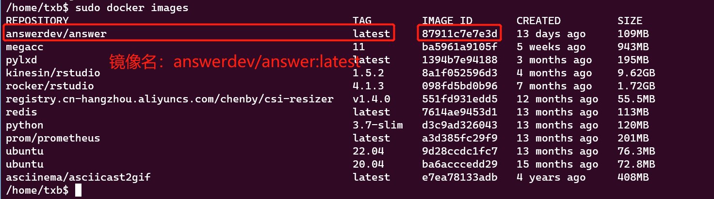
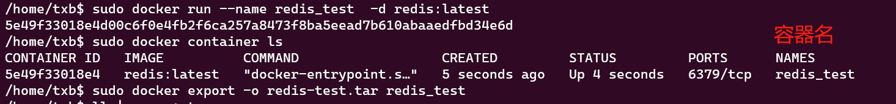

docker 安装教程：https://docs.docker.com/engine/install/ubuntu/

<!--more-->

docker 中有两个很重要的概念，明白它们能帮助明白 docker 的工作原理。

镜像是一种文件，你可以根据[Dockfile](http://www.dockerinfo.net/dockerfile%E4%BB%8B%E7%BB%8D)进一步了解这种文件，在 Dockerfile 中，每做一步操作就给镜像文件增加了一层内容。镜像文件可以和 tar 格式的文件相互转化。使用 docker 可以把镜像文件运行起来成为一个 **docker 进程**，我们把这个进程称为容器，因此通常也把容器称为“运行的镜像”。

关于对镜像和容器的操作可以查看以下内容。

## 镜像

### 查看镜像信息

镜像名 = REPOSITORY + : + TAG

如：redis:latest

```bash
docker images

# 从远程仓库搜索镜像信息
docker search 镜像名
```

### 导入

```bash
# 使用 docker save 保存的镜像使用 load 的方式加载
docker load < xx.tar
docker load -i xx.tar
# 使用 docker export 保存的容器使用 import 的方式加载
docker import xx.tart
```

### 导出

#### 导出镜像

```bash
docker save -o xx.tar 镜像名称
docker save -o xx.tar 镜像id
# 举例
docker save -o xx.tar answerdev/answer:latest
```



#### 导出容器

```bash
docker export -o xx.tar 容器名
docker export -o xx.tar 容器id
# 容器导出为镜像，镜像名举例：redis:latest
docker commit -a "作者" -m "comment" 容器id 镜像名
# 举例
docker export -o xx.tar 5e49f33018e4
```



### 拉取

拉取镜像是如果不指定标签，则默认拉取最新的的镜像，大部分情况下，最新的镜像标签为 latest

```bash
docker pull 镜像名
# 举例
docker pull ubuntu:latest
```

### 构建

默认根据当前目录下的 Dockerfile 来构建一个镜像，关于 Dockerfile 的语法可以参考这个链接：http://www.dockerinfo.net/dockerfile%E4%BB%8B%E7%BB%8D

构建 docker 镜像时可以通过参数对镜像进行设置，详情可以参考这个链接：https://www.runoob.com/docker/docker-build-command.html

```bash
docker build -t .
docker build -f Dockfile所在的目录
```

### 删除

```bash
docker rmi 镜像名
docker rmi 镜像id
```

## 容器

### 查看容器信息

```bash
# 查看运行中的容器
docker container ls
# 查看系统中所有的容器信息
docker ps -a
# 查看容器的元信息
docker inspect 容器名
docker inspect 容器id
# 查看容器中运行的进程
docker top 容器id
# 查看容器的输出日志
docker logs 容器名
# 查看容器的端口映射
docker port 容器id
# 查看容器的资源状态
docker stats
# 查看容器中的文件结构更改
docker diff 容器id
```

### 运行

更多参数的使用方法请查看这个链接：[https://www.runoob.com/docker/docker-run-command.html](https://www.runoob.com/docker/docker-run-command.html)

```bash
# 让容器后台运行，退出容器后，容器不会立即停止运行
docker run -d --name 容器名 镜像id
```

### 启动

运行后的容器就处于 running 状态了，但容器可能因为一些情况终止运行，此时需要将容器重新启动。

```bash
docker start 容器名
docker restart 容器 id
```

### 停止

```bash
docker stop 容器id
docker stop 容器名
```

### 进入容器

```bash
docker exec -it 容器id /bin/bash
docker exec -it 容器名 /bin/bash
```

### 容器与宿主机

```bash
# 容器与宿主机之间文件拷贝
docker cp 宿主机文件路径 容器id:容器文件路径
# 拷贝文件举例
docker cp /xiyou 96f7f14e99ab:/xiyou/
docker cp 96f7f14e99ab:/xiyou/ /xiyou
```

## docker服务管理

```bash
# 启动 docker 服务
service docker start
# 停止 docker 服务
service docker stop
# 重启 docker 服务
service docker restart

# 查看 docker 服务信息
docker info
# 查看 docker 版本
docker version
```

## dial unix /var/run/docker.sock connect permission denied

出现这种情况是因为权限不够，将当前用户加入到 docker 组可以解决这个问题。或者你可以使用 `sudo docker xxx`执行 docker 相关命令来避免权限问题。

```bash
# 用户名为 txb，需要自行修改为想要使用 docker 的用户名
sudo gpasswd -a txb docker
# 如果未生效，切换为 root 用户再做操作
## 切换为 root 用户
sudo su
gpasswd -a txb docker
```

