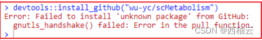

<iframe src="//player.bilibili.com/player.html?aid=390903031&bvid=BV1Hd4y1s7XC&cid=915054365&page=1"style="width:100%;height:500px;min-width:375px;min-height:200px" scrolling="no" border="0" frameborder="no" framespacing="0" allowfullscreen="true"> </iframe>

<!--more-->

>适用于 ubuntu 20.04
>ubuntu 20.04 是 “西柚云” 主要使用的操作系统 [西柚云官网](https://www.xiyoucloud.net/aff/VKRWMUHQ)

你还在因为 github 访问太慢而感到焦虑吗？
你还在因为无法访问 github 导致的一系列问题而感到苦恼吗？
克隆仓库报错？
安装 R 包失败？
github 抽风了？

**解决github访问出错的终极方式——使用github代理**

## 使用git访问github出错
### **报错信息：**

fatal：unable to access 'https://github.com/wu-yc/scMetabolism.git/': gnutls_handshake() failed: Error in the pull function


### **解决办法：**

使用github代理：
[https://ghproxy.com](https://ghproxy.com 
) 

```bash
git clone https://github.com/wu-yc/scMetabolism.git
git clone https://ghproxy.com/https://github.com/wu-yc/scMetabolism.git
```

## 安装R包出错
### **报错信息：**

Error: Failed to install 'unknown package' from GitHub:
gnutls_handshake() failed: Error in the pull function.


### **解决办法：**

使用github代理，以 https://phproxy.com为例：
[https://ghproxy.com](https://ghproxy.com 
) 

```bash
# 可能因为网络问题而导致下载 R 包失败
devtools::install_github("wu-yc/scMetabolism")
# 使用代理下载 R 包
remotes::install_git("https://ghproxy.com/https://github.com/wu-yc/scMetabolism.git")
```

**使用 wget，curl 访问 github 相关的链接失败也可以参照此法！**

看看我的其他文章呗：
[网络的连通性之ping和github代理](https://blog.csdn.net/weixin_64316191/article/details/128046805)
[如何安装 R包：内含使用github代理的方式](https://blog.csdn.net/weixin_64316191/article/details/127536791)

### 更多github代理：

github 代理使用方式需要点击链接查看网站详情。

[https://hub.yzuu.cf/](https://hub.yzuu.cf/)
[https://hub.njuu.cf/](https://hub.njuu.cf/)
[https://ghproxy.com/](https://ghproxy.com/)
[https://github.moeyy.xyz/](https://github.moeyy.xyz/)
[https://kgithub.com/](https://kgithub.com/)
[https://gitclone.com/](https://gitclone.com/)

在此对所有 github 代理的站长表示衷心的感谢！