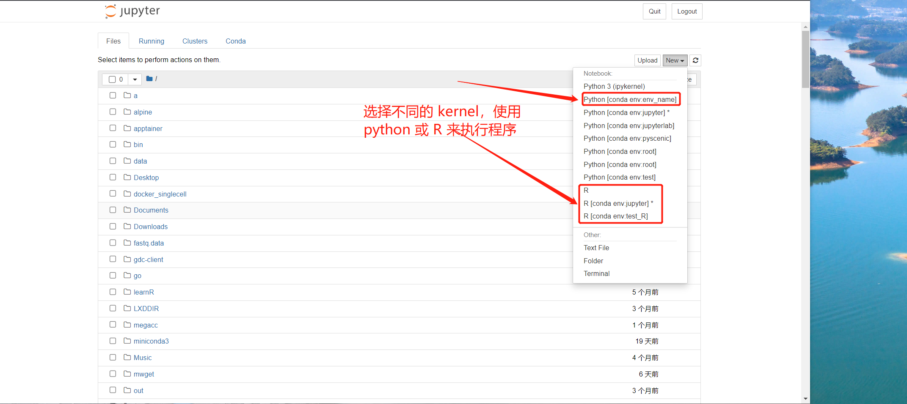
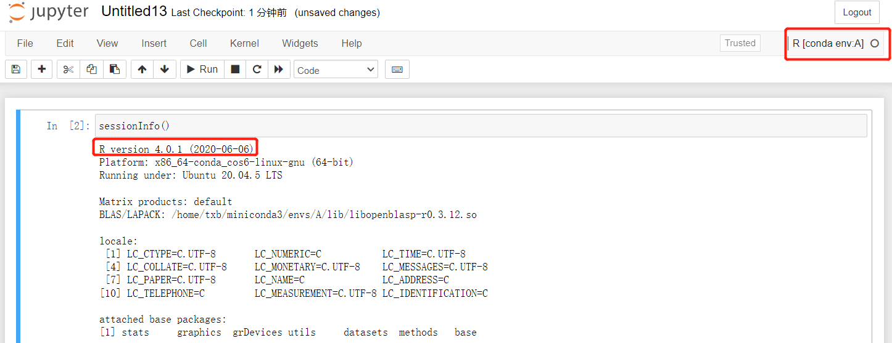
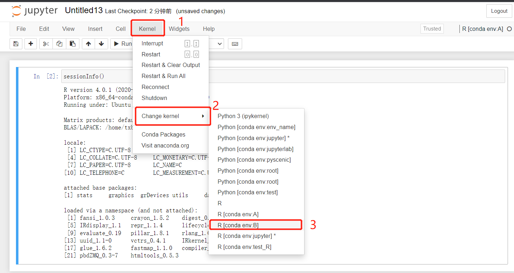
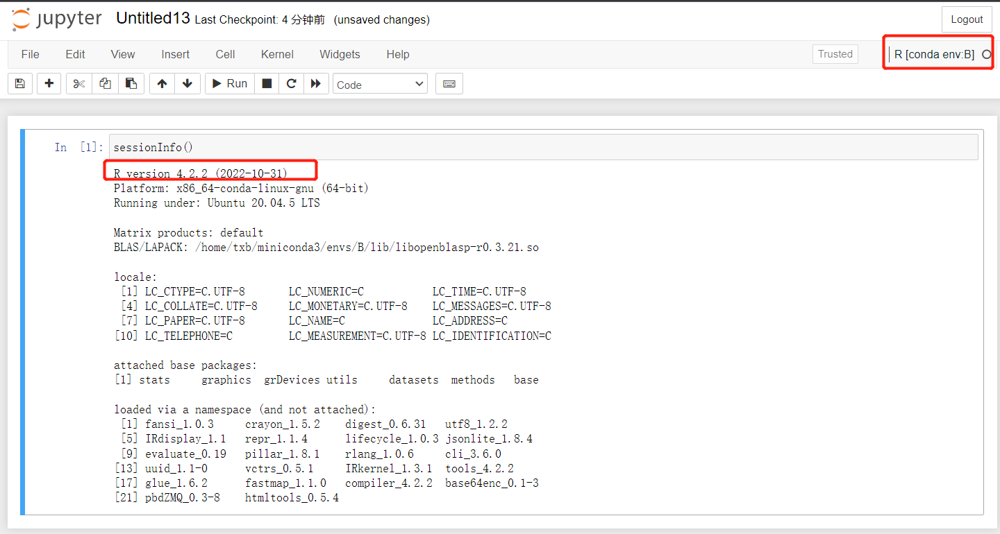

# jupyter识别kernel

jupyter 是借助 kernel 来运行程序的，在创建文件的时候，我们可以选择已经安装的kernel来运行文件。

如：[r-irkernel 1.3.1](https://anaconda.org/conda-forge/r-irkernel)、[ipykernel 6.20.1](https://anaconda.org/conda-forge/ipykernel)。

<!--more-->

kernel 可以调用当前环境中安装的解释器（R，python）来执行程序，以下的命令在 jupyter 所在的虚拟环境中执行，jupyter可以自动识别到本环境下的 kernel 。

```bash
conda install r-base=4.0.1 -y -vv
conda install r-irkernel -y -vv
# 如果使用 jupyter lab 的话还需要安装 nodejs 和 text-shortcuts 插件
conda install nodejs -y -vv
jupyter labextension install @techrah/text-shortcuts
```

# 重启Jupyter的方法

所谓重启，其实包含两步，杀死之前的 jupyter 进程，再次运行 jupyter 进程

1. 杀死之前运行的 jupyter 进程

```bash
ps -ux | grep jupyter | grep -v grep | awk '{print $2}' | xargs kill -9
```

2. 启动 jupyter：在终端执行命令

```bash
# 如果 jupyter 安装在 conda 的 jupyter 环境中，需要使用下面这条命令激活虚拟环境，然后再运行 jupyter
# 如果 jupyter 安装在 xxx 环境，则运行 conda activate xxx
conda activate jupyter
# 后台运行 jupyter notebook 的方式
nohup jupyter notebook >~/jupyter.log 2>&1 &

# 后台运行 jupyter lab 的方式
nohup jupyter lab >~/jupyterlab.log 2>&1 &
```

# jupyter使用其他conda环境中的kernel

## 方法1

如果想要在 jupyter 中使用其他 conda 环境中的kernel（如：ipykernel，r-irkernel），需要在安装 jupyter 对应的虚拟环境下安装 nb_conda 插件，然后在其他的虚拟环境中安装对应的 kernel。nb_conda 可以识别到其他 conda 虚拟环境中的 kernel。

```Shell
conda activate jupyter
conda install nb_conda -y -vv
```

安装 nb_conda 后需要重启 jupyter，否则点击 Conda 栏会报错。

```bash
# 杀死当前的 jupyter 进程
ps -ux | grep jupyter | grep -v grep | awk '{print $2}' | xargs kill -9
# 运行 jupyter notebook（以下两个命令根据实际情况选择）
## 运行 jupyter notebook
nohup jupyter notebook >~/jupyter.log 2>&1 & 
## 运行 jupyter lab
nohup jupyter lab >~/jupyterlab.log 2>&1 &
```



上图中显示的效果是在 jupyter 所在的虚拟环境中安装 nb_conda 后，jupyter 识别到了各虚拟环境中的 kernel。选择不同的 kernel 即可实现切换软件版本的效果。如在虚拟环境 A 中安装 r4.0.1，在虚拟环境 B 中安装 r4.2.2，切换到 A 环境中的 r-irkernel 就使用 r4.0.1来运行代码，切换到 B 环境中的 r-irkernel 就使用 r4.2.2来运行代码。当然，能够识别的前提是你应该在 A 和 B 中 分别安装了 r-base 和 r-irkernel。

```bash
# 创建两个虚拟环境，分别名为 A 和 B
conda create -n A -y -vv
conda create -n B -y -vv
# 安装 r-base 和 r-irkernel
conda install -n A r-base=4.0.1 r-irkernel -y -vv
conda install -n B r-base=4.2.2 r-irkernel -y -vv
```

查看虚拟环境 A 中对应的 R 版本信息：




切换 kernel 为虚拟环境 B 的 r-irkernel：



查看虚拟环境 B 中对应的 R 版本信息：



## 方法2

对于 ipykernel, 还有另一种方式让 jupyter 识别到它。想要使用哪个 conda 虚拟环境中的 python，就在哪个环境安装ipykernel（**不需要重启**），不过如果同时想要在 jupyter 使用 R 和 python，推荐使用 nb_conda。

```bash
# 如我想要在jupyter中使用sradownload的环境，其中安装了numpy作为演示
conda activate sradownload

conda install ipykernel -y -vv

# 如果安装 ipykernel 后 jupyter 没有识别到，可以在安装 jupyter 的 conda 环境中执行类似下面的命令
# 这个命令会让 jupyter 识别到虚拟环境 sradownload, 并在jupyter 中显示为 Python [conda env:sradownload]
python -m ipykernel install --user --name sradownload --display-name "Python [conda env:sradownload]"
```

