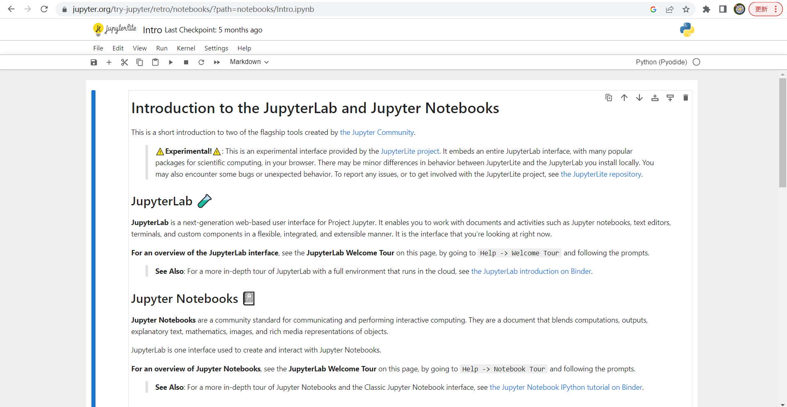
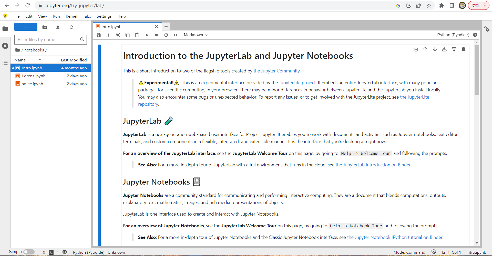

**jupyter 分为 jupyter notebook 和 jupyter lab，两者选其一配置即可。**

jupyter 官网：[https://jupyter.org/](https://jupyter.org/)

<!--more-->

## jupyter notebook 样例：

https://jupyter.org/try-jupyter/retro/notebooks/?path=notebooks/Intro.ipynb



## jupyter lab 样例：

https://jupyter.org/try-jupyter/lab/



## 1-1.使用pip安装

安装 jupyter notebook：

```bash
pip install jupyter -i https://pypi.douban.com/simple
```

安装 jupyter lab：

```bash
# 安装 jupyter lab 的方式
pip install jupyterlab -i https://pypi.douban.com/simple
```

## 1-2.使用conda安装

如果你需要使用多个虚拟环境，推荐使用 conda 安装 jupyter notebook。

安装 jupyter notebook：

```bash
# 安装 jupyter notebook, python版本可以自行指定
conda create -n jupyter python=3.9 -y -vv
conda activate jupyter
conda install jupyter -y -vv
```

安装 jupyter lab：

```bash
# 安装 jupyter lab, python版本可以自行指定
conda create -n jupyterlab python=3.9 -y -vv
conda activate jupyterlab
conda install jupyterlab -y -vv
```

你可能会想到在 conda 的虚拟环境中使用 pip 安装，因为它的安装速度更快。如下:

```bash
conda create -n jupyter python=3.9 -y -vv
conda activate jupyter
# 安装 jupyter notebook
pip install jupyter -i https://pypi.douban.com/simple
# 安装 jupyter lab
pip install jupyterlab -i https://pypi.douban.com/simple
```

conda 官方建议在 conda 中尽可能使用 conda install 的方式来安装包，jupyter 官方提供的安装方式是使用 pip 安装的，见仁见智吧，我认为两种方式都可以，使用 conda install 安装符合 conda 的使用规范，使用 pip 安装更快。

## 2.生成jupyter配置文件

为 jupyter notebook 生成配置文件：

```bash
jupyter notebook --generate-config
```

为 jupyter lab 生成配置文件：

```bash
jupyter lab --generate-config
```

## 3.设置jupyter访问密码（推荐12位）

为了安全，密码需要设置得复杂点，包含数字，英文字母大小写和特殊字符。

为 jupyter notebook 设置访问密码，需要两次输入密码：

```bash
jupyter notebook password
```

为 jupyter lab 设置访问密码，需要两次输入密码：

```bash
jupyter lab password
```

## 4.设置jupyter运行端口

jupyter notebook 设置运行端口：

```bash
# 设置 jupyter notebook 运行端口，以下 5 行是一条完整的命令，执行一次就行
cat >> ~/.jupyter/jupyter_notebook_config.py << EOF
c.NotebookApp.ip='*'  # 允许远程连接
c.NotebookApp.open_browser = False 
c.NotebookApp.port = 9527  # jupyter notebook 运行端口，根据实际情况设置
EOF
```

jupyter lab 设置运行端口：

```bash
# 设置 jupyter lab 运行端口，以下 6 行是一条完整的命令，执行一次就行
cat >> ~/.jupyter/jupyter_lab_config.py << EOF
c.ServerApp.allow_remote_access = True  # 
c.LabServerApp.open_browser = False
c.ServerApp.ip = '*'
c.ServerApp.port = 9527 # jupyter lab 运行端口，根据实际情况设置
EOF
```

## 5.运行

如果你之前有运行 jupyter 的话，为了防止干扰后面的运行，可以使用这个命令杀死之前运行的 jupyter 进程

```bash
ps -ux | grep jupyter | grep -v grep | awk '{print $2}' | xargs kill -9
```

jupyter notebook 运行命令：

```bash
nohup jupyter notebook >~/jupyter.log 2>&1 &
```

jupyter lab 运行命令：

```bash
nohup jupyter lab >~/jupyterlab.log 2>&1 &
```

## 6.查看jupyter运行状态

查看 jupyter notebook 运行状态：

```bash
cat ~/jupyter.log
```

查看 jupyter notebook 运行状态：

```bash
cat ~/jupyterlab.log
```

## 7.访问jupyter

访问链接为 http://域名:端口，如:

- http://localhost:8888
- http://xiyoucloud.net:8888

**开启 jupyter 的远程访问是不安全的，密码或token并不能保证安全，因此建议使用完毕后关闭jupyter服务**

这里的不安全是指双方通信的数据可能会被第三方窃取。

```bash
# 关闭开启的 jupyter 进程
ps -ux | grep jupyter | grep -v grep | awk '{print $2}' | xargs kill -9
```

