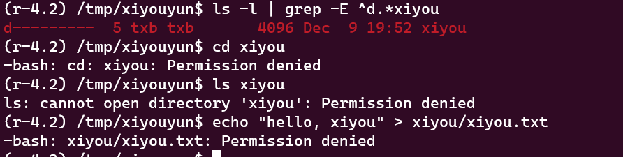
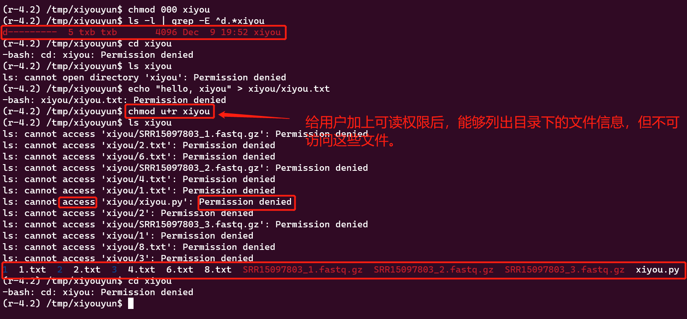
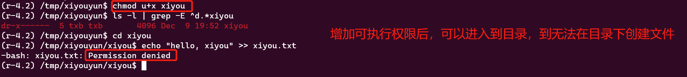
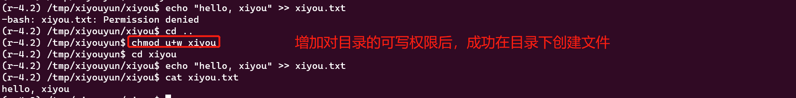
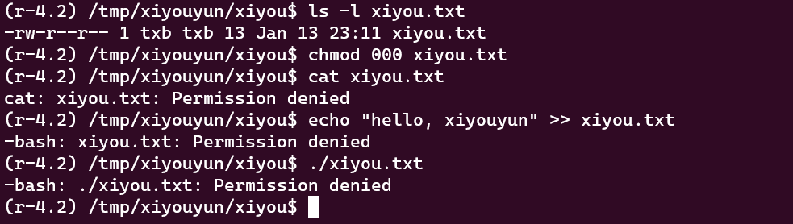
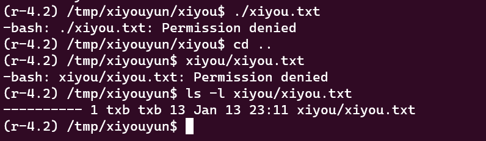

造成 permission denied 的原因有很多，这个报错的意识其实就是操作不被许可，我们也可以通俗的理解为权限不足。

而在 Linux 你主要操作的对象就是文件了，因此**通常此类报错与文件的权限有关**。说到文件的权限，你可以去看看我的另一篇文章，其中是搭配有视频演示的。

这里我就不系统地说了，系统的论述你可以查看上面的链接。

<!--more-->

## 目录的权限：

对于目录来说，如果你不能 cd（change work directory）到这个目录，说明你没有对这个目录的可执行权限。

如果你不能使用 ls 查看目录下的内容，说明你对这个目录没有可读权限。

如果你不能使用 vim/nano，重定向的方式在该目录下创建文件，说明你对这个目录没有可写权限。

以上 3 种情况，都会报错 **Permission Denied**。



如果目录的所有者是你，以上 3 种情况下产生的报错都可以通过给自己加上对应的权限来解决。

```bash
# 给目录的所有者加上可读权限
chmod u+r directory
# 给目录的所有者加上可写权限
chmod u+w directory
# 给目录的所有者加上可执行权限
chmod u+x directory
```







使用 ls -l 可以查看文件的权限信息，对于 ls -l 的输出结果的说明可以查看这篇文章 

## 文件的权限：

对于文件来说，如果你不能读取到一个文件的内容，说明你对该文件没有可读的权限。

如果你不能向一个文件写入内容，说明你对该文件没有可写的权限。

如果你不能执行 1 个文件，说明你对该文件没有可执行的权限。



同理如果你是该文件的所有者的话，你也可以通过给自己加上权限来解决 **Permission denied** 的报错。

```bash
# 给文件的所有者加上可读权限
chmod u+r file
# 给文件的所有者加上可写权限
chmod u+w file
# 给文件的所有者加上可执行权限
chmod u+x file
```

## 关于文件的可执行

值得一提的是，这里的文件的可执行描述的是将文件的路径的以命令的方式输入在终端中执行，如：

```bash
./xiyou.txt
/tmp/xiyouyun/xiyou/xiyou.txt
```

如果你将文件所在的目录加入到 PATH 环境变量后，你也可以直接输入文件名来执行文件，如：

```bash
PATH=$PATH:/tmp/xiyouyun/xiyou
# 注意它于 ./xiyou.txt 的区别
xiyou.txt
```



关于 PATH 的原理你可以查看这篇文章 

而如果你使用另一个可执行程序来解释 1 个文件，此时只需要对该文件具有可读权限，就能对该文件进行解释了，此时你需要对该解释程序就有可执行权限，如：

```bash
python xiyou.py
perl xiyou.pl
Rscript xiyou.R
bash xiyou.sh
```

使用 python 来解释一个 xiyou.py 文件，只要你对 python 这个解释器具有可执行权限，又对 xiyou.py 具有可执行权限，就不会抛出 “Permission denied” 的报错，反之就会抛出 “Permission denied” 的错误。

## 如何查看一个解释程序的权限

```bash
# 可以查看一个解释程序文件的位置
which python
# 查看解释程序对应文件的权限
ls -l `which python`
```


