这篇文章的目的是为了让大家关于rstudio有更多的共同语言。

这篇文章的结构是零散的，大家按需查看对应的段落即可。

<!--more-->

# rstudio布局

关于rstudio的布局可以通过rstudio界面顶部的 **Worksapce Panes**来设置。如无特殊说明，后文中所有的界面采用下图中红色标注的设置。

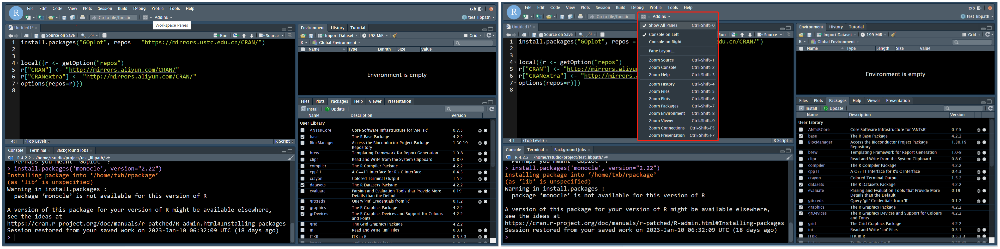

# 查看libpath中安装的R包

在rstudio右下角中选择**Packages**，然后再下方的搜索框中搜索。

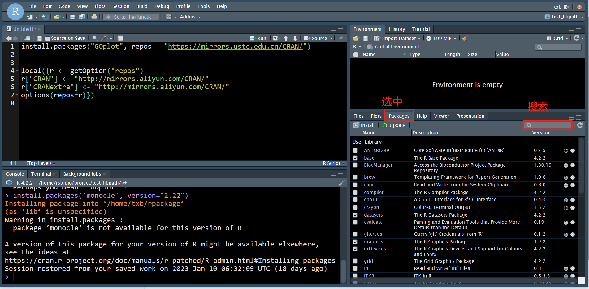

# 新建一个终端

布局中左下角的位置可以查看 Console、Terminal、Background Jobs，如果不小心关掉了终端，可以这样新建一个终端。

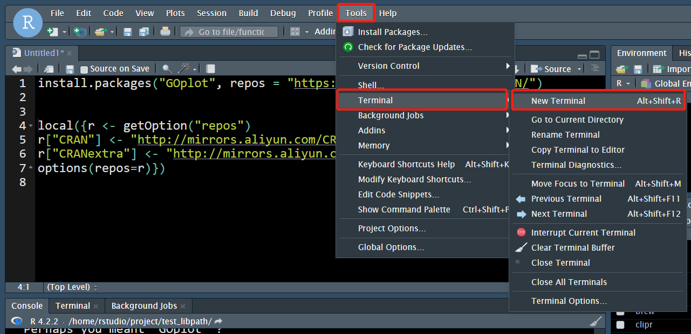

# 关闭当前Session

布局中右上角可以关闭当前session（会话）

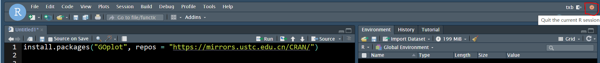

# Start New Session

关闭一个session后可以创建一个新的session（会话）

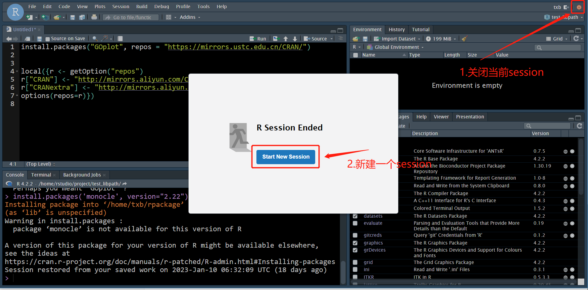

# 终止代码的执行

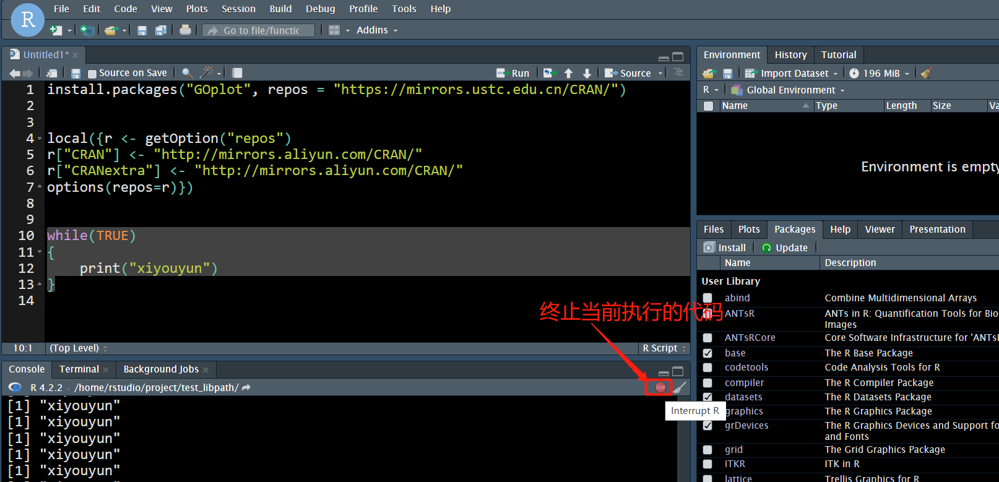

# 执行代码

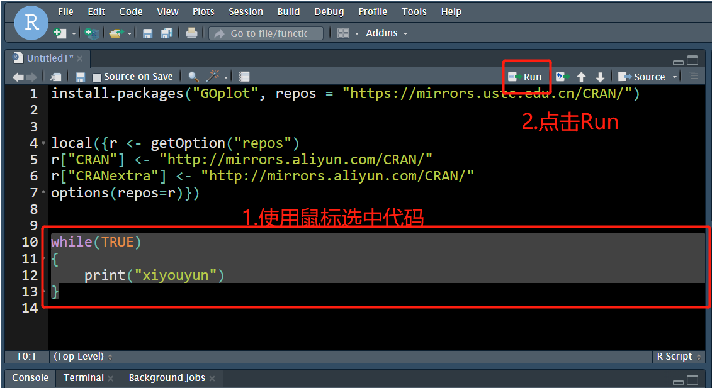

# 保存rstudio中的文件

rstudio崩溃会导致文件内容丢失，因此为了防止文件内容丢失，需要养成好习惯，经常对文件内容进行保存。使用 ctrl + s 即可保存文件。对于没有创建文件名的文件，需要手动设置一下文件名，对于已经创建文件名的文件则自动将文件内容保存在文件中。

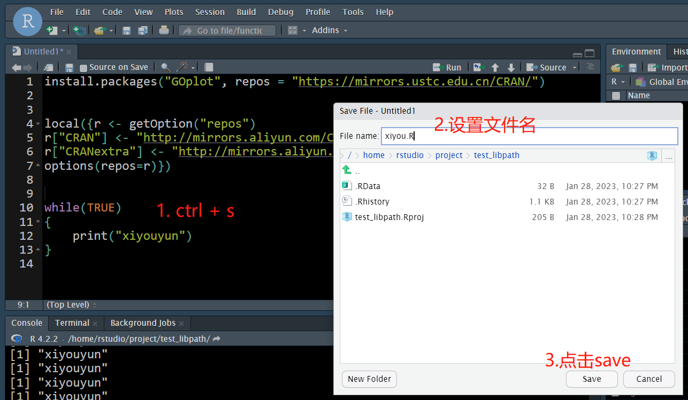

未保存的文件在文件名的右上角会有一个星号：

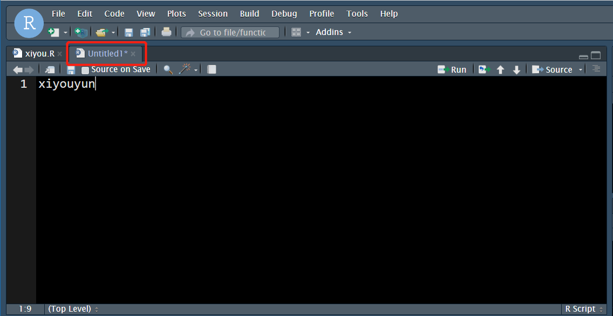

# 查看R中的内存使用报告

在Environment中点击显示内存的下拉框按钮，然后点击 **Memory Usage Report** 就可以查看 R 和系统的内存使用报告了。

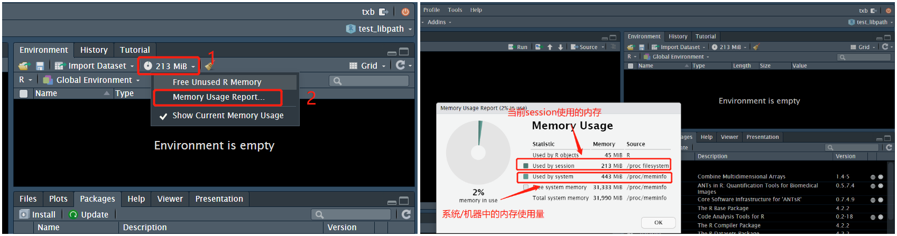

# 设置工作目录

大家都知道在R中可以使用setwd()可以设置工作目录，但有时候不知道该怎样描述设置的路径，可以参考下面图片将当前项目的目录设置为工作目录。如果你需要设置其他目录为工作路径，酌情更改即可。

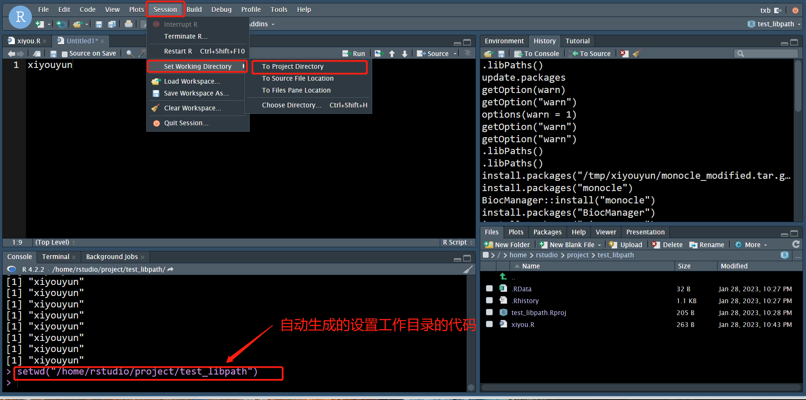

# rsession异常导致工作空间数据丢失

这里的数据丢失可能包括计算过程中的中间结果和未保存的代码。

避免数据丢失的方式是使用 ctrl + s 保存代码，将重要的工作空间中的变量保存带 Rdata 或 rds 文件中。

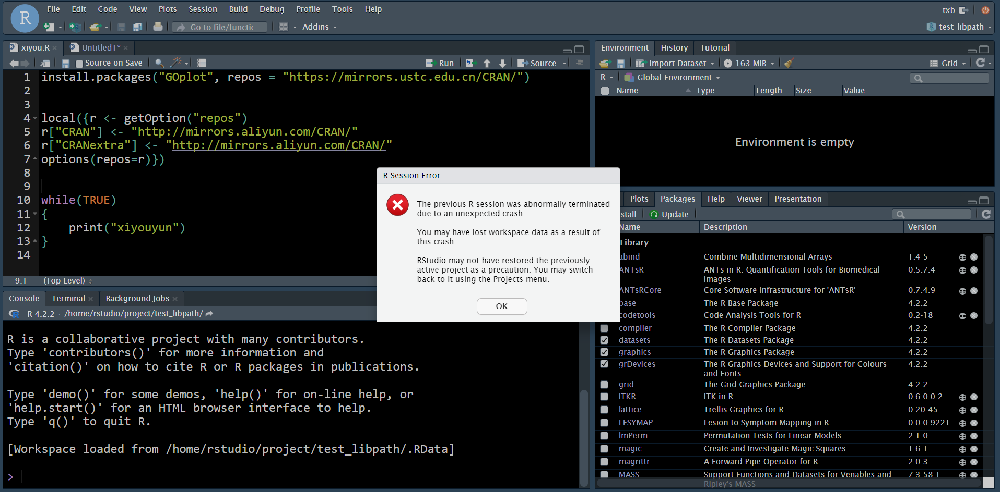

# 在终端中使用R

在终端（Terminal）中输入 R 进入到 R 的交互界面，可以在此交互界面执行 R 代码。

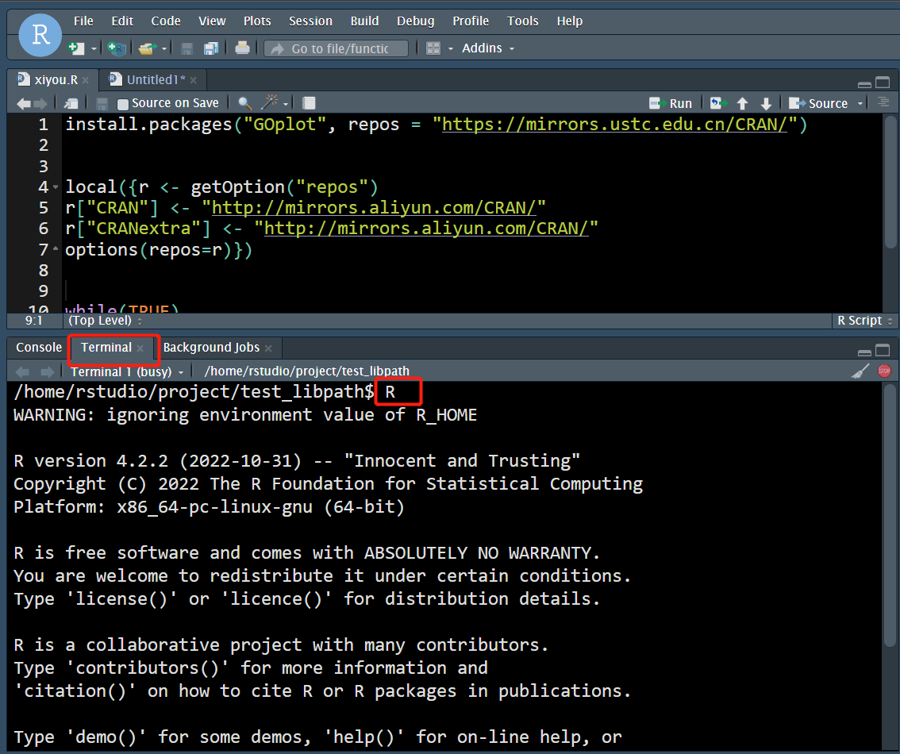

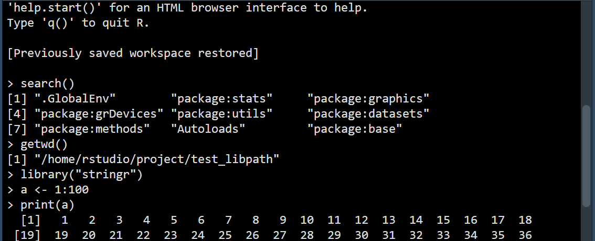

# 重启rstudio-server服务

如果 rstudio-server 服务异常，比如不能正常访问，可以尝试重启 rstudio-server 服务。

```bash
# 重启
sudo service rstudio-server restart
# 查看运行状态
sudo service rstudio-server status
```

# 杀死rsession对应的用户进程

由于 rstudio-server 的性能问题，可能会出现在网页端访问 rstudio 卡住，不能加载出数据的情况，此时可以杀死当前的session进程，然后尝试重新登陆 rstudio-server。**杀死进程可能会导致 workspace 中计算产生的结果丢失**，因此要养成经常将计算结果保存在本地磁盘中的好习惯（保存为Rdata或rds文件），下次使用时直接从磁盘中加载就好了。

```bash
ps -ef | grep "/usr/lib/rstudio-server/bin/rsession -u $(whoami)" | grep -v grep | awk '{print $2}' | xargs kill -15
```

# 清除用户rsession

一个 rsession 对应一个 rstudio-server 的会话，用户与 rstudio-server 建立一个连接后，会话信息会保存在一个文件中，如果出现 rstudio 卡住、不能登陆等情况时，在杀死进程后还是没有解决问题，可以清除 session 文件再重新登陆。这一操作通常要搭配[杀死rsession对应的用户进程](#杀死rsession对应的用户进程)使用，因此**可能会导致 workspace 中计算产生的结果丢失****。

```bash
# 新版 rstudio 的 session 文件的存放位置
ls ~/.local/share/rstudio/sessions/active
# 如果有内容，则删除
rm -rf ~/.local/share/rstudio/sessions/active

# 旧版 rstudio 的 session 文件的存放位置
ls ~/.rstudio/sessions/active/session-*
# 如果有内容则删除
rm -rf ~/.rstudio/sessions/active/session-*
```

# 不在同一个浏览器界面打开多个rstudio应用

rstudio-server 使用的登陆机制会导致同一个浏览器界面打开的多个 rstudio-server 应用会互相干扰。比如：同界面的多个 rstudio 应用中，应用 A 的登陆回到应用 B 退出登陆。是否还有其他的干扰就不得而知了，因此更好的方式是使用不同的浏览器来访问不同的rstudio应用。当然，你也可以使用浏览器的私密模式。

# 无法使用root登陆？

出于安全考虑，rstudio-server不支持root用户登陆。需要新建其他用户用于登陆 rstudio 。