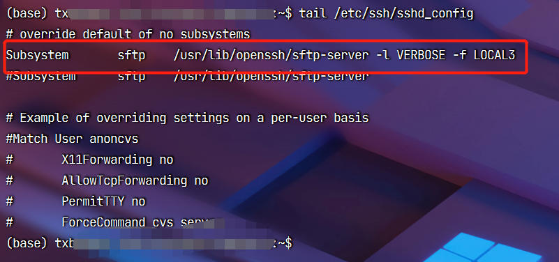
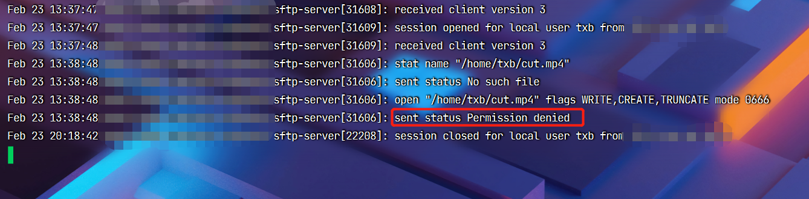

stfp服务默认不记录日志到文件中，不过你可以通过修改配置文件来让它将日志记录在文件中。修改配置文件需要 root 权限。

## 修改配置文件/etc/ssh/sshd_config

**注意：不要修改到配置文件的其他信息，否则可能导致无法登陆。**

```bash
# 为防止改乱配置文件，需要先备份文件
sudo cp /etc/ssh/sshd_config /etc/ssh/sshd_config.bak

# 编辑文件
sudo vi /etc/ssh/sshd_config

# 修改前
Subsystem       sftp    /usr/lib/openssh/sftp-server
# 修改后
Subsystem       sftp    /usr/lib/openssh/sftp-server -l VERBOSE -f LOCAL3
```



## 修改配置文件/etc/rsyslog.conf

```bash
# 在文件末尾增加一行
local3.*    /var/log/sftp.log
```

## 重启sshd和rsyslog

```bash
service sshd restart
service rsyslog restart
```

## 查看日志

```bash
tail -f /var/log/sftp.log
```

之后再通过sftp上传文件到服务器时，就可以到 /var/log/sftp.log 中查看日志了。以下图片是将本地的 cut.mp4 文件上传到服务器的 /home/txb 时文件中记录的日志信息，从日志中的 Permission denied 可以知道当前用户没有该目录的写入权限，因此上传文件失败了，最后会话关闭了（session closed）。



