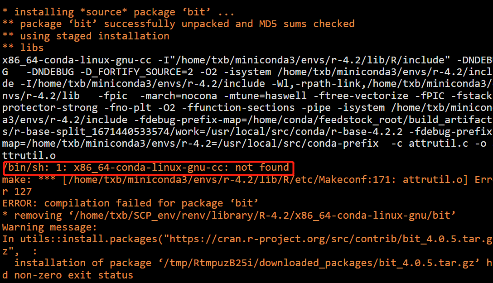
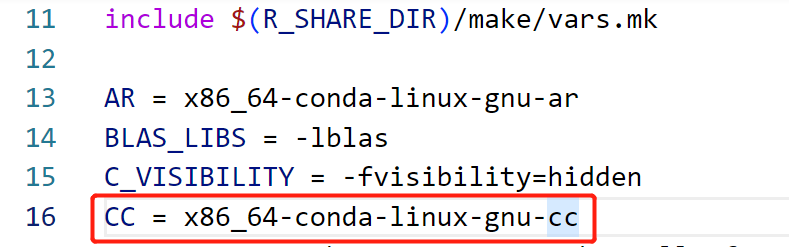

之前有一篇文章给大家介绍了如何在 rstudio-server 中切换 R 的版本，在那篇文章中不同的 R 版本是用 conda 安装的。最近在 rstudio 中使用 conda 中 的 R 时（在 rserver.conf 中配置的 R），发现会报错，报错截图如下：



可是在 conda 的对应目录中这个 x86_64-conda-linux-gnu-cc 是已经安装好的。更奇怪的是，这个包在 R 的交互环境中可以安装好（在终端中输入 R，然后执行相关的装包代码），而在 rstudio 中运行相应的装包代码是却会出现报错。根据报错提示可以看到导致报错的行是在 `/home/txb/miniconda3/envs/r-4.2/lib/R/etc/Makeconf`文件中的第 171 行代码。然后我去查看了第 171 行代码，好像描述的是一种编译文件的方式。


这里的 CC 看起来是一个变量，最后我在该文件的第 16 行找到了变量定义的值，它的值是 x86_64-conda-linux-gnu-cc, 我将它改为了 x86_64-conda-linux-gnu-cc 这个文件的绝对路径，这样就不会报错 `x86_64-conda-linux-gnu-cc not found `了。

修改前：



修改后：


**这个报错虽然是说的 x86_64-conda-linux-gnu-cc 没找到，不过有朝一日在 rstudio-server 中安装其他 R 包时又报其他的 xx not found，而你已经使用 conda 安装了相关软件，也可以参照此法修改 Makeconf 文件**


当然，出现这种情况还有一种可能，就是你本地没安装 x86_64-conda-linux-gnu-cc。如果是这样，你需要在你使用的 R 所在的 conda 虚拟环境中安装它。安装命令如下：

```bash
conda install  gcc_linux-64 
conda install  gxx_linux-64
conda install  gfortran_linux-64
```


