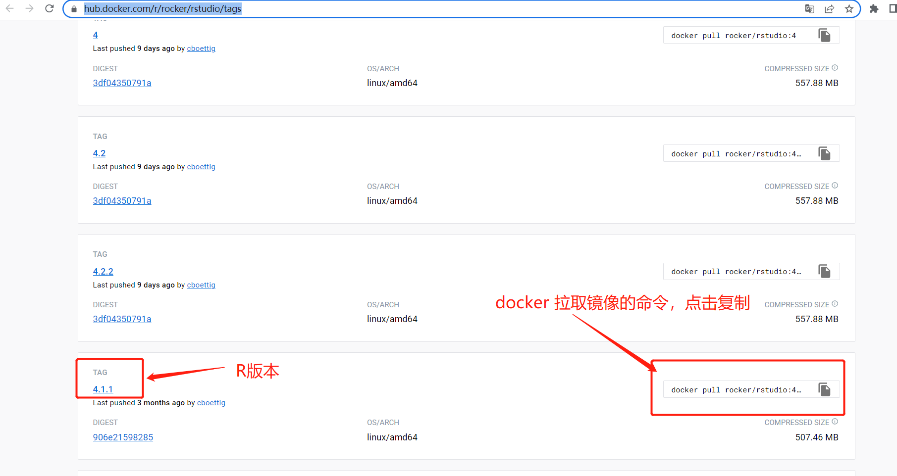
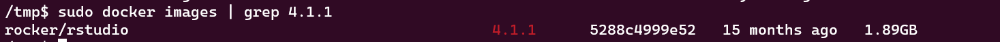
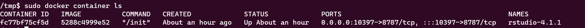
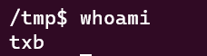
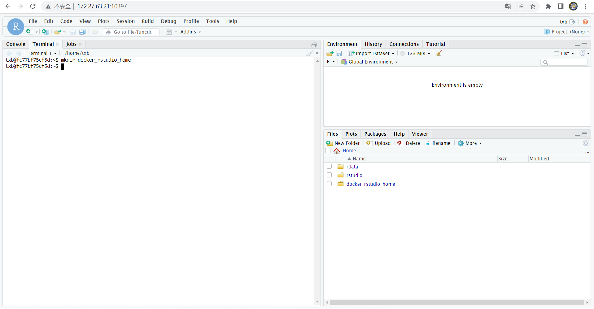

rstudio 官方提供了使用不同 R 版本的 rstudio 镜像，使用 docker 来运行它们就可以在容器中使用不同的 R 版本了。

rstudio docker 官方镜像地址：[https://hub.docker.com/r/rocker/rstudio/tags](https://hub.docker.com/r/rocker/rstudio/tags)

<!--more-->

## 拉取镜像

首先前往 rstudio docker 的官方镜像地址找到想要拉取的 rstudio 镜像，点击复制拉取镜像的命令，然后将它粘贴到终端中执行就可以拉取对应的 rstudio 镜像了。可以看到，rstudio 官方是根据 R 版本来给 rstudio 镜像打 TAG 的，如 TAG 为 4.1.1 的 rstudio 镜像中使用的就是 R 的 4.1.1 版本。






这里的 5288c4999e52 就是镜像id。

## 运行rstudio镜像

### 命令说明

```bash
docker run --name 容器名 -d --restart always -p 访问端口:8787 -e USER=容器内用户名 -e PASSWORD=容器内密码 -e USERID=用户uid -e GROUPID=用户groupid -v 宿主机目录:容器内目录 镜像id
```

### 命令示例

密码应该足够复杂，下文中的命令应该修改“足够复杂的密码”。

复杂的密码应该包含数字、英文字母大小、特殊符号，且长度不少于8位。

```bash
# 虽然是命令示例，但还是请你手动修改一下密码部分吧。
docker run --name rstudio-4.1.1 -d --restart always -p 10397:8787 -e USER=$(whoami) -e PASSWORD=足够复杂的密码 -e USERID=$(id -u) -e GROUPID=$(id -g) -v /home/$(whoami)/docker_rstudio_home:/home/$(whoami)/docker_rstudio_home 5288c4999e52
```

## 查看rstudio运行状态

```bash
# 查看容器运行状态
docker container ls
# 查看容器运行日志
docker logs rstudio-4.1.1
```



这里的 fc77bf75cf5d 是容器id，5288c4999e52 就是镜像id。STATUS 下的信息是容器的运行状态，Up 表示容器正常运行，更详细的运行情况可以通过查看容器的日志来了解。NAMES 下的信息是容器名（rstudio-4.1.1），容器名是上文中的运行命令设置的。

## 访问rstudio

关于命令的含义可以参考上文的[命令说明](#命令说明)部分。

访问链接示例：

http://域名或IP:端口

http://xiyouyun.gitee.io:10397

http://localhost:9527

http://ip:port

**访问时请参考以上链接将相关信息替换为自己的域名和端口**

登陆 rstudio 的用户名为运行命令中设置的用户名，登陆的密码为运行命令中设置的密码。如果你的运行命令是参考[命令示例](#命令示例)，那么登陆用户名就是运行该命令的当前用户的用户名，密码为你修改的密码。

你可以在终端中使用 whoami 查看当前用户的用户名






## 宿主机与容器内的数据共享

宿主机和容器之间的文件都是独立的，互不干扰的，在容器中看不到宿主机的文件，在容器外的宿主机中也看不到容器内的文件。

不过通常我们会有在宿主机和容器之间传递文件的需求，上文的运行命令中，我将宿主机的 `/home/$(whoami)/docker_rstudio_home` 目录挂载到了容器的`/home/$(whoami)/docker_rstudio_home`中，因此在宿主机的`/home/$(whoami)/docker_rstudio_home`目录下的文件也可以在容器或 rstudio 的 `/home/$(whoami)/docker_rstudio_home`中看到。

**更重要的是，当容器被销毁时，容器内的其他文件都会被清空，而/home/$(whoami)/docker_rstudio_home目录下的文件仍然可以在宿主机中访问到**

因此对于代码、输入文件、运行结果……等重要文件应该将它们放在 `/home/$(whoami)/docker_rstudio_home`中，以免容器异常导致数据丢失。

```bash
# 在容器或宿主机中执行，可以查看目录下对应的文件
ls /home/$(whoami)/docker_rstudio_home
```

## 管理容器

上文中运行容器的容器名为 rstudio-4.1.1，你可以参考以下命令来管理你的容器。

```bash
# 停止容器
docker stop rstudio-4.1.1
# 启动容器
docker start rstudio-4.1.1
# 重启容器
docker restart rstudio-4.1.1
# 查看容器日志
docker logs rstudio-4.1.1
# 删除容器，谨慎操作！
docker stop rstudio-4.1.1 && docker rm rstudio-4.1.1
```

## 补充内容

如果你对 docker 不太熟悉的话，可以查看  这篇文章。

