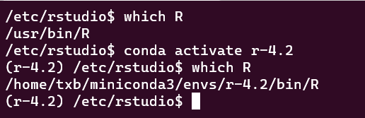
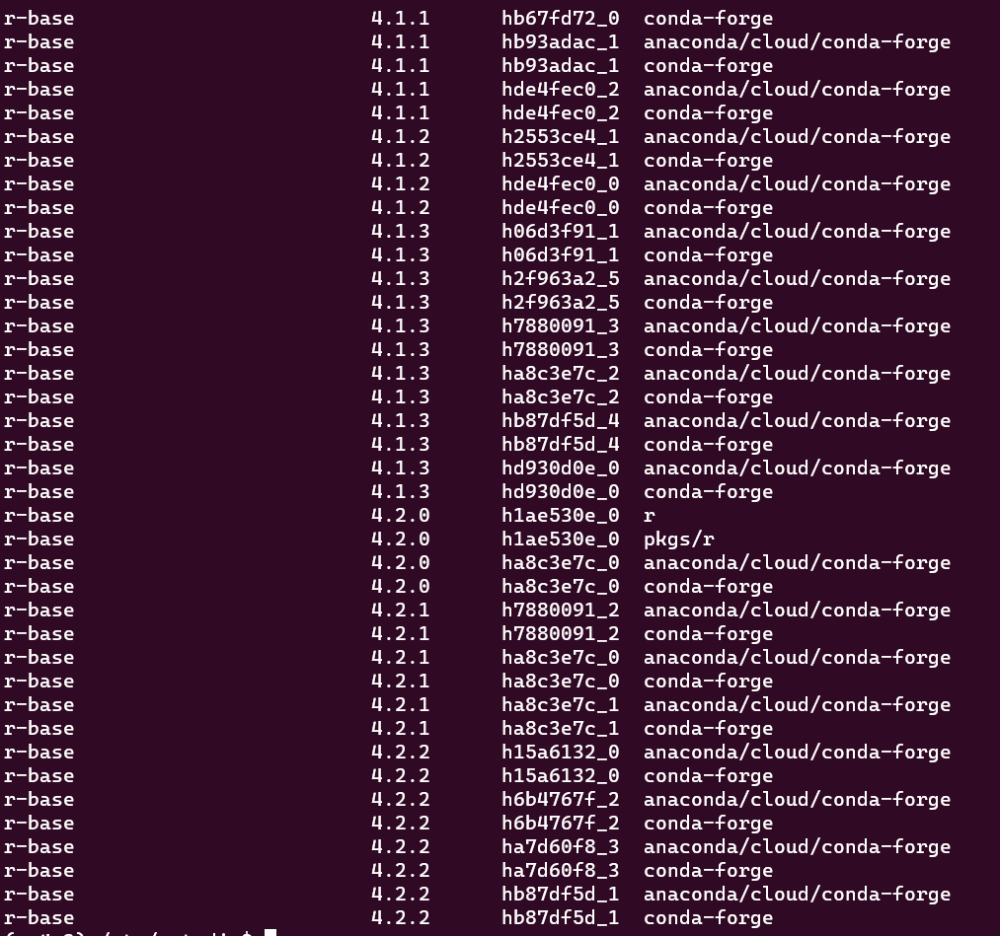
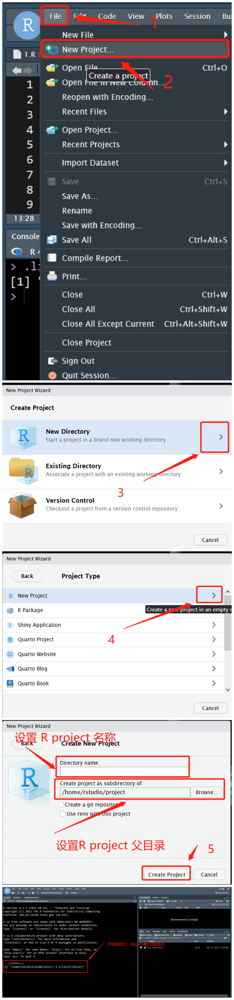
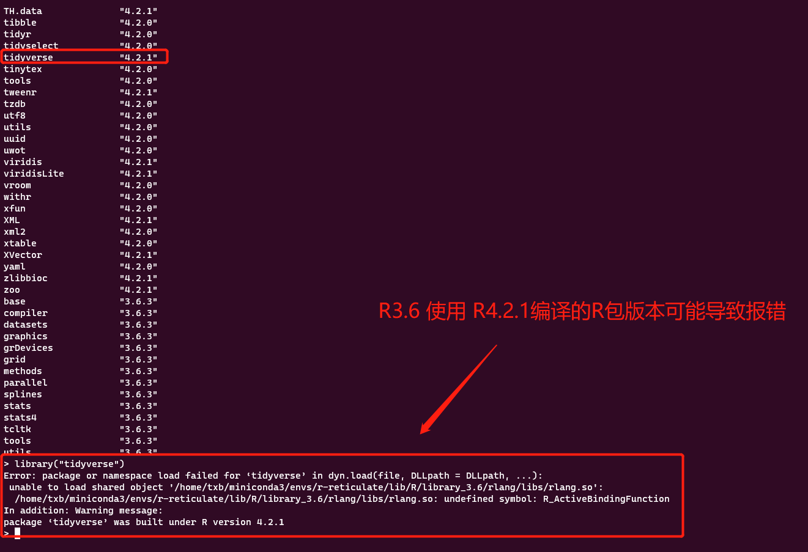
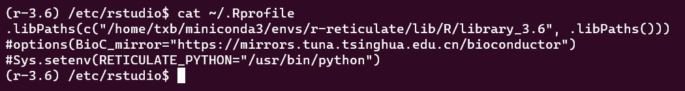

## 在Linux系统中安装多个R

在系统中使用 apt 安装的 R 是全局安装的，无法使用 apt 安装多个版本的 R。

使用apt安装好R后会在 /usr/bin 目录下回生成一个 R 的可执行文件。

如果想要在系统中安装多个版本的 R，推荐使用 conda 在不同的虚拟环境中安装不同的 R。在终端中可以通过激活虚拟环境来使用不同的虚拟环境中的R。在 rstudio-server 中可以通过修改 /etc/rstudio/rserver.conf 文件来指定使用的R。



<!--more-->

关于 conda 的安装和使用可以参考我写的conda教程：






## 使用conda安装R

搜索可以使用的R版本:

```bash
# 搜索 conda 软件源中的 r-base 版本
conda search r-base
```



使用 conda 安装 R，推荐每安装1个R就使用conda创建一个虚拟环境并在其中安装，R版本直接在虚拟环境的名称中体现。

```bash
# 创建虚拟环境 r-4.2 的同时安装 R4.2.2 版本
conda create -n r-4.2 r-base=4.2.2 -y -vv
```

## 指定rstudio-server中的R

编辑 /etc/rstudio/rserver.conf 文件来指定 rstudio-server 中使用的 R

**rserver.conf文件示例：**

```bash
# Server Configuration File
# 设置rstudio-server 运行端口
www-port=8787
# 设置 rstudio-server 中使用的 R
rsession-which-r=/home/txb/miniconda3/envs/r-4.2/bin/R
```

**还没完**，如果你想在 rstudio-server 中使用该版本的需要重启一下 rstudio-server，然后在 rstudio-server 中开启一个新的 R project 使用，在新的 R project 中使用 rserver.conf 中指定的 R。

```bash
# 停止 rstudio-server 服务
sudo rstudio-server stop
# 运行 rstudio-server 服务
sudo rstudio-server start
```

需要新创建 1 个 R project 的原因是之前的 R project 中**可能**会保留之前的 libpath 信息，这样在安装 R 包时会导致混乱。




## 在指定的libpath中安装R包

参考教程：

```R
# 通过指定 lib 参数来设置 R 包的安装位置，使用 remotes,devtools,BiocManager 安装 R 包同理
install.packages("devtools", lib = "/home/txb/miniconda3/envs/r-4.2/lib/R/library")
```

## 不能混用不同版本的R安装的R包

如果R版本相同，可以将另一个 R 的 libpath 加入到当前 R 的 libpath 中。

参考教程：

```R
# xxx 为加入的 libpath
.libPaths(c("xxx", .libPaths()))
```

使用新版本的 R 后，如果还使用原来旧版本R编译的R包**可能**会导致报错。同理，如果使用旧版本的 R 在 libpath 中包含新版本的 R 安装的 R 包的 libpath 也**可能**会导致报错。



此时需要在当前的 R 环境中剔除其他 R 版本的包使用的 libpath，然后重新在当前R的 libpath 中安装 R 包后才能使用该R包。如果 libpath 是在 ~/.Rprofile 中配置的，需要删除相关语句。[在指定的libpath中安装R包](#在指定的libpath中安装R包)



