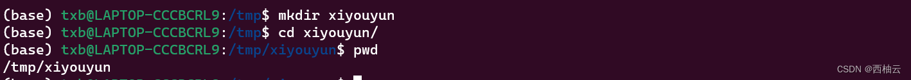
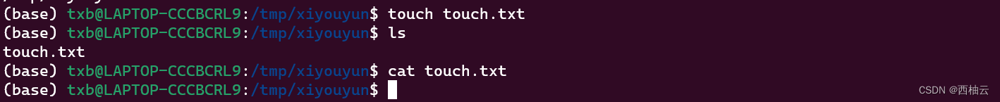
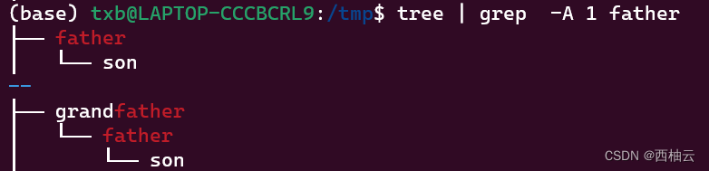

<iframe src="//player.bilibili.com/player.html?aid=689969785&bvid=BV1c24y127Nq&cid=886497148&page=1" style="width:100%;height:500px;min-width:375px;min-height:200px"scrolling="no" border="0" frameborder="no" framespacing="0" allowfullscreen="true"> </iframe>

<!--more-->

>适用于 ubuntu 20.04
>ubuntu 20.04 是 “西柚云” 主要使用的操作系统 [西柚云官网](https://www.xiyoucloud.net/aff/VKRWMUHQ)

`cd /tmp` (我们首先将工作目录切换到这个目录，之后所有的命令都在这个工作目录下执行)

`mkdir xiyouyun` (创建一个目录，目录的名称为 xiyouyun，它的路径为 /tmp/xiyouyun)

`cd xiyouyun` (切换工作目录的路径到 /tmp/xiyouyun，使用 xiyouyun 而不是 /tmp/xiyouyun 并不会导致错误，这是因为当前的工作目录是 /tmp，所以在这个工作目录下可以用 xiyouyun 来代替 /tmp/xiyouyun)

```bash
# 查看当前工作目录的路径，路径中包含 xiyouyun，说明目录创建成功，当然，此前 change directory 成功也说明了目录创建成功。
pwd
```


## `touch touch.txt`(创建一个空文件)

```bash
# 列出当前目录下的文件信息，查看文件是否被创建
ls 
# 查看 touch.txt 文件的内容
cat touch.txt
```


## 使用vim创建一个文件并向其中写入内容

输入`vim vim.txt`命令后进入到 vim 界面，在英文输入法模式按 <kbd>i</kbd>，切换到 vim 的输入模式，输入内容 hello，xiyouyun，然后按下<kbd>Esc</kbd>，再依次输入":wq" 3 个字符，然后按下回车，文件内容写入完毕。

```bash
# 列出当前目录下的文件信息，查看文件是否被创建
ls 
# 查看 vim.txt 文件的内容
cat vim.txt
```


## 使用 echo 创建文件并写入内容

```bash
# 使用重定向符号 > 向 echo.txt 写入 hello
echo "hello" > echo.txt
# 使用 cat 查看 echo.txt 文件的内容， 使用相对于工作目录的相对路径
cat echo.txt
# 使用重定向符号 > 向 echo.txt 写入 xiyouyun
echo "xiyouyun" > echo.txt
# 使用 cat 查看 echo.txt 文件的内容，可以看到第一次写入的内容被第二次写入的内容覆盖了，文件内容只包含第二次写入的内容
cat echo.txt
# 如果想要持续写入一个文件而不发生覆盖，需要使用追加重定向符号（>>）
echo "hello， xiyouyun" >> echo.txt
# 查看文件内容，可以看到，之前文件中的内容并没有被覆盖，而是在之前的文件内容后面追加了新的内容
cat echo.txt
```


## 补充内容

### 创建多层目录

mkdir 还有一个 -p 参数，可以用来创建多层目录
```bash
cd /tmp
mkdir -p father/son
mkdir -p grandfather/father/son 
# tree 可以查看目录的组织结构，后面的 “| grep  -A 1 father” 可以暂时忽略它的含义
tree | grep  -A 1 father
```
上面的代码执行后，会创建一个名为 father 的目录，在它的下面还有一个名为 son 的目录。
还有创建一个 grandfather 的目录，在它的下面有一个名为 father 的目录，father 目录的下面还有一个名为 son 的目录。
