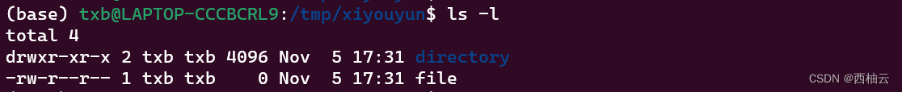

<iframe src="//player.bilibili.com/player.html?aid=559933357&bvid=BV1Se4y117LF&cid=886499421&page=1" style="width:100%;height:500px;min-width:375px;min-height:200px"scrolling="no" border="0" frameborder="no" framespacing="0" allowfullscreen="true"> </iframe>

<!--more-->
>适用于 ubuntu 20.04
>ubuntu 20.04 是 “西柚云” 主要使用的操作系统 [西柚云官网](https://www.xiyoucloud.net/aff/VKRWMUHQ)
## rmdir 删除一个**空目录**

```bash
# 在 /tmp 目录下创建一个名为 xiyouyun 的目录
cd /tmp 
mkdir xiyouyun
# 将工作目录切换为 xiyouyun
cd xiyouyun
# 在 xiyouyun 目录下创建一个名为 to_delete 的目录
mkdir to_delete
# 查看当前工作目录下的文件信息，确认 to_delete 目录是否被创建
ls
# 删除 to_delete 目录
rmdir to_delete
# 查看当前目录下的文件信息，确认 to_delete 目录是否被删除
ls
# 在当前工作目录下生成一个 xiyou.txt 的文件
echo "hello, xiyouyun" > xiyou.txt
ls
# 此时 xiyouyun 目录下存在一个名为 xiyou.txt 的文件，不能被删除
rmdir /tmp/xiyouyun
```


## rm 删除文件或目录

支持**正则表达式**匹配待删除的文件或目录, `*` 在匹配文件路径时可以代表任意字符。

```bash
# 在 /tmp 目录下创建一个名为 xiyouyun 的目录
cd /tmp 
mkdir xiyouyun
# 将工作目录切换为xiyouyun
cd xiyouyun
# 在 /tmp/xiyouyun 目录下创建 9 个文件，分别为 1.txt、2.txt …… 9.txt，可以暂时忽略这里的语法
touch {1..9}.txt
ls
# 删除文件 1.txt
rm 1.txt
# 删除文件 9.txt, * 可以表示后面的 .txt, * 在表示路径时可以表示任意字符，因此这里的 9* 可以被解释为 9.txt
rm 9*
# 创建两个目录 father/son 此时在 father 目录下会创建一个名为 son 的子目录，因此创建后 father 目录不是空目录
mkdir -p father/son
# 查看目录层级结构，如果系统中不存在这个命令，可以借助 ls 查看当前工作目录下的文件，或者通过 apt install tree 安装这个软件。
tree
# 删除 father 目录，以及 father 目录下面的所有文件
# 失败，rmdir 只能删除空目录
rmdir father 
# rm 命令默认删除文件，使用 -r 参数可以删除目录，-i 参数会在删除目录前一一询问用户是否删除该的文件，输入 yes 并回车就会将对应的文件删除
rm -r -i father 
ls
# rm 的 -f 参数表示在删除文件时不用输入 yes 确认，强制删除。
mkdir -p father/son
# 这里的 -r 和 -f 可以连在一起写作 -rf，效果同分开写相同，下面这条命令会删除 father 目录和 father 目录下的所有文件
rm -rf father
ls
```


## 补充内容

### 区分文件和目录

`mkdir` 能够创建目录，`touch` 能够创建文件，那么怎么区分文件或目录呢？

- 使用 `ls` 输出当前工作目录下的文件信息时，会通过不同的颜色来区分目录和文件，但这种方式不一定总是可靠。因为光凭颜色只能看出有一种颜色表示目录，另一种颜色表示文件，不能看出哪一种颜色对应目录，哪一种颜色对应文件。
- 在 windows 中可以通过文件后缀（如：1.txt）来区分文件和目录，文件有后缀，目录没后缀，这在 linux 系统中也不可行。
- 这里介绍一种方法：使用 `ls -l` 以 list（列表）的形式列出当前工作目录下的所有文件信息，每个文件或目录对应一行，看每一行的第 1 个字符就可以判断对应的文件信息是目录还是文件了。第 1 个字符为 `d` 的行表示该行对应的文件类型为目录，第 1 个字符为`-`的行表示该行对应的文件类型为文件。

	```bash
	# 创建 xiyouyun 目录，如果 /tmp/xiyoyun 目录存在，不做操作
	mkdir -p /tmp/xiyouyun
	cd /tmp/xiyouyun
	# 创建 1 个目录
	mkdir directory
	# 创建一个名为 file 的文件，文件名不带后缀
	touch file
	ls -l
	```
	
	

### **删除文件的最佳实践**

我们之前说到 rmdir 和鸡肋，只能用来删除空目录，这是一种非常保守的做法。但 rm -rf 的时候会直接删除文件而无法找回，这是不是又有点激进呢？

在使用图形化界面的电脑中，有一个“回收站（trash）”的概念，我们删除文件后，文件会被放入到”回收站“中，并不会立即被删除。此时文件还可以从”回收站“中恢复，只有在做完“清空回收站“后，文件才会被真正删除。而在终端中，你使用 rm 删掉一个文件后就无法恢复了，文件不会被放入回收站。

这对初学者并不友好，慎重使用 rm 这个命令是需要刻意训练的。因为在图形化界面中删除一个文件后可以在想要使用这个文件时将它从 trash 中恢复，这会让人们在做出删除操作时很草率，这可能导致误删文件之后后悔莫及。

这里我给大家介绍一个新命令：mv（move），它有两个参数 mv [source_path] [target_path]，第 1 个参数是想要删除的文件或目录的路径，第 2 个参数是 trash 的路径，trash 是一个目录。文件或目录会被移动到 trash 目录中。

```bash
# 在家目录下创建 trash，之前的文章有说到，在路径中 ~ 可以表示家目录
mkdir ~/trash

# 创建 9 个文件
touch xiyou{1..9}.txt
ls

# 将刚刚的 9 个文件放入 trash, 上文的内容有说到，在路径中的 * 可以表示任意字符
mv xiyou*.txt ~/trash
ls

# 将xiyou9.txt文件从 trash 中恢复到当前目录中, 之前的文章有说到，在路径中 . 可以代表当前的工作目录
mv ~/trash/xiyou9.txt .
ls
```

**为了避免“回收站”占用空间过大，记得使用 rm 命令定期删除其中不再需要的文件哦~**