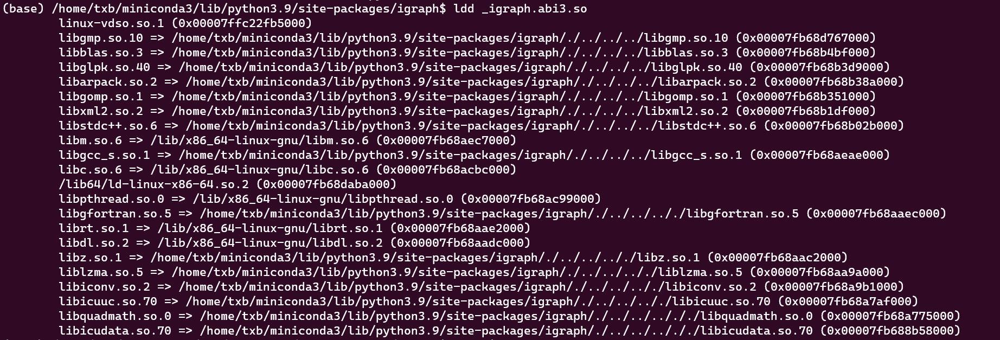
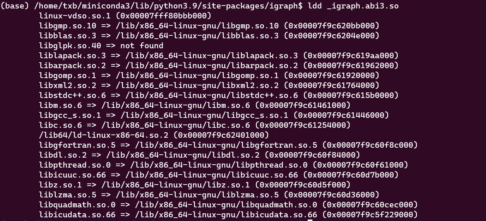

## 介绍

动态链接库是一个共享函数集合。我们编写程序时，可以利用其他人或自己编译好的动态链接库中的函数。当然，动态链接库之间也可以互相依赖，比如：动态链接库A在执行时可能需要使用动态链接库B中的函数。此时需要**动态链接器**在执行A中调用动态链接库B的代码时链接到B来执行代码。

<!--more-->

那么**动态链接器**是怎样找到动态链接库B的呢？它通常是按照这个顺序去找动态链接库的：

1. 编译代码时通过`-Wl -rpath=""`指定的rpath路径
2. 通过环境变量`LD_LIBRARY_PATH`指定的动态库搜索路径
3. 通过`xx.so`文件中的`RUNPATH`或`RPATH`指定的路径
4. 动态链接器的配置文件中配置的路径`/etc/ld.so.conf`
5. 默认寻找路径`/lib`和`/usr/lib`

如果没找到就报类似下面这样的错误：

```bash
error while loading shared libraries: libxxx.so: cannot open shared object file: No such file or directory
```

动态链接库在 Linux 系统中是通常以 .so 结尾。通常，我们可以通过 patchelf 设置 xx.so文件中配置的 rpath 信息来设置查找动态链接库的位置（RPATH的优先级高于系统默认配置的路径）

## 查看动态链接器找到的动态链接库位置

```bash
# 查看动态链接器找到的动态链接库位置
ldd xx.so
```



## 查看rpath

```bash
# 查看 xx.so 文件中设置的 RPATH
readelf -d xx.so | grep PATH
patchelf --print-rpath xx.so
```

RPATH 中的 $ORIGIN 表示的是当前 xx.so 文件所在的目录，".." 表示的是当前目录的父目录。


可以看到 _igraph.abi3.so 中的 RPATH 为 `$ORIGIN/../../../`，翻译过来为`/home/txb/miniconda3/lib`，因为 _igraph.abi3.so 所在的目录为 `/home/txb/miniconda3/lib/python3.9/site-packages/igraph`，因此该动态链接库需要的其他动态链接库都是优先在 `/home/txb/miniconda3/lib`目录下找到的，当然，根据前文讲到的动态链接器的查找顺序，如果在该目录下没有找到对应的动态链接库，如上文中的 libc.so.6 是在 /lib 目录下找到的。

## 设置rpath

有时动态链接器在非预期的目录去找动态链接库，为了让动态链接器优先在某个目录下寻找动态链接库，可以通过设置 rpath 路径的方式来实现。因为在查找动态链接库时，rpath 的优先级高于 /etc/ld.so.conf 中配置的目录，也高于/lib 和 /usr/lib 目录。

```bash
# 设置动态链接库中的 rpath
patchelf --set-rpath /lib xx.so
```

上文中的`_igraph.abi3.so` 的 RPATH 刚开始指向的是 `/home/txb/miniconda3/lib` 目录，如果将 rpath 修改为`/lib`目录，再次使用 `ldd _igraph.abi3.so` 查看各动态链接库的位置，发现动态链接器是优先在 `/lib`目录下找的。



## 工具安装

使用 conda 安装：

[patchelf安装链接](https://anaconda.org/search?q=patchelf)

## 注意事项

如果 xx.so 文件设置了 RUNPATH，RPATH 设置的目录会被忽略。此时需要通过设置 LD_LIBRARY_PATH 这个环境变量来让动态链接器优先查找某个目录。

