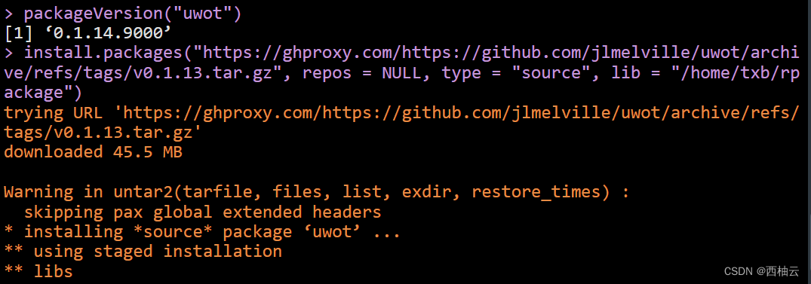
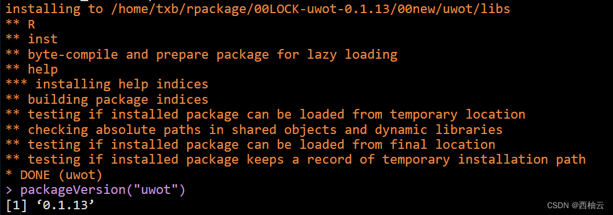
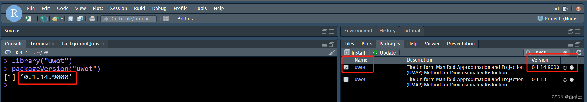
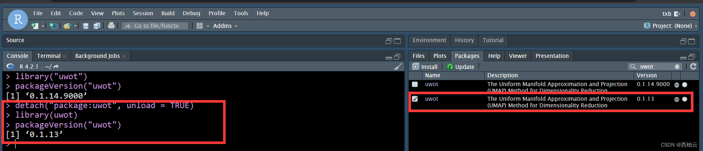

<iframe src="//player.bilibili.com/player.html?aid=986974785&bvid=BV1xt4y1T7Gd&cid=881793170&page=1"style="width:100%;height:500px;min-width:375px;min-height:200px" scrolling="no" border="0" frameborder="no" framespacing="0" allowfullscreen="true"> </iframe>

<!--more-->
> 适用于 ubuntu 20.04
> ubuntu 20.04 是 “西柚云” 主要使用的操作系统 [西柚云官网](https://www.xiyoucloud.net/aff/VKRWMUHQ)

### 原理


**R 不支持在一个目录下安装同一个包的多个版本**，在加载 R 包时，它按照系统中配置的 libpaths 的优先级从高到低查找，在某个 libpath 下找到这个包后，将这个包加载到环境中，即使后面找到这个包的其他版本，也不会再次加载了。（R包加载机制）

如：在执行 library("uwot") 时，R 就会依次搜索 libpath 找到 uwot 的位置，即使 libpaths 中有多个 uwot，它找到第一个 uwot 后，就将 uwot 加载到环境中，而不会再加载后续找到的 uwot 包到环境中了。

不过我们可以将当前加载到环境中的 uwot 这个包 unload，然后加载其他 libpath 中的 uwot 包。后面我会演示这个步骤。（切换 uwot 版本的原理）

```R
# 查看系统中配置好的 libpath 输出，按照优先级从高到低的方式输出
.libPaths()
# 示例输出：
[1] "/home/txb/R/x86_64-pc-linux-gnu-library/4.2"
[2] "/usr/local/lib/R/site-library"              
[3] "/usr/lib/R/site-library"                    
[4] "/usr/lib/R/library" 
```
如图：/home/txb/rpackage 目录下的初始 uwot 版本是 0.1.14，我在这个目录下重新安装了 uwot 的 0.1.13 版本。两个版本没有共存，而是将原来的 uwot 0.1.14 版本卸载掉了，安装上了 uwot 的 0.1.13 版本。这就是我们为什么要构造新的 libpath 的原因 —— 同一个 libpath 下的包只有1个版本。



### 实现方式

R 包的安装目录是使用 lib 参数指定的，指定这个参数可以将 R 包下载到对应的目录。在指定目录下安装好R包后，通过 .libPaths() 函数将该目录配置为新增的 libpath。

通过在 Console 中执行 .libPaths() 函数配置好的 libpath 仅在当前 rsession 中生效，“Start New Session” 之后，配置的 libpath 就会失效。

为了让 .libPaths() 配置的 libpath 永久生效，可以将相关的配置命令写入的 ~/.Rprofile 中，这样在“Start New Session” 之后，配置的 libpath 依然有效。

实现方式 1: 将 R 包安装在 rpackage 目录并配置

```R
# 将包安装在指定的 libpath 示例：
# 注意：libpath 必须在系统中存在，如果不存在，需要新建对应的目录：mkdir -p /home/txb/rpackage

# 将 R 包下载在指定目录命令示例：
remotes::install_github("jlmelville/uwot", lib="/home/txb/rpackage")
install.packages("xxx", lib="/home/txb/rpackage")
devtools::install_github("xxx/xxx", lib="/home/txb/rpackage")
BiocManager::install("xxx", lib="/home/txb/rpackage")

# 查看未添加 libpath 之前 uwot 的版本
library("uwot")
packageVersion("uwot")
# 向 R 包的 libpaths 中新增一个 libpath，并将它放在第 1 个元素 （最高优先级）
.libPaths(c("/home/txb/rpackage",.libPaths()))
# 查看添加 libpath 之后 uwot 的版本
library("uwot")
packageVersion("uwot")
```

实现方式 2：使用 conda 安装 R 包并配置 libpath

```shell
# 使用 conda 安装指定版本的 R 包
## 创建 conda 环境
conda create -n r-reticulate r-uwot==0.1.11 -y
conda activate r-reticulate 

# 配置 libpath
.libPaths(c("/home/txb/miniconda3/envs/r-reticulate/lib/R/library", .libPaths()))

# 查看此时 R 找到的第 1 个 R 包的版本。
library("uwot")
packageVersion("uwot")
```

### 效果演示


结合 rstudio-server 查看 R 包的版本。在这个步骤我先 "Start New Session" 将原先配置的 libpath 取消掉（后面会说明原因）。

```R
.libPaths(c("/home/txb/rpackage",.libPaths()))
library("uwot")
packageVersion("uwot")

.libPaths(c("/home/txb/miniconda3/envs/r-reticulate/lib/R/library", .libPaths()))
library("uwot")
packageVersion("uwot")

# Seurat 中会 import uwot，此时 uwot 无法 unload，想要切换 uwot 版本，有两种方式。
# 1. 将 Seurat unload
# 2. “Start New Session”，然后再选中想要使用的 uwot 版本 (推荐)
library("Seurat")
detach("package:Seurat", unload = TRUE)
```




```bash
# 让 libpath 永久生效，将相关命令写入到文件
file.edit("~/.Rprofile")
```

## 加载指定libpath下的R包

```bash
# lib 参数指定 libpath，即从那个目录下加载 R 包
library("remotes", lib = "xxx")
```

