ubuntu 有两种常用的系统 ubuntu desktop 和 ubuntu server。

ubuntu desktop 常用于个人电脑，是有图形化界面的，用户可以通过图形化界面与计算机交互。

ubuntu server 常用于服务器，是没有图形化界面的，用户通过终端与计算机交互。

<!--more-->

ubuntu server 常用于服务器的一个重要原因是ubuntu server 占用更低的硬件资源。

ubuntu desktop 虽然更易于使用，但占用更多的服务器资源，因为服务器的硬件资源宝贵，所以服务器大多安装 ubuntu server。

然而使用 ubuntu server 的用户可能也有使用图形化界面的需求，下面介绍一下在 ubuntu server 20.04LTS 中安装图形化界面的方式。

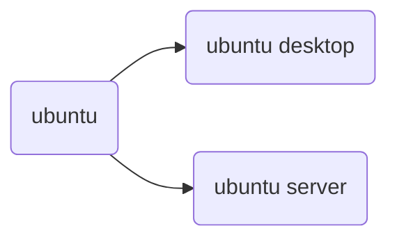

# VNC

VNC (Virtual Network Computer)是[虚拟网络](http://baike.baidu.com/view/747782.htm)计算机的缩写。它是基于 unix 和 linux 操作系统的免费的[开源软件](http://baike.baidu.com/view/444964.htm)。

[tightvnc](https://www.tightvnc.com/) 是 VNC 的一个实现。在服务端运行 tightvncserver 后你可以使用它去运行一个桌面系统，然后使用软件连接并显示这个桌面系统，这样就能**看到远程计算机的桌面并**使用本地鼠标和键盘控制它，就像您坐在那台计算机的前面一样。

## 1.安装vncserver

```bash
sudo apt install tightvncserver
```

## 2.1安装桌面-xfce（两个桌面系统2选1）

xfce 是一个轻量级的类UNIX桌面系统：https://www.xfce.org/?lang=zh_CN

[xfce使用指南](https://docs.xfce.org/)

```bash
sudo apt install xfce4 xfce4-goodies
```

## 2.2安装桌面gnome（两个桌面系统2选1）

gnome 是一个简单且容易使用的桌面系统：https://www.gnome.org/getting-gnome/

[gnome使用指南](https://help.gnome.org/users/)

```bash
sudo apt install gnome -y
```

## 3.安装autocutsel

autocutsel 让用户可以在vncview内外之前复制粘贴。

```bash
sudo apt install autocutsel
```

## 4.1为vncserver配置桌面环境xfce4（两个桌面系统2选1）

编辑 ~/.vnc/xstartup 文件，在文件末尾增加内容：

```bash
unset SESSION_MANAGER
unset DBUS_SESSION_BUS_ADDRESS
startxfce4 &
# 让桌面系统支持vncview内外之间的复制粘贴
autocutsel -f &
```

## 4.2为vncserver配置桌面环境gnome（两个桌面系统2选1）

编辑 ~/.vnc/xstartup 文件，在文件末尾增加内容：

如果之前添加了 xfce4 的相关行，需要删除后再添加下面内容。

```bash
export XKL_XMODMAP_DISABLE=1
export XDG_CURRENT_DESKTOP="GNOME-Flashback:GNOME"
export XDG_MENU_PREFIX="gnome-flashback-"
gnome-session --session=gnome-flashback-metacity --disable-acceleration-check &
# 让桌面系统支持vncview内外之间的复制粘贴
autocutsel -f &
```

## 5.启动vncserver

vncserver默认运行在 5900 端口，不过 5900 并不是 vncserver 的连接端口。连接 vncserver 的端口根据vncserver运行桌面时的命令决定。如果使用`vncserver :9527` 运行桌面，那么使用软件[vncview](https://www.realvnc.com/en/)连接桌面系统使用的端口就是$5900+9527=15427$。

```bash
# 为当前用户设置 vncserver 连接密码，初次运行时会让用户设置一个 8 位的密码
vncpasswd
# 停止运行在 5901 端口的桌面系统
vncserver -kill :1
# 让桌面系统运行在 5901 端口
vncserver :1
# 运行桌面系统时指定屏幕分辨率
vncserver -kill :1
vncserver -geometry 1920x1080 :1
```

5900配置在文件/usr/bin/vncserver中，你也可以手动修改它。

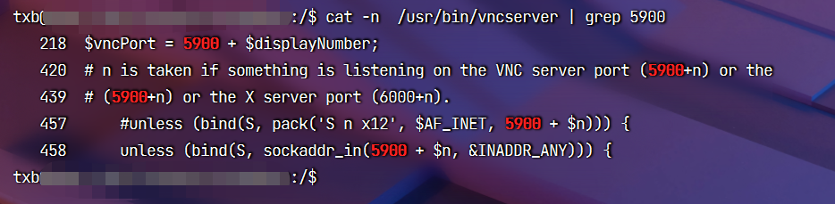

## 6.使用vncview连接vncserver运行的桌面系统

[vncview下载链接](https://www.realvnc.com/en/connect/download/viewer/)

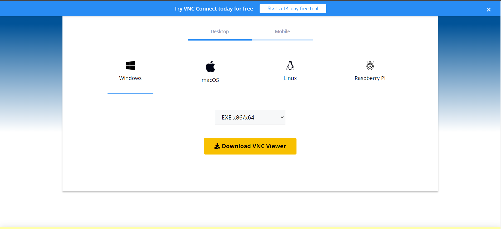

使用vncview连接vncserver的链接为 ip:port，如：xiyoucloud.net:9527，编辑好连接信息后双击OK后生成的连接信息，再输入之前设置的 VNC 连接密码就能连接上 vncserver 了。

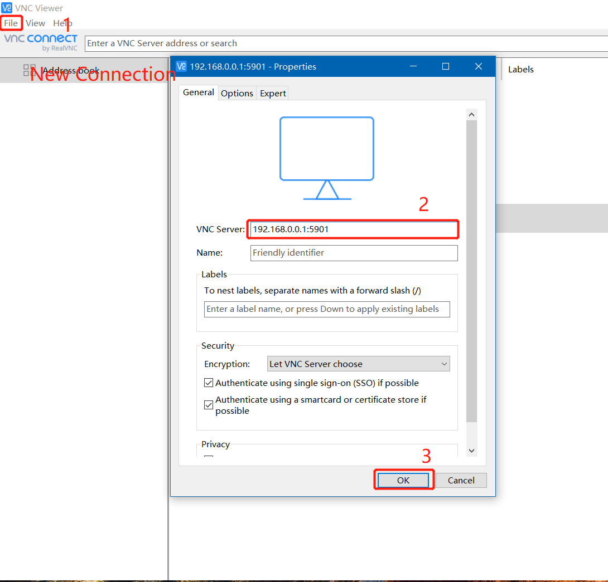

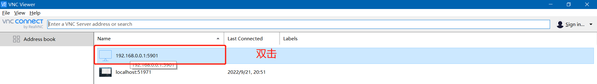

从下面这张截图可以看到我们使用的第三方 vncserver（tightvncserver）使用 vncview 连接是没有完整的端到端会话加密的，而使用vncview 官方的 vncserver 可以提供这些功能，不过这是**付费**的。**总的来说，如果你对数据的安全性要求较高，就不要使用vnc这一套工具。**

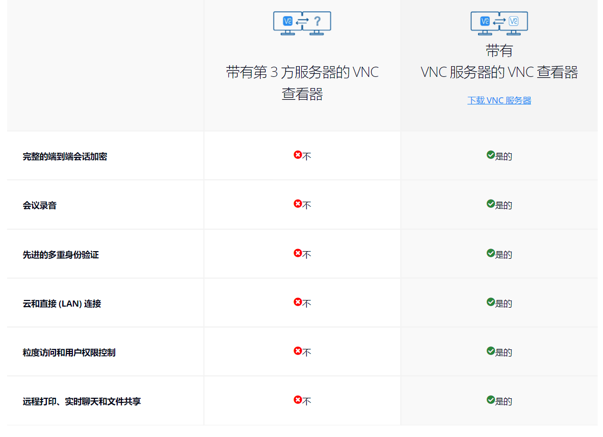

## 7.使用远程桌面系统

具体细节请参考桌面系统的使用指南：

[xfce使用指南](https://docs.xfce.org/)

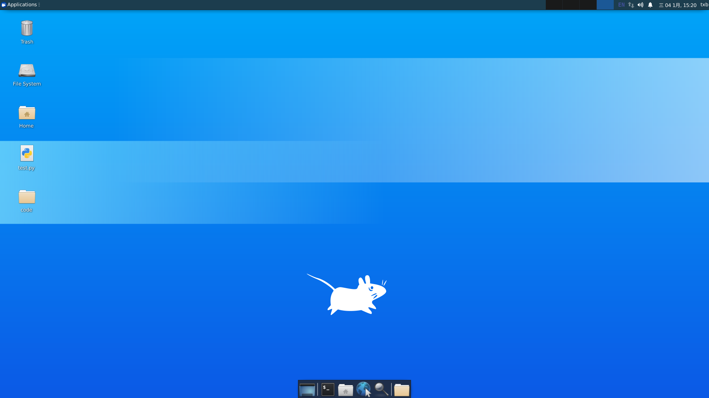

[gnome使用指南](https://help.gnome.org/users/)

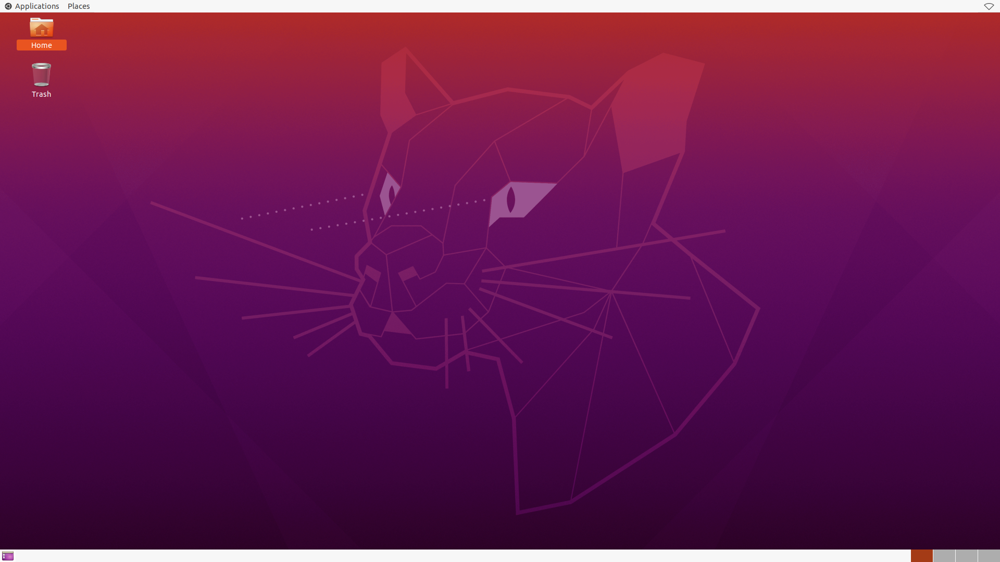

**常用快捷键：**

+ CTRL + ALT + T：打开一个终端


你也可以使用其他软件连接 tightvncserver。

## 其他连接tightvncserver的软件

[Remote Ripple](https://remoteripple.com/download/)

<a href="https://remoteripple.com/download/">

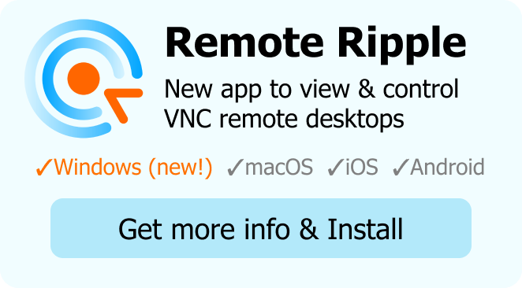

</a>

[MightyViewer](https://mightyviewer.com/)

<a href="https://mightyviewer.com/">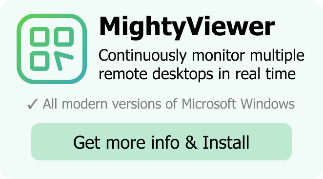</a>

[Unidostup](https://unidostup.com/)

<a href="https://unidostup.com/">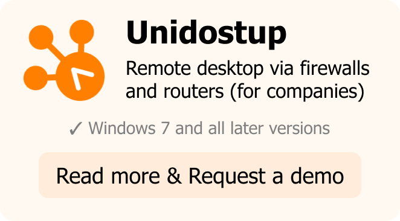</a>

## 常见问题

### 忘记密码怎么办？

使用 vncpasswd 重置密码，设置的密码最多 8 位，如果输入超过 8 位密码会自动被截取为 8 位。

```bash
vncpasswd
```

其他问题和解决方式欢迎在评论区补充，如果比较常见的话我会补充到文章中，感谢支持~

> 参考链接：
>
> https://help.aliyun.com/document_detail/59330.html


