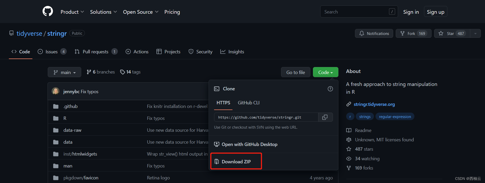

<iframe src="//player.bilibili.com/player.html?aid=774448127&bvid=BV1k14y1577d&cid=881813168&page=1" style="width:100%;height:500px;min-width:375px;min-height:200px"scrolling="no" border="0" frameborder="no" framespacing="0" allowfullscreen="true"> </iframe>

<!--more-->

> 适用于 ubuntu 20.04
> ubuntu 20.04 是 “西柚云” 主要使用的操作系统 [西柚云官网](https://www.xiyoucloud.net/aff/VKRWMUHQ)

## 步骤

CRAN 在国内下载速度很快，因为它在国内有很多镜像。

### 1.设置国内镜像源（**可选**）

- 使用 install 下载：https://cran.r-project.org/mirrors.html（镜像源列表）

    ```R
    # 从 CRAN 镜像下载安装包 (通常不需要,因为 CRAN 的 R 包下载速度不慢)
    install.packages("devtools", repos = "https://mirrors.ustc.edu.cn/CRAN/")
    ```

- 使用 BiocManager 下载 https://www.bioconductor.org/about/mirrors/（镜像源列表）

    ```shell
    # 从 BiocManager 镜像安装 XVector
    options(BioC_mirror="https://mirrors.tuna.tsinghua.edu.cn/bioconductor")
    BiocManager::install("XVector")
    
    # 向 ~/.Rprofile 文件中写入配置镜像的代码可以永久配置镜像
    file.edit("~/.Rprofile")
    ```

### 2.搜索 R 包，找到安装命令

- 在浏览器中搜索关键字：“xxx install” （推荐 google 搜索）
- CRAN https://cran.r-project.org/web/packages/available_packages_by_name.html （能够在这里搜到的 R 包都能够通过 install.packages("xxx") 安装）
- Bioconductor https://www.bioconductor.org/help/search/index.html?/，（能够在这里搜到的 R 包都能通过 BiocManager::install("xxx") 的方式安装）
- GitHub https://github.com/ （通常在 github 仓库的 README.md 文件会提供安装方法）

### 3.安装 R 包

### 安装R包的不同方式

```R
# R 包安装工具的下载方式, 养成好习惯，安装包时指定 lib，这样能把R包安装在指定的目录下
install.packages("devtools", lib = "/usr/local/lib/R/site-library")
install.packages("remotes", lib = "/usr/local/lib/R/site-library")
install.packages("BiocManager", lib = "/usr/local/lib/R/site-library")
```

- 从 CRAN 安装：

    ```bash
    install.packages("stringr")
    ```

- 从 Bioconductor 安装：

    ```R
    BiocManager::install("XVector")
    ```

- 从 GitHub 在线安装：

    推荐一个 GitHub 代理网站 [https://ghproxy.com/](https://ghproxy.com/), 感谢该网站站长为中国开源做出的贡献！

    ```R
    # 这里 R 包对应的 GitHub 链接是 https://github.com/tidyverse/stringr
    devtools::install_github("tidyverse/stringr")
    remotes::install_github("tidyverse/stringr")
    
    # 使用 remotes 可以在安装时指定完整的 GitHub 链接，方便我们使用 GitHub 代理
    remotes::install_git("https://github.com/tidyverse/stringr")
    
    # 使用国内代理下载 R 包源码并安装
    remotes::install_git("https://ghproxy.com/https://github.com/tidyverse/stringr")
    ```

- 从 GitHub 离线安装：

    ```R
    # 假设我们将安装好的 zip包命名为 main.zip
    devtools::install_local("main.zip")
    # 可以参考 https://ghproxy.com 使用 github 代理下载文件
    ```

    zip 包需要从 GitHub 下载(如图):

    


- 从在线源码安装：

    ```R
    # 这里的 "https://cran.r-project.org/src/contrib/stringr_1.4.1.tar.gz" 就是源码的下载路径
    install.packages("https://cran.r-project.org/src/contrib/stringr_1.4.1.tar.gz", repos=NULL, type="source")
    ```

- 从离线源码安装：

    ```R
    # 将源码下载到本地，然后使用以下方式编译安装
    
    install.packages('/tmp/stringr_1.4.1.tar.gz', repos=NULL, type="source")
    # 下载方式示例：
    wget "https://cran.r-project.org/src/contrib/stringr_1.4.1.tar.gz"
    ```

**其实归根结底所有的 R 包都是通过源码安装的，不过是下载源码的渠道不一样**

### 卸载 R 包

```R
# 命令示例，stringr 是包的名称
remove.packages("stringr", lib = "/usr/local/lib/R/site-library")
```