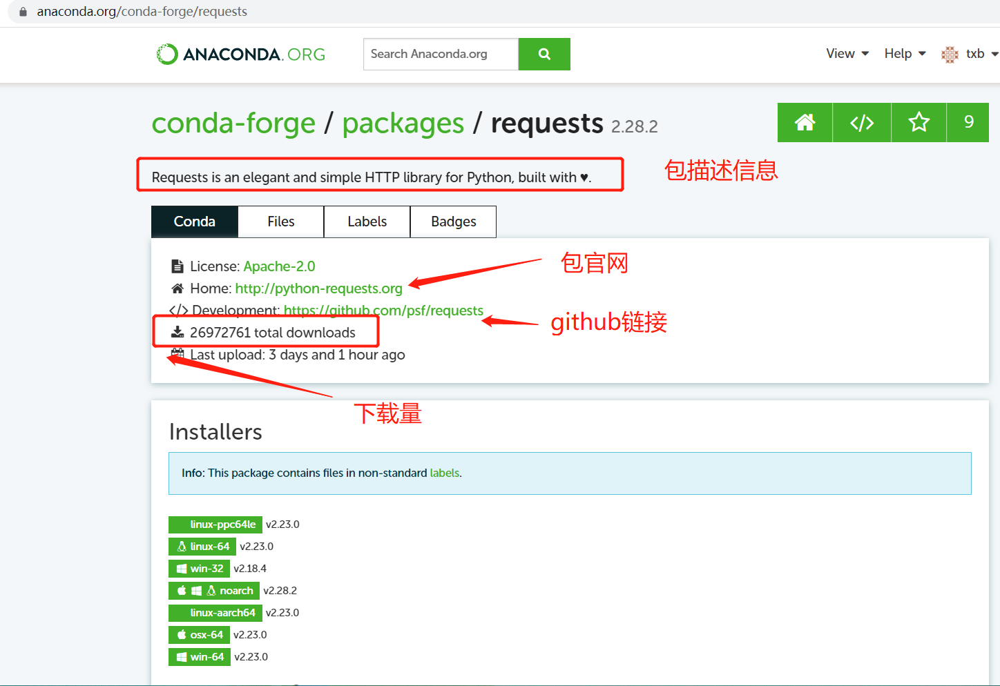

这篇文章将介绍 4 种安装 python 包的方式。

<!--more-->

## 通过conda安装



在这个链接中搜conda包：https://anaconda.org/search?

如何确定搜到的 conda 包就是你在 [python官网](https://pypi.org) 找到的python包呢？

1. 看包对应的github链接
2. 看包对应的官网链接

如果一致就表示是同一个包，另一方面，下载量也能从一定程度上反映出该包是否是比较常用的python包。



```bash
conda install xxx
```

## 通过pip安装

pip 工具可以通过 conda 安装。

如果你有 root 权限的话，也可以通过 apt 安装。

```bash
sudo apt install python3-pip
```

### pip镜像源

| 源名称           | 源地址                                              |
| :--------------- | :-------------------------------------------------- |
| 清华大学         | https://pypi.tuna.tsinghua.edu.cn/simple            |
| 中国科学技术大学 | https://pypi.mirrors.ustc.edu.cn/simple             |
| 阿里云           | https://mirrors.aliyun.com/pypi/simple/             |
| 华为云           | https://repo.huaweicloud.com/repository/pypi/simple |
| 豆瓣             | https://pypi.douban.com/simple                      |

使用不同镜像源安装python包：

```bash
# 从 python 官网安装 requests 包
pip install requests
# 从豆瓣源安装 requests 包
pip install requests -i https://pypi.douban.com/simple
```

## 通过whl文件安装

whl 文件是 python 包的另一种保存格式，你可以把他理解为一个压缩包，看起来它跟源码压缩包没什么两样，不过有的作者会提供针对不同平台编译好的 whl 版本，这样如果我们下载符合我们平台（win/mac/linux、python版本）的 whl 文件，就可以直接安装而不会遇到可能会发生的软件依赖报错了。

从官网或其他途径（如 github）可获得某个python 包的 whl 版本。

举个例子，通过这个链接可以下载 requests 包的不同版本的源码和whl文件：https://pypi.doubanio.com/simple/requests

```bash
pip install xx.whl
```

## 通过源码安装

源码可能通过多种形式打包，如 zip，tar，xx.gz...。源码解压后通常包含一个 setup.py 文件，进入到setup.py文件所在的目录，然后使用以下命令安装。

```bash
python setup.py install
```

## 如何选择安装方式

**按优先级从高到低依次排序如下：**

1. 在 conda 虚拟环境中优先使用 conda 安装
2. 使用 pip 从官网或官网镜像中安装
3. 从源码安装
4. 从 whl 文件安装，有些作者会针对不同平台（mac，linux，win）发布编译好的 whl 文件，这样安装就不用处理软件的依赖了。

