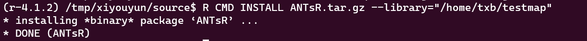

# 环境信息说明

| R版本   | 4.1.2                          |
| ------- | ------------------------------ |
| libpath | /home/txb/lesymap (可自行修改) |

<!--more-->

如何使用指定 libpath 下的 R 包可以参考 

这个教程会将 R 包安装在 /home/txb/lesymap 中，因此需要添加这个 libpath，代码如下：

```R
# 添加 libpath: /home/txb/lesymap
.libPaths(c("/home/txb/lesymap", .libPaths()))

# 添加后该 libpath 只在当前 session 暂时被添加
# 如果需要每次启动 R 时自动添加，需要将以上代码写入 ~/.Rprofile 中，然后关闭当前 session，再 Start New Session 即可生效
file.edit("~/.Rprofile")
```

以下步骤如果下载 github 相关文件太慢，可以参考我这篇文章使用 github 代理：


# 安装步骤

## 1.安装依赖包

```bash
# 安装 Rcpp 等依赖包
mylist = c("Rcpp", "RcppArmadillo", "graphics", "grDevices", 
           "magic", "magrittr", "misc3d", "pixmap",
           "psych", "rsvd", "stats", "utils", 
           "lmPerm", "nparcomp" )
needindx =  ! mylist %in% installed.packages()
if (any(needindx)) install.packages(mylist[needindx], lib = "/home/txb/lesymap")

# 安装 remotes
install.packages("remotes", lib = "/home/txb/lesymap")
```

## 2.安装ITKR

```bash
# 安装 ITKR
library("remotes", lib = "/home/txb/lesymap")
install_github("stnava/ITKR", lib = "/home/txb/lesymap")
```

## 3.安装ANTsRCore

```bash
# 安装 RcppEigen
install.packages("RcppEigen", lib = "/home/txb/testmap")

# ANTsRCore，可根据实际情况指定软件版本 https://github.com/ANTsX/ANTsRCore/releases/
wget -O ANTsRCore.tar.gz https://github.com/ANTsX/ANTsRCore/releases/download/v0.7.4.9/ANTsRCore_0.7.4.9_R_x86_64-pc-linux-gnu_R4.1.tar.gz
R CMD INSTALL ANTsRCore.tar.gz --library="/home/txb/lesymap"
```

## 4.安装ANTsR

```bash
# 安装 ANTsR
wget -O ANTsR.tar.gz https://github.com/ANTsX/ANTsR/releases/download/v0.5.7.4/ANTsR_0.5.7.4_R_x86_64-pc-linux-gnu_R4.1.tar.gz
R CMD INSTALL ANTsR.tar.gz --library="/home/txb/lesymap"
```

## 5.安装LESYMAP

```bash
# 安装 lesymap
library("RcppEigen")
remotes::install_git("https://github.com/dorianps/LESYMAP", lib = "/home/txb/lesymap")

# 如果安装 lesymap 报错 “RcppEigen 包 not found”，再次安装 RcppEigen 并 library 它
install.packages("RcppEigen", lib = "/home/txb/lesymap")
```

## 安装成功截图




