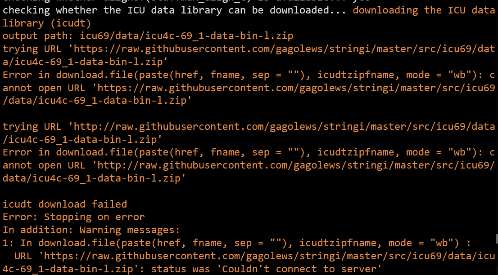

在安装 stringi 时出现报错时，可以参考一下这篇文章。

<!--more-->

## 报错截图



从报错中我们可以看到，stringi 安装失败的原因是因为[icu](https://icu.unicode.org/)这个软件下载不下来，这里我们可以通过代理将这个 zip 文件下载下来，然后使用 R CMD INSTALL 的方式安装。

## 获取安装文件

在终端中执行

```bash
wget https://cran.r-project.org/src/contrib/stringi_1.7.12.tar.gz
# 如果下载不下来可以使用代理下载
wget https://raw.githubusercontent.com/gagolews/stringi/master/src/icu69/data/icu4c-69_1-data-bin-l.zip

# 使用代理下载
wget https://ghproxy.com/https://raw.githubusercontent.com/gagolews/stringi/master/src/icu69/data/icu4c-69_1-data-bin-l.zip

```

## 安装

在终端中执行：

```bash
R CMD INSTALL --configure-vars='ICUDT_DIR=/packages/path/' stringi_1.7.5.tar.gz
```

