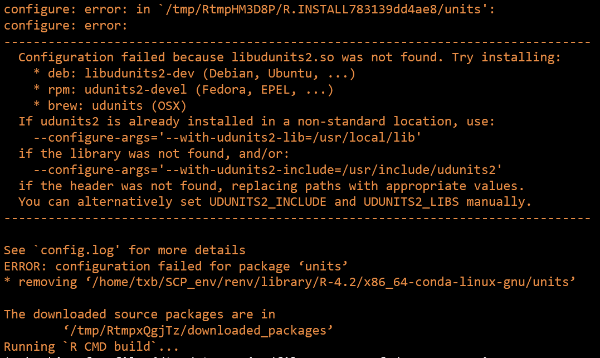
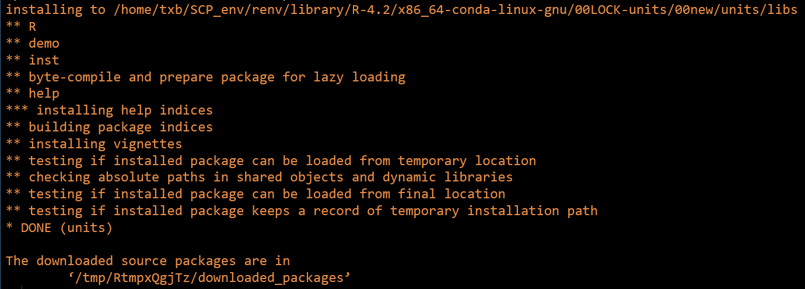

在安装 R 包 units 时使用正常的安装方式安装不上时，可以参考这篇文章指定一下依赖软件的位置进行安装。

```bash
# 一般安装方式
install.packages("units")
```

<!--more-->

## 报错截图




**使用哪种方式安装依赖软件取决于你使用的 R 的环境。**

## 在apt中安装依赖软件：

如果是在 rstudio 中使用 conda 安装的 r-base，你就需要在 conda 中为该 R 包安装好依赖，如果使用的是全局环境中的 R，安装好依赖后参考以下安装方式就行。

```bash
# 在 rstudio 中使用系统环境下的 R（使用 apt 安装的），需要根据提示安装依赖软件
# 如在 ubuntu 中安装 units 包的依赖软件。
apt install libudunits2-dev
```

## 在conda中安装依赖软件

在终端中执行：

```bash
# 激活虚拟环境
conda activate r-4.2
# 安装依赖环境
conda install  udunits2 -y -vv
```

## 安装

在 R 的交互环境中执行：

```bash
config <- c(units="--with-udunits2-lib=/home/txb/envs/r-4.2/lib --with-udunits2-include=/home/txb/envs/r-4.2/include")
install.packages("units", configure.args = config)
```

