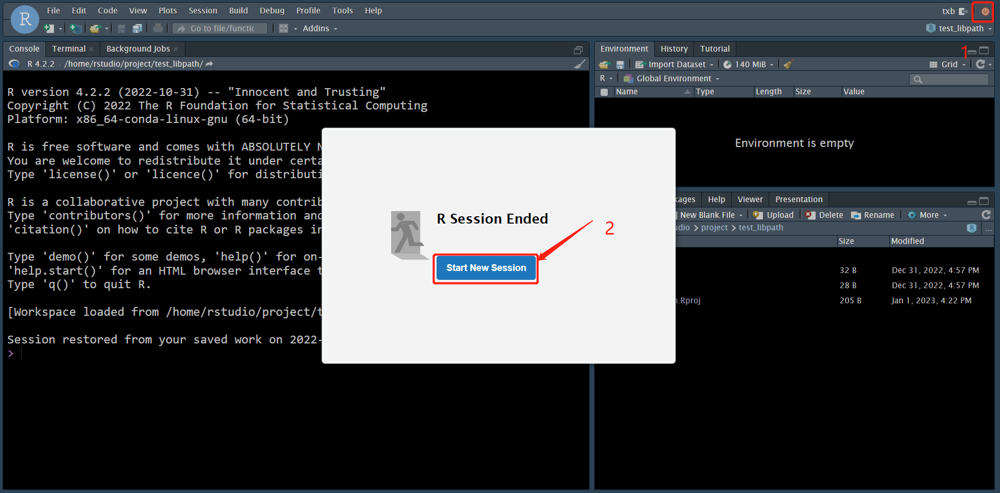

### 1.安装conda



### 2.使用conda安装monocle2.18

**小技巧，在安装monocle2.18之前需要先安装 r-base 4.0.5**

```bash
# 创建虚拟环境
conda create -n rpackage r-base==4.0.5 -y -vv
conda activate rpackage
conda install bioconductor-monocle==2.18.0 -y -vv
```

<!--more-->

### 3.在rstudio-server中使用monocle2.18

```bash
# 在 R 语言的执行环境中执行
.libPaths(c("/home/txb/miniconda3/envs/rpackage/lib/R/library", .libPaths()))

# 在 R 中 load monocle
library(monocle,lib.loc="/home/txb/miniconda3/envs/rpackage/lib/R/library")
```

### 4.配置libpath永久生效

将以下内容写入 ~/.Rprofile，然后 Start New Session，其中 /home/txb/miniconda3/envs/rpackage/lib/R/library 就是R包的安装路径，也就是所谓的 libpath。

```bash
.libPaths(c("/home/txb/miniconda3/envs/rpackage/lib/R/library", .libPaths()))
```



