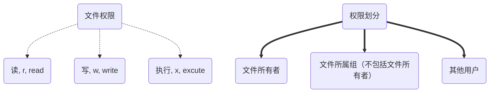
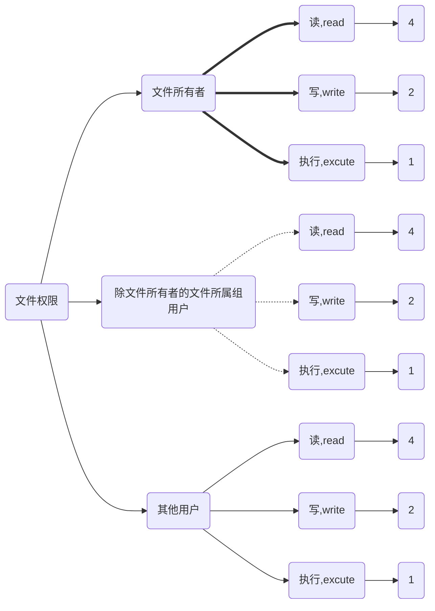

<iframe src="//player.bilibili.com/player.html?aid=262822119&bvid=BV1aY411o75b&cid=895360256&page=1" style="width:100%;height:500px;min-width:375px;min-height:200px"scrolling="no" border="0" frameborder="no" framespacing="0" allowfullscreen="true"> </iframe>
<!--more-->


>适用于 ubuntu 20.04
>ubuntu 20.04 是 “西柚云” 主要使用的操作系统 [西柚云官网](https://www.xiyoucloud.net/aff/VKRWMUHQ)

linux 是个多用户系统，那么如何保证多个用户使用同一个系统不会导致混乱、互相干扰呢？这就需要说到 linux 系统中的 文件权限了。

文件的权限是如何组织的呢？首先我们需要了解文件和目录具有有读、写、执行的权限。可以分别对文件所有者，文件所有者所属组，其他用户划分不同的文件权限。

这里的组是用户组的意思，用户组中包含了一些用户，可对这些用户设置权限。

其他用户是指既不是文件所有者，也不在文件所属组中的用户。



## **使用 ls -l 查看文件的权限：**

```bash
xiyou@xiyou:~$ ls -l
total 8
drwxr-xr-x 2 xiyou xiyougroup 4096 Nov 16 21:36 xiyou
-rw-r--r-- 1 xiyou xiyougroup   21 Nov 16 21:36 xiyou.txt
# 这里的第 1 个字符是表示文件类型 d,l,-
# 2-10 的字符以每3个一组，分别是文件所有者、文件所属组（不包括文件所有者）、其他用户的权限
# ”-“表示无该处的权限，r 表示读权限，w 表示写权限，x 表示执行权限。
```

| 文件类型+文件权限 | 文件引用数 | 文件所有者 | 文件所属组 | 文件大小（bit） | 文件修改日期 | 文件名    |
| ----------------- | ---------- | ---------- | ---------- | --------------- | ------------ | --------- |
| drwxr-xr-x        | 2          | xiyou      | xiyougroup | 4096            | Nov 16 21:36 | xiyou     |
| -rw-r--r--        | 1          | xiyou      | xiyougroup | 21              | Nov 16 21:36 | xiyou.txt |

## **环境准备：**

```bash
# 创建用户组
groupadd xiyougroup
# 创建用户，并把用户添加到用户组
sudo useradd -m -d /home/xiyou -s /bin/bash -g xiyougroup xiyou
# 为 xiyou 用户设置密码为 xiyou
echo -e "xiyou\nxiyou" | sudo passwd xiyou

# 切换当前用户为 xiyou，需要输入密码
su xiyou 
# 创建目录和文件用于命令演示
cd ~
mkdir xiyou
echo "echo hello, xiyouyun" > xiyou.txt
```

## chmod 修改文件权限

只能文件所有者或root用户才能更改文件的权限

```bash
# u:user, g:group, o:others, w:write, r:read, x:excute
chmod u-x xiyou.txt
chmod u+w xiyou.txt
chmod ug+r xiyou.txt
chmod g+x,u-x xiyou.txt
chmod o+x xiyou.txt
# 使用 R 参数，对目录以及目录下的所有文件进行权限变更
chmod -R u+x xiyou
bash xiyou.txt
```

## chown：变更文件所有者或文件所属组

只有 root 用户才能变更文件所有者，非root用户只能变更文件所属组

```bash
# 将文件的所有者设置为 root 用户
chown root xiyou.txt
# 将文件的所有者设置为 root 用户，将文件所属组设置为 xiyougroup
chown root:xiyougroup xiyou.txt
# 为目录和目录下的所有文件设置所有者和所属组
chown -R root:xiyougroup xiyou
```


# 补充内容

## 使用数字来表示文件权限



## 这可以应用在 chmod 命令中:

```bash
chmod 777 xiyou.txt
chmod 755 xiyou.txt
chmod 666 xiyou.txt
```

## 对于目录来说读、写、执行权限的意义。

- 读：能用 ls 看到目录中包含有哪些文件
- 写：能在目录下创建文件
- 执行：能用 cd 将工作目录切换到目录下，能够在目录中创建和删除文件

## 对于文件来说读、写、执行权限的意义。

- 读：能读取文件内容

- 写：能向文件中写入内容

- 执行：能用 ./xx 的方式执行文件

    ```bash
    which bash
    # 查看文件的权限
    ls -l /usr/bin/bash
    # 借助 bash 来执行不具有可执行权限的文件
    bash xx.txt
    ```

    