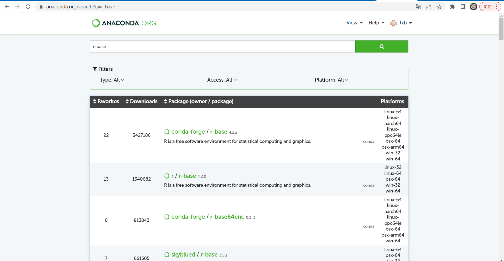
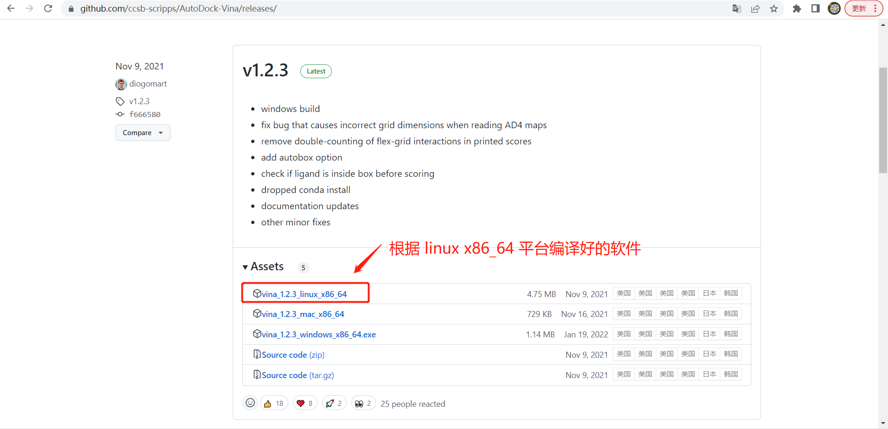
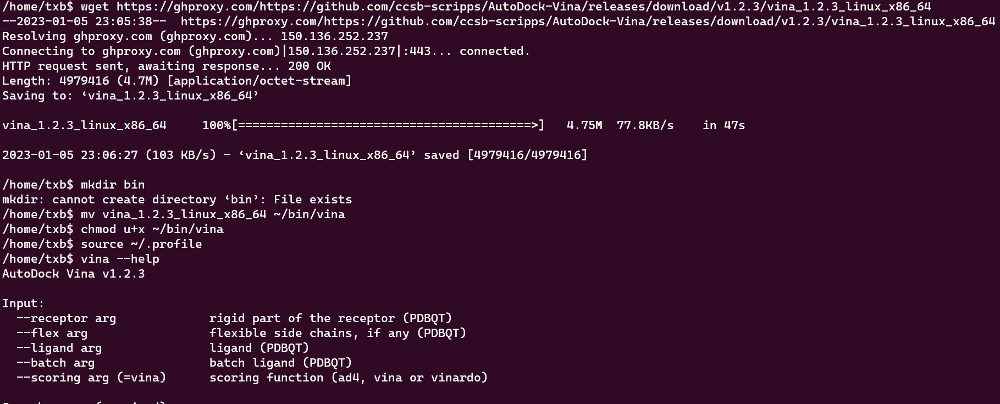
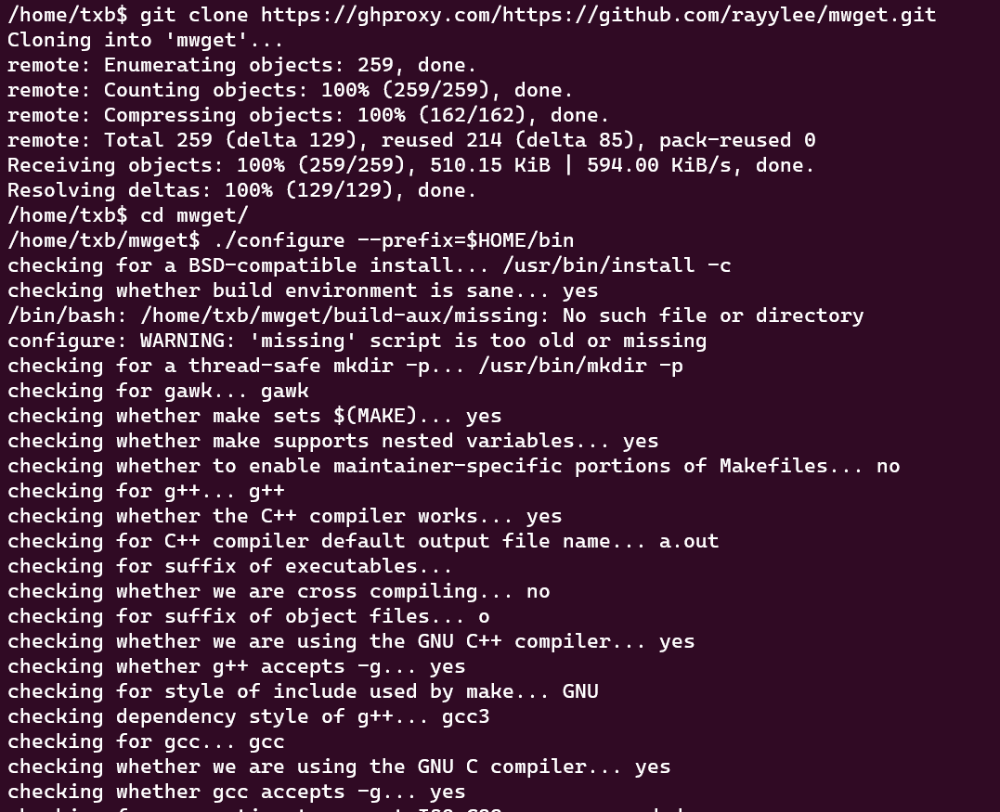
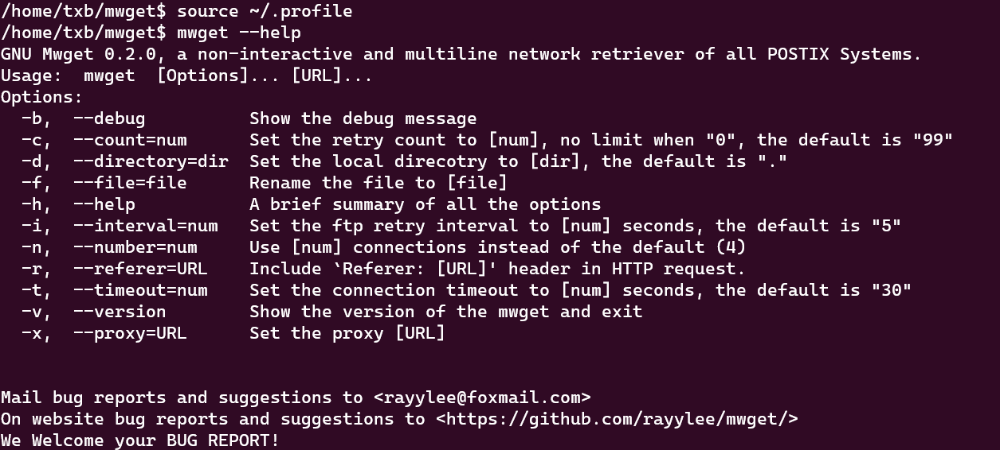

## 无 root 权限安装软件的好处

- 不同用户可以使用不同的软件版本

- 软件可以随意安装和卸载，不会影响到其他用户

- 不需要 root 权限

<!--more-->

## 1.使用conda安装

能够用conda安装的软件都能在该链接中搜索到：https://anaconda.org/search?q=

- 

- 

推荐使用conda安装软件的几大原因：

1. conda 在安装软件时会自动解决软件的依赖问题；
2. 可以在系统安装同一软件的多个版本（如R3.6，R4.1，R4.2），需要安装在不同的虚拟环境中；
3. 不需要 root 权限；



```bash
# 安装命令示例
conda create -n py39 -y -vv
conda activate py39
conda install python=3.9 -y -vv

conda create -n r422 -y -vv
conda activate r422
conda install r-base=4.2.2 -y -vv
```

## 2.使用编译好的软件

有些软件作者会提供不同平台的编译好的软件，使用者可以下载对应平台的编译好的软件版本使用。

这种程序的特点是不用编译就可以直接使用，下面以安装 vina 为例。

```bash
# 查看当前使用系统的 operating-system 和 hardware-platform
uname -io
# 如 x86_64 GNU/Linux
```

这个链接中有 vina 根据不同平台编译好的软件版本 [https://github.com/ccsb-scripps/AutoDock-Vina/releases/](https://github.com/ccsb-scripps/AutoDock-Vina/releases/)，我们可以根据自己使用的操作系统平台下载使用。



```bash
# 将软件下载到家目录
cd ~
wget https://github.com/ccsb-scripps/AutoDock-Vina/releases/download/v1.2.3/vina_1.2.3_linux_x86_64
# 创建 bin 目录用于存放可执行程序
mkdir bin
# 将程序移动到 bin 目录中，并给它赋上可执行权限，为了方便使用，这里还将 vina_1.2.3_linux_x86_64 重命名为 vina
mv vina_1.2.3_linux_x86_64 ~/bin/vina
chmod u+x ~/bin/vina
# 执行 .profile 文件
source ~/.profile

# 使用软件
vina --help
```



执行 .profile 文件的原因是因为 .profile 脚本内部将家目录下的 bin 目录加入到 PATH 中，如果你的家目录下没有 .profile 文件可以参考  中的误删 .profile 创建它。如果你讲可执行程序下载到其他路径，你也可以参考  将对应的路径添加到 PATH 中。

上文中如果使用 wget 下载 github 中的文件太慢，可以考虑使用 github 代理。参考：

## 3.编译安装

如果某些软件需要进行编译安装的，也不一定必须使用 root 权限安装到`/usr/local/bin`等需要 root 权限才能操作的目录，可以将其安装到自己的家目录下，这样更安全（因为使用root权限安装的软件拥有root权限，可以在系统里面为所欲为，如果安装了一个来路不明的病毒软件，那么系统就很危险了）。

下面以安装 mwget 为例，mwget 是多线程版本的 wget。

```bash
# 进入到家目录，下载软件源码
cd ~
git clone https://github.com/rayylee/mwget.git

# 创建 bin 目录用于存放可执行程序
mkdir bin

# 进入源码所在的目录
cd mwget

# 免root的关键是在configure的时候指定prefix参数，指定软件的安装目录
# 可能报错 configure: error: Your intltool is too old.  You need intltool 0.35.0 or later，这是由于缺乏软件依赖导致的
# 联系管理员执行：sudo apt-get install intltool，然后重新执行 configure 命令
./configure --prefix=$HOME/bin
make
make install

# 执行 .profile 文件
source ~/.profile

# 使用软件
mwget --help
```



截图信息略去了 make 和 make install 产生的编译信息（太长了……）



执行 .profile 文件的原因是因为 .profile 脚本内部将家目录下的 bin 目录加入到 PATH 中，如果你的家目录下没有 .profile 文件可以参考  中的误删 .profile 创建它。如果你讲可执行程序下载到其他路径，你也可以参考  将对应的路径添加到 PATH 中。

上文中如果使用 wget 下载 github 中的文件太慢，可以考虑使用 github 代理。参考：

