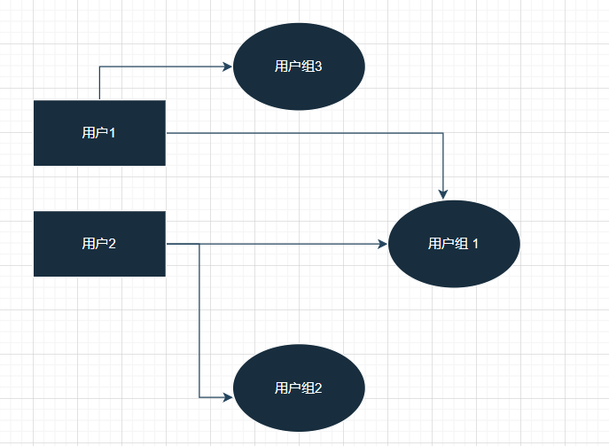
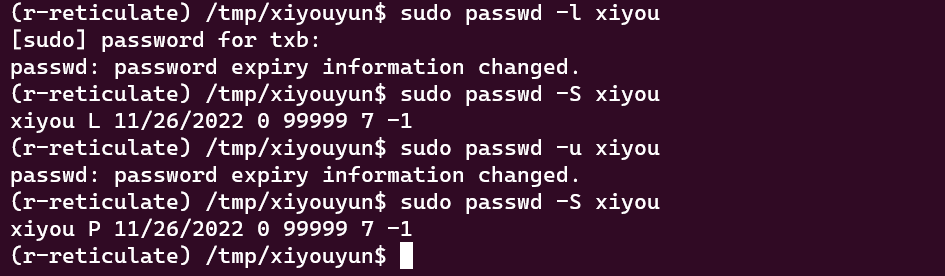
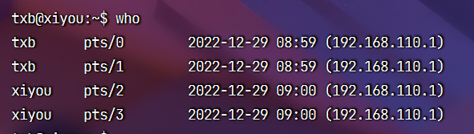

<iframe src="//player.bilibili.com/player.html?aid=989421942&bvid=BV1B44y1R7tJ&cid=943112784&page=1" style="width:100%;height:500px;min-width:375px;min-height:200px"scrolling="no" border="0" frameborder="no" framespacing="0" allowfullscreen="true"> </iframe>

<!--more-->

>适用于 ubuntu 20.04
>ubuntu 20.04 是 “西柚云” 主要使用的操作系统 [西柚云官网](https://www.xiyoucloud.net/aff/VKRWMUHQ)

用户和用户组是用来划分权限的抽象概念，用户除了作为权限的抽象之外。我们通常还需要借助用户名和密码来登陆系统。

用户和用户组是多对多的关系，即1个用户可以对应多个用户组，1个用户组也可以包含多个用户。



<!--more-->

## 创建用户

useradd：通常用于在脚本中创建用户

adduser：交互式地创建用户，手动设置密码，自动创建家目录

```bash
# 创建用户组
groupadd xiyougroup
# 创建用户，并把用户添加到用户组
sudo useradd -m -d /home/xiyou -s /bin/bash -g xiyougroup xiyou
# 为 xiyou 用户设置密码
password=$(cat /proc/sys/kernel/random/uuid);echo -e "$password\n$password" | sudo passwd xiyou
# 获取刚刚为 xiyou 用户设置的密码
echo $password

# 切换当前用户为 xiyou，需要输入刚刚设置的密码
su xiyou 
# 交互式地创建用户
sudo adduser xiyou2
```


## 管理用户

usermod：修改用户信息

userdel：删除用户

```bash
# 修改用户名
usermod -l 新用户名 旧用户名
# 修改用户家目录
usermod -d 新家目录 用户名
# 锁定用户不能登陆
usermod -L 用户名
# 解除用户锁定
usermod -U 用户名
# 查看用户状态
passwd -S 用户名
# 删除用户的同时删除家目录
usermod -r 用户名

# 删除用户
userdel 用户名
# 删除用户名和用户的家目录
userdel -r 用户名 
```

## 创建用户组

```bash
# 查看新增用户组命令的使用方法
addgroup --help
groupadd --help

# 创建用户组
groupadd xiyougroup
```

## 管理用户组

groups：查看用户组信息

id：查看用户的 uid 和 gid 信息

groupmod：修改用户组信息

```bash
# 查看系统中所有的用户组
cat /etc/group
# 查看当前用户所在的用户组
groups
# 查看某用户所在的用户组
groups txb
# 查看用户id、用户组、用户组id
id txb

# 修改用户组名
groupmod -n 新组名 旧组名

# 修改用户组 id
groupmod -g 组id 组名

# 删除用户组
groupdel 组名

# 将用户添加到某个用户组
gpasswd -a 用户名 组名
```

## 补充内容

passwd:修改用户密码信息

```bash
# 修改用户密码
passwd 

# 锁定用户密码，用户不能登陆
passwd -l 用户名
# 解除锁定
passwd -u 用户名

# 查看用户的密码是否被锁定
passwd -S

# 删除用户密码，删除后用户不能登陆系统，重新设置密码后可以登陆系统
passed -d 用户名
```



查看系统在线人员信息：

```bash
who
```



强制用户下线：

任何用户都可让自己强制下线，强制其他用户下线需要 root 权限

```bash
# pts/0 是用户使用的终端的名称
sudo pkill -kill -t pts/2
```


