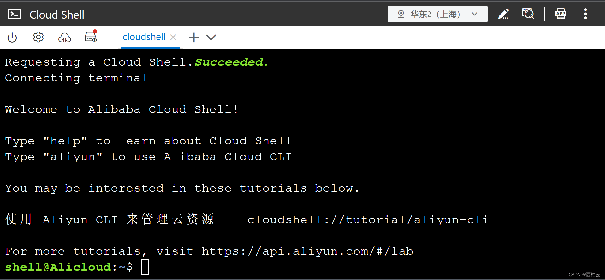
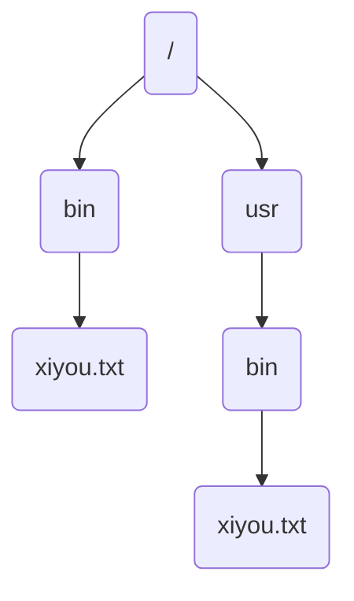
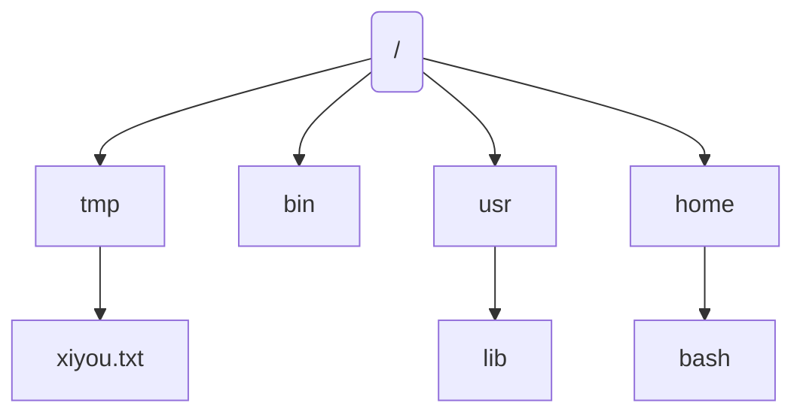

<iframe src="//player.bilibili.com/player.html?aid=902282431&bvid=BV1tP4y1U7zP&cid=883084717&page=1" style="width:100%;height:500px;min-width:375px;min-height:200px"scrolling="no" border="0" frameborder="no" framespacing="0" allowfullscreen="true"> </iframe>

<!--more-->

>适用于 ubuntu 20.04
>ubuntu 20.04 是 “西柚云” 主要使用的操作系统 [西柚云官网](https://www.xiyoucloud.net/aff/VKRWMUHQ)

## 1.终端（terminal）

终端是一种输入输出设备，用于人与计算机交互，早期是一种计算机硬件。（电传打字机）电传打字机将用户输入的文字翻译成纸带上的孔，然后将纸带输入到计算机中获得用户输入的文字。终端是人与计算机交互的桥梁。


现在使用的终端是使用软件模拟出来的虚拟终端，用于人与计算机交互，输出系统是屏幕，输入系统是键盘。如：https://bash.aliyun.com/（使用支付宝扫码登陆）




我们可以在终端输入命令来与计算机进行交互。

## 2.工作目录（work directory）

工作目录是在终端中使用`pwd`（print work directory）命令输出的目录，通常也被称为“当前所在的目录”。

它的意义是执行命令时如果涉及到目录，可以以它为参考来指定其他目录。当命令涉及到目录却并未指定时，则默认使用工作目录。如使用`ls`(list information about the files)列出某个目录下的文件和目录信息时，如果不指定目录，则默认列出工作目录下的文件和目录信息。使用`cd`（change directory）可以切换工作目录，将当前的工作目录切换为 /tmp 的命令为`cd /tmp`

```bash
# 输出当前的工作目录
pwd
# 不指定目录，列出当前工作目录下的文件信息
ls
# 指定目录，输入 tmp 目录下的文件信息
ls /tmp
# 将当前的工作目录切换为 /tmp
cd /tmp
# 不指定目录，列出当前工作目录(tmp)下的文件
ls
```

## 3.文件和目录

文件是一种数据的组织形式，通常人们以**文件名**来称呼一个文件，如：“新建文本文档.txt”。

目录是一种组织文件的方式，不同目录下可能存在着拥有相同名称的文件或目录，为了消除歧义，人们称呼某个文件或目录时，会称呼为 “xx目录下的xx文件”、“xx目录下的xx目录”。但这还不够，因为一个系统中可能存在多个 a 目录。当说到 “a 目录下的 xx 文件” 时还是可能存在歧义。


为了彻底消除歧义，可以用**路径**来指代文件，在 linux 系统中，不同的文件或目录拥有不同的路径，也就是说每个文件或目录对应的路径是唯一的，使用路径来指代文件就没有歧义了。

```bash
# 将工作目录切换为 /
cd /
# 输出工作目录下的文件和目录信息
ls
# 将各做目录切换为 /usr 目录
cd /usr
# 输出工作目录下的文件和目录信息
ls
# 根据上图可以看到 / 目录下和 /usr 目录下都有 bin 目录 两个 bin 目录下都有 xiyou.txt文件，此时可以通过路径来区分它们
/bin
/usr/bin
/bin/xiyou.txt
/usr/bin/xiyou.txt
```

## 4.路径

在 linux 系统中，目录和文件都有其对应的路径，路径是区分不同文件或不同目录的唯一标识，目录和文件的区别是目录名可以作为文件路径的前缀，但文件名不能作为目录路径的前缀。假设在 /tmp 目录下有一个文件 xiyou.txt ，则目录 tmp 的路径为 /tmp， xiyou.txt 的路径是 /tmp/xiyou.txt。


下图中 lib 的路径为`/usr/lib`，xiyou.txt 的路径为 `/tmp/xiyou.txt`



根目录："/" 代表根目录，是系统中**所有**目录的前缀。

绝对路径：绝对路径是以 "/"（根目录）为标准，相对于根目录的文件路径，前文中所说的路径都是绝对路径。

相对路径：当路径不以"/"开头时，则路径相对于当前的工作目录。使用 "." 指代当前工作目录，使用".."指代当前工作目录的父目录。使用 "../../" 来指代当前文件的父目录的父目录，以此类推……

家目录："~"代表家目录，它的格式是 "/home/<username>"，如果用户名为 bash 的话，则家目录为 /home/bash
上一个工作目录："-"代表最近一次 cd 切换前的工作目录，使用 cd 切换工作目录后如果想要切换回上一次的工作目录，可以使用`cd -`。
```bash
# tips：当前的工作目录可以用命令 pwd 查看
# 切换工作目录为根目录
cd /
# 切换到 tmp 工作目录，注意这里的路径是相对路径，是相对于当前工作目录的路径，不以 "/" 开头，不过当前的工作目录是 /， 相对于 / 的 tmp 目录对应的路径是 /tmp 。
cd tmp
# 此时工作目录是 /tmp， 可是使用 ".."指代它的上一层目录， 它的上一层目录就是根目录 /
cd ..
# 切换工作目录为家目录
cd ~
# 使用 pwd 查看家目录的路径
pwd
# 切换工作目录为根目录 /
cd -
pwd
```

## 5.命令和参数

上文中使用到的`pwd`，`ls`，`cd`是 linux 中的命令。

命令是 linux 中的可执行程序，执行后会让计算机做某种操作。

参数是跟在命令后的描述信息，它们就像电路中的开关一样，控制着命令的执行过程和结果。

```bash
# 前文中的 cd /tmp ，cd 是命令，/tmp 是参数，这个参数描述的是切换的目录的路径
cd /tmp

# -l 是 ls 的参数，它描述的是将目录下的文件以 list 的形式列出
ls -l

# 可以多个参数搭配使用，下面这个命令表示以 list 的形式列出路径为 /etc 的目录下的文件
ls  -l /etc 

# 参数的形式多种多样，这里的 --color=never 会让 ls 的输出内容不以颜色来区分文件类型
ls -l /tmp --color=never
```

## 补充知识
在 linux 中，大多数命令可以通过 命令  --help 的方式查看命令的使用方法。
```bash
# 示例:
ls --help
pwd --help
cd --help
```