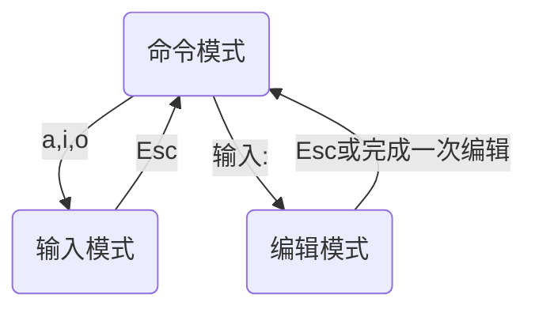

<iframe src="//player.bilibili.com/player.html?aid=474968672&bvid=BV1AK411U73x&cid=887434972&page=1" scrolling="no" border="0" frameborder="no" framespacing="0" allowfullscreen="true"> </iframe>

<!--more-->

> 针对 ubuntu20.04
> ubuntu 20.04 是 “西柚云” 主要使用的操作系统  [西柚云官网](https://www.xiyoucloud.net/aff/VKRWMUHQ)

使用 nano 或 vim 编辑一个文件时，都是使用命令加文件的绝对路径或相对路径。如果该路径对应的文件不存在，写入内容后，文件会自动创建。
为了方便演示，这里我在 /tmp 目录下创建 xiyouyun 目录作为工作目录, 之后的命令在 `/tmp/xiyouyun`工作目录下执行。

```bash
mkdir -p /tmp/xiyouyun
cd /tmp/xiyouyun
```

## 简单编辑
### nano：nano [filepath] 

```bash
# 使用 nano 编辑一个文件
nano /tmp/xiyouyun/nano.txt
```
如果你只想用 nano 做简单的编辑，在编辑完文件后按 Ctrl + s 保存文件，然后按 Ctrl + x 退出编辑，编辑内容就被写入文件了。


### vim：vim [filepath]

```bash
# 使用 vim 编辑一个文件
vim /tmp/xiyouyun/vim.txt
```
如果你只想用 vim 做简单编辑，你需要掌握它的**3**种工作模式。当使用命令进入 vim vim.txt 进入 vim 时，此时是**命令模式**，输入<kbd>i</kbd>进入 vim 的**输入模式**，此时可以编辑文件内容，编辑好内容后，按<kbd>Esc</kbd>回到命令模式，输入":"进入到 vim 的**编辑模式**，此时可以对文件进行保存，如输入":wq"后回车是对文件进行保存并退出。



##  复杂编辑
### nano

如果你想使用 nano 做一下复杂编辑，你需要掌握一些快捷键。
进入 nano 的编辑窗口后，使用 <kbd>Ctrl</kbd> + <kbd>G</kbd> 查看使用说明，在使用说明中首字母 "^" 表示<kbd>Ctrl</kbd>，首字母"M"可以用<kbd>Alt</kbd>、<kbd>Esc</kbd>、<kbd>Cmd</kbd>中的任意一个来实现，这里我使用<kbd>Alt</kbd>。
**常用的快捷键：**

> Ctrl + G 可以查看 nano 使用说明，使用<kbd>↓</kbd> 和 <kbd>↑</kbd>滚动查看使用说明，再按一次 Ctrl + G 退出使用说明。
>
> Alt + # 显示行号，这里的 “#” 需要借助<kbd>Shift</kbd> 才能打出来。
>
> Ctrl + _ 跳转到指定行，这里的“_”需要借助<kbd>Shift</kbd>才能打出来。
>
> Ctrl + s 保存写入文件的内容
>
> Ctrl + x 退出编辑模式，一般来说退出之前需要保存文件内容，也可不保存退出，这样文件更改就不会生效。
>
> Alt + u 撤销上一次的更改
>
> Alt + e 重做上一次撤销的更改
>
> Ctrl + \ 替换文件中的内容
>
> Ctrl + q 搜索文件中的内容
>
> Ctrl + r 读取另一个文件中的内容，加载到当前编辑的文件中
>
> 
>
> Ctrl + a 将光标跳转到行首
>
> Ctrl + e 将光标跳转到行尾
>
> Ctrl + p 将光标跳转到上一行，也可以用<kbd>↑</kbd>代替
>
> Ctrl + n 将光标跳转到下一行，也可用<kbd>↓</kbd>代替
>
> Alt + \ 跳转到文件的第一行
>
> Alt + / 跳转到文件的最后一行
>
> Ctrl + y 跳转到上一页
>
> Ctrl + v 跳转到下一页
>
> 
>
> Ctrl + t 剪切从当前位置到文件末尾的全部内容
>
> Ctrl + 6 选择文本，此时移动光标就会选中部分文本
>
> Alt + 6 复制选中的文本
>
> Ctrl + k 剪切当前行
>
> Ctrl + u 粘贴

### vim

如果你想用 vim 做一些复杂编辑，你需要掌握它在**命令模式**下的一些快捷键，还需要掌握一些在编辑模式下的命令。

**vim 常用快捷键和命令：**

> 命令模式：
> 	dd 删除当前行
> 	yy 复制当前行
> 	p / P 粘贴缓冲区中的内容（可以是复制或者剪切的内
> 	容）
> 	u 撤销更改
> 	Ctrl + r 重做撤销的更改
> 	gg 跳转到文件的第一行
> 	Shift + g 跳转到文件的最后一行
> 	d + Shift + g 删除从当前行到文件末尾的所有内容
> 	d + g + g 删除从当前行到文件开头的所有内容
> 	v 移动光标选中文本
> 	y 复制选中的文本
> 	">" 右移选中的文本
> 	"<" 左移选中的文本
> 	d 剪切选中的文本
> 	i 进入到输入模式
> 	<number> + d + d 删除当前行后的 number 行，
> 	这里的 <number> 替换为想要删除的行数
> 	Shift + z + z 退出 vim，保存改动的内容
> 	Shift + z + q 退出 vim，不保存改动的内容
> 	：进入到编辑模式
> 编辑模式：
> 	:set number 显示行号
> 	:wq 保存并退出
> 	:q 退出vim，只有当文件未做改动时才能成功退出
> 	:q! 退出 vim，并放弃所有的更改
> 	:r <filename> 在光标后读入另一个文件的内容，
> 	这里的<filename>替换为想要读入的文件名
> 	:w <filename> 文件内容另存为 filename，这里
> 	的<filename>替换为想要保存的文件名
> 	/<search_text> 从当前行往后搜索字符串，支持正
> 	则表达式，这里的<search_test>替换为想要搜索的字符
> 	串模式
> 	?<search_test> 从当前行往前搜索字符串，支持正
> 	则表达式，这里的<search_test>替换为想要搜索的字
> 	符串模式
> 	以上两种搜索方式都可以用 n 移动到后一个匹配项，N
> 	移动到前一个匹配项
> 	%s/<match>/<replace> 检索第一个匹配的字符
> 	串，并将其替换为另一个字符串。这里的<match>替换为
> 	要搜索的字符串模式，<replace>替换为要替换的字符串
> 	%s/<match>/<replace>/g 检索所有匹配的字符
> 	串，并将所有匹配的字符串替换为另一个字符串。这里的
> 	<match>替换为要搜索的字符串模式，<replace> 替换
> 	为要替换的字符串
> 	%s/<match>/<replace>/g 检索所有匹配的字符串，
> 	并将所有匹配的字符串替换为另一个字符串，不过在替换每一个
> 	匹配的字符串时都会询问用户是否替换。这里的<match>替
> 	换为要搜索的字符串模式，<replace>替换为要替换的字符
> 	串
> 输入模式：
> 	输入模式无快捷键

将以下内容写入到 ~/.vimrc 中，可以对 vim 进行设置，设置立即生效
 vim ~/.vimrc

```bash
# 显示行号
set nu
# 复制粘贴时保持文件缩进格式
set paste
```

