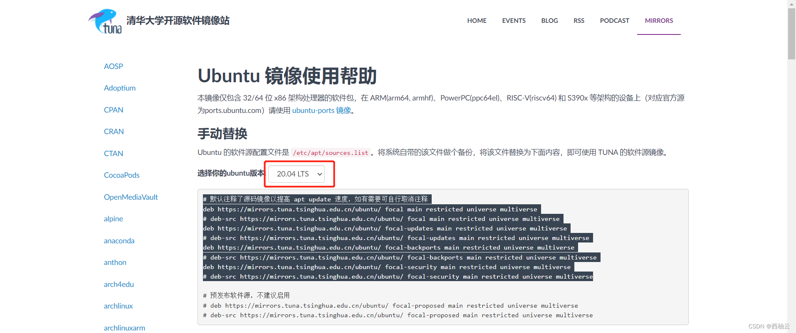

<iframe src="//player.bilibili.com/player.html?aid=903804972&bvid=BV1yP4y1D787&cid=926416540&page=1" style="width:100%;height:500px;min-width:375px;min-height:200px" scrolling="no" border="0" frameborder="no" framespacing="0" allowfullscreen="true"> </iframe>

<!--more-->

>适用于 ubuntu 20.04
>ubuntu 20.04 是 “西柚云” 主要使用的操作系统 [西柚云官网](https://www.xiyoucloud.net/aff/VKRWMUHQ)

## 介绍

apt 是 ubuntu 系统默认的软件包管理工具，就好像 centos 的 yum，不过 yum 只能在 centos 中使用，在 ubuntu 中应该使用 apt 来管理包。

## 软件源

软件包是从哪里下载到的呢？答案是软件源，顾名思义软件的来源称为软件源。

软件源实际上是一个链接，链接中包含了很多的软件资源。

系统默认是配置好软件源的，它保存在 /etc/apt/sources.list 和 /etc/apt/sources.list.d/xiyou.list 的文件中

**值得一提的是不同的操作系统版本使用的软件源是不一样的，因此配置源时需要配置操作系统版本对应的源**

```bash
apt edit-sources

# 查看操作系统版本
lsb_release -a
```

好习惯是如果你手动修改 /etc/apt/sources.list 文件，你最好对它建立一个备份，然后再编辑它，这样能够防止自己改错文件后可以从备份中恢复文件。 

```bash
cp /etc/apt/sources.list /etc/apt/sources.list.bak
vi /etc/apt/sources.list

# 让配置的源生效
apt update
```

### 1.增加/修改软件源（以修改文件的方式）

清华软件源：https://mirrors.tuna.tsinghua.edu.cn/help/ubuntu/ （可以手动选择到合适的系统版本）

```bash
# ubuntu 20.04 修改官方软件源为清华源
sudo sed -i "s@http://.*archive.ubuntu.com@https://mirrors.tuna.tsinghua.edu.cn@g" /etc/apt/sources.list
sudo sed -i "s@http://.*security.ubuntu.com@https://mirrors.tuna.tsinghua.edu.cn@g" /etc/apt/sources.list
```





```bash
# 默认注释了源码镜像以提高 apt update 速度，如有需要可自行取消注释， 这是 ubuntu 20.04 的软件源
deb https://mirrors.tuna.tsinghua.edu.cn/ubuntu/ focal main restricted universe multiverse
# deb-src https://mirrors.tuna.tsinghua.edu.cn/ubuntu/ focal main restricted universe multiverse
deb https://mirrors.tuna.tsinghua.edu.cn/ubuntu/ focal-updates main restricted universe multiverse
# deb-src https://mirrors.tuna.tsinghua.edu.cn/ubuntu/ focal-updates main restricted universe multiverse
deb https://mirrors.tuna.tsinghua.edu.cn/ubuntu/ focal-backports main restricted universe multiverse
# deb-src https://mirrors.tuna.tsinghua.edu.cn/ubuntu/ focal-backports main restricted universe multiverse
deb https://mirrors.tuna.tsinghua.edu.cn/ubuntu/ focal-security main restricted universe multiverse
# deb-src https://mirrors.tuna.tsinghua.edu.cn/ubuntu/ focal-security main restricted universe multiverse
```

### 2.增加软件源 (以命令的方式)

```bash
apt-add-repository 'deb http://myserver/path/to/repo stable myrepo'
apt-add-repository 'http://myserver/path/to/repo myrepo'
apt-add-repository 'https://packages.medibuntu.org free non-free'
apt-add-repository http://extras.ubuntu.com/ubuntu
apt-add-repository ppa:user/repository
apt-add-repository ppa:user/distro/repository
apt-add-repository multiverse
```

### 3.删除软件源

以修改文件的方式：使用“#”注释掉不想要的软件源 vi /etc/apt/sources.list

```bash
# 在文件的每一行的前面加 #，即注释掉该文件中所有的源
sed -i "s/^/#/" /etc/apt/sources.list
# 删除刚刚添加的 #，撤销上一步操作
sed -i 's/.//' /etc/apt/sources.list
```

使用命令的方式删除源：`apt-add-repository -r 'https://packages.medibuntu.org free non-free'`

## 软件包

dpkg 用于安装本地的 .deb 包，处理依赖的能力较差。

apt 是基于 dpkg 封装好的软件包管理工具，它从软件源安装软件，并能较好地处理软件依赖，使用起来更加方便。

**以下命令以 wget 软件为例**

### 更新存储库

apt 从软件源安装软件，它需要在本地维护一个软件源的存储库，这样就能在存储库中搜索软件包了。但软件源中的软件包信息是频繁更新的，如果你想使用更新版本的软件，你就需要先更新本地的存储库，再进行软件安装。

```bash
apt update
```

### 搜索软件包

支持正则表达式

```bash
# 能搜索到的软件包才能被 apt 安装
apt search ^wget
```

如果搜索不到某软件，就去 google “xx install in ubuntu”

### 安装软件包

```bash
apt install wget

# 使用 dpkg 安装软件包
dpkg -i xx.deb
```

### 查看软件包

```bash
# 查看本地是否安装 wget
apt list | grep ^wget
# 查看软件包的具体信息
apt show wget

# 查看软件包对应的文件信息
dpkg -L rstudio-server
```

### 卸载软件包

```bash
# 卸载软件，保留相关文件
apt remove rstudio-server
# 卸载软件并删除相关文件
apt autoremove rstudio-server
```

### 更新软件包

```bash
# 先更新存储库，确保获取到更新的版本包信息
apt update
# 更新系统中所有的软件包，使用 installing/upgrading packages 的方式来处理依赖
apt upgrade
# 更新系统中所有的软件包，使用 removing/installing/upgrading packages 的方式来处理依赖
apt full-upgrade
```

# 补充内容

## apt 和 apt-get 的关系：

在 shell 中通常使用 apt，因为可以少打 4 个字符。在脚本中安装软件通常使用 apt-get，兼容性更好，通常在脚本中使用。

**WARNING: apt does not have a stable CLI interface. Use with caution in scripts.**

| apt                   | apt-get                     | 命令含义                                   |
| --------------------- | --------------------------- | ------------------------------------------ |
| apt install 包名      | apt-get install 包名        | 安装软件包                                 |
| apt remove 包名       | apt-get remove 包名         | 移除软件包                                 |
| apt purge 包名        | apt-get purge 包名          | 移除软件包及配置文件                       |
| apt update            | apt-get update              | 刷新存储库索引                             |
| apt upgrade           | apt-get upgrade             | 升级所有可升级的软件包                     |
| apt autoremove 包名   | apt-get autoremove 包名     | 自动删除所有不需要的软件包                 |
| apt full-upgrade      | apt-get dist-upgrade        | 在升级软件包时自动处理依赖关系             |
| apt search 正则表达式 | apt-cache search 正则表达式 | 搜索应用程序                               |
| apt show 包名         | apt-cache show 包名         | 显示安装细节                               |
| apt clean             | apt-get clean               | 清理已下载的软件包，不会影响软件的正常使用 |
| apt autoclean         | apt-get autoclean           | 删除已经卸载的软件的软件包备份             |

## E:Unable to locate package xxx

有两种可能，一种可能是你要搜索的软件在软件源中并不存在。如果你没有添加其他的软件源，说明该软件在官方原中不存在，如果你知道该软件在那个软件源的话可以通过添加第三方软件源来安装该软件。

另一种可能是本地的软件源没有该软件的信息，这种情况下您可以使用以下命令更新一下本地的软件信息，然后再次执行安装。

```bash
apt update
```

