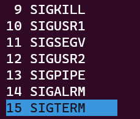

<iframe src="//player.bilibili.com/player.html?aid=647818915&bvid=BV1Ee4y1p77d&cid=896823750&page=1" style="width:100%;height:500px;min-width:375px;min-height:200px"scrolling="no" border="0" frameborder="no" framespacing="0" allowfullscreen="true"> </iframe>

<!--more-->

> 针对 ubuntu20.04
> ubuntu 20.04 是 “西柚云” 主要使用的操作系统  [西柚云官网](https://www.xiyoucloud.net/aff/VKRWMUHQ)

什么是进程？进程就是运行的程序。

我们可以（运行程序，终止程序，查看程序的运行状态）

那么我们如何产生1个进程呢？我们通常使用命令，命令对应程序，程序执行后就会产生进程。

如：

```bash
# 输入 python3 进入python3 的交互模式中，期间你可以执行 python 代码，输入 exit（）退出该模式
python3
print("hello, xiyouyun")
exit()

# 输出一串字符串
echo "hello, xiyouyun"
```

运行在前台的进程：

```bash
# 1 个 sleep 进程，占用终端 1000s 不做操作
sleep 1000
# 这些都是运行在前台的进程
pwd
ls
cd
```

这种运行后就占用了终端，让我们不能做其他操作的进程，我们称它运行在前台，可以使用 ctrl + c 结束运行。

运行在后台的程序：

```bash
# 让进程在后台运行
sleep 1001 &
sleep 10086 &
sleep 10010 &
echo "hello, xiyouyun" > xiyou.txt
```

运行在后台的进程，需要借助进程的 pid 来终止进程。如何查找到进程的 pid 呢？这就涉及到进程信息的查看。

## 进程查看（ps）

| 参数 | 含义                                                         |
| ---- | ------------------------------------------------------------ |
| e    | 显示所有进程                                                 |
| f    | 搭配 e 使用，显示更全面的信息                                |
| a    | 显示终端的所有进程，包括其他用户的进程                       |
| u    | 默认显示当前用户的进程，也可指定用户，和 a 组合在一起会显示所有进程的用户名 |
| x    | 显示不在某个终端运行的进程，如 init 进程，TTY 为 ？          |

常用查看进程的方式:

```bash
# 利用运行进程使用的命令中的关键字查询出进程的 pid
ps -ef | grep <keyword>

ps -aux | grep <keyword>
# 查看当前用户运行的全部进程
ps -ux 
```

## 杀死进程

```bash
# 使用 kill 命令来杀死进程
kill -9 <pid>
kill -15 <pid>
```

9 和 15 这两个数字的含义可以在终端输入 htop，然后按 F9 查看，每个数字对应了一种发送给进程的信号。

- 15 对应的是 SIGTERM，通知进程结束，不加参数时，如：kill pid 默认使用该信号终止进程。
- 9 对应的是 SIGKILL，强制终止进程。

所以我们也可以在 htop 界面中发送相应的信号来结束进程。



# 补充内容

## 杀掉包含关键字的所有程序（**切记杀死进程前需要确认，防止误杀**）

```bash
# 以进程信息中包含 jupyter 关键字为例
# 杀死进程前，需确认列出的进程不包含不想杀死的进程，如果包含不想杀死的进程，可以使用 grep 增加筛选条件，直至输出的进程信息全部为你想要杀死的进程为止
ps -ux
ps -ux | grep jupyter
ps -ux | grep jupyter | grep -v grep 
ps -ux | grep jupyter | gerp -v grep | grep <keyword>

# 这条命令会杀死进程信息中包含 jupyter 关键字的进程
ps -ux | grep jupyter | grep -v grep | awk '{print $2}' | xargs kill -9
```

## 查看进程时用户名显示不全

```bash
ps -o ruser=userForLongName -e -o pid,ppid,c,%cpu,%mem,stime,tty,time,cmd
```

